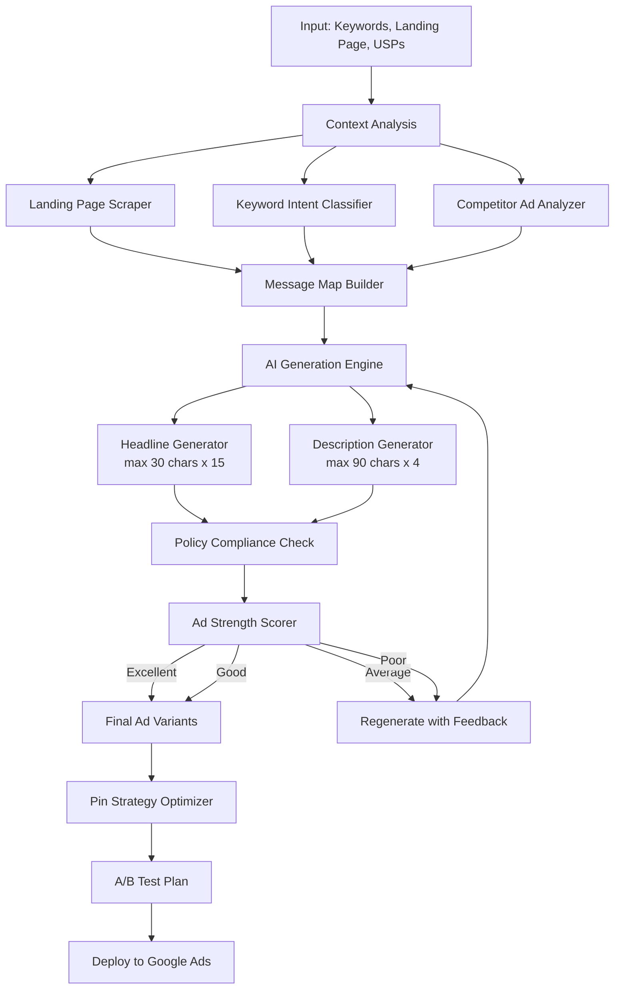

# Ad Copy Generation

Part of [Agent Skills™](https://github.com/itallstartedwithaidea/agent-skills) by [googleadsagent.ai™](https://googleadsagent.ai)

## Description

The Ad Copy Generation skill produces high-performance responsive search ad (RSA) copy using AI-driven generation pipelines calibrated against millions of ad performance data points. It generates headlines (up to 15, max 30 characters each) and descriptions (up to 4, max 90 characters each), optimizing for ad strength, click-through rate, and conversion relevance while adhering to Google Ads editorial policies.

The generation engine applies proven copywriting frameworks including AIDA (Attention, Interest, Desire, Action), PAS (Problem, Agitate, Solve), and benefit-driven messaging. It incorporates dynamic keyword insertion (DKI) syntax where appropriate, manages pin strategies for controlled ad assembly, and generates systematic A/B testing variants. Each ad variant is scored against Google's ad strength criteria before submission.

Beyond generation, the skill manages the full ad copy lifecycle: competitive ad analysis to identify messaging gaps, performance-based variant pruning, statistical significance testing for A/B experiments, and automated winner scaling. It integrates with the Buddy™ platform to learn from historical performance data, continuously improving generation quality for each specific account and industry vertical.

## Use When

- User asks to "write ad copy" or "generate ads"
- User wants "new headlines" or "new descriptions" for RSAs
- User mentions "ad strength" improvement
- User asks for "A/B test variants" or "ad testing"
- User wants to "improve click-through rate" on ads
- User mentions "responsive search ads" or "RSA optimization"
- User asks about "dynamic keyword insertion" or "DKI"
- User wants "pin strategy" recommendations
- User asks to "refresh stale ad copy" or "combat ad fatigue"

## Architecture



## Implementation

Core ad copy generation with character limit enforcement and DKI support:

```javascript
const HEADLINE_MAX_LENGTH = 30;
const DESCRIPTION_MAX_LENGTH = 90;
const MAX_HEADLINES = 15;
const MAX_DESCRIPTIONS = 4;

const COPYWRITING_FRAMEWORKS = {
  AIDA: ['attention', 'interest', 'desire', 'action'],
  PAS: ['problem', 'agitate', 'solve'],
  BENEFIT: ['primary_benefit', 'secondary_benefit', 'proof', 'cta']
};

async function generateAdCopy(config) {
  const { keywords, landingPageUrl, usps, industry, targetAudience } = config;

  const landingPageContent = await scrapeLandingPage(landingPageUrl);
  const competitorAds = await analyzeCompetitorAds(keywords);
  const intentSignals = classifyKeywordIntent(keywords);

  const headlines = await generateHeadlines({
    keywords,
    usps,
    competitorAds,
    intentSignals,
    landingPageContent,
    maxLength: HEADLINE_MAX_LENGTH,
    count: MAX_HEADLINES
  });

  const descriptions = await generateDescriptions({
    keywords,
    usps,
    landingPageContent,
    maxLength: DESCRIPTION_MAX_LENGTH,
    count: MAX_DESCRIPTIONS
  });

  return buildAdVariants(headlines, descriptions);
}

function applyDynamicKeywordInsertion(headline, defaultText) {
  const dkiSyntax = `{KeyWord:${defaultText}}`;
  if (dkiSyntax.length <= HEADLINE_MAX_LENGTH) {
    return dkiSyntax;
  }
  return defaultText;
}

function generatePinStrategy(headlines, descriptions) {
  return {
    position1: headlines.filter(h => h.type === 'brand' || h.type === 'primary_keyword'),
    position2: headlines.filter(h => h.type === 'benefit' || h.type === 'usp'),
    position3: headlines.filter(h => h.type === 'cta' || h.type === 'offer'),
    desc1: descriptions.filter(d => d.type === 'primary'),
    desc2: descriptions.filter(d => d.type === 'supporting')
  };
}
```

A/B testing framework for ad variants:

```javascript
function createABTestPlan(adVariants, config) {
  const { minImpressions = 1000, confidenceLevel = 0.95 } = config;

  return {
    controlGroup: adVariants[0],
    testGroups: adVariants.slice(1),
    evaluationCriteria: {
      primaryMetric: 'conversion_rate',
      secondaryMetrics: ['ctr', 'cost_per_conversion'],
      minImpressions,
      confidenceLevel,
      testDuration: calculateMinTestDuration(minImpressions)
    },
    decisionRules: {
      winner: 'statistically_significant_improvement',
      loser: 'statistically_significant_decline',
      inconclusive: 'extend_test_or_increase_budget'
    }
  };
}

function evaluateAdStrength(headlines, descriptions) {
  let score = 0;
  const uniqueHeadlines = new Set(headlines.map(h => h.text.toLowerCase()));
  if (uniqueHeadlines.size >= 8) score += 25;
  if (headlines.some(h => h.includesKeyword)) score += 15;
  if (headlines.some(h => h.includesCTA)) score += 15;
  if (headlines.some(h => h.includesNumber)) score += 10;
  if (descriptions.length >= 4) score += 15;
  if (descriptions.some(d => d.includesCTA)) score += 10;
  if (descriptions.some(d => d.includesUSP)) score += 10;

  if (score >= 80) return 'Excellent';
  if (score >= 60) return 'Good';
  if (score >= 40) return 'Average';
  return 'Poor';
}
```

## Integration with Buddy™ Agent

Within the Buddy™ Agent platform, Ad Copy Generation operates as a core creative engine. When the Google Ads Audit skill identifies underperforming ads or low ad strength scores, it automatically triggers the Ad Copy Generation pipeline with the relevant keywords, landing pages, and competitive context pre-loaded.

Buddy™ maintains a performance history for every ad variant generated, building an account-specific model of what messaging resonates with each audience segment. Over time, the generation engine learns industry-specific patterns: which CTAs drive conversions, which benefit angles produce the highest CTR, and which headline structures earn the best Quality Scores.

The skill integrates with Buddy™'s approval workflow, presenting generated variants to the user for review before deployment. Users can approve, edit, or reject variants, and this feedback loop further refines the generation model.

## Best Practices

1. Always provide at least 10 unique headlines to give Google's algorithm maximum flexibility
2. Include at least one headline with a clear call-to-action (CTA)
3. Use dynamic keyword insertion sparingly and only when the default text reads naturally
4. Pin headlines only when brand or compliance requirements demand specific messaging positions
5. Test at least 3 ad variants per ad group before drawing performance conclusions
6. Wait for statistical significance (typically 1,000+ impressions) before pausing underperformers
7. Include numbers, percentages, or specific offers in at least 2-3 headlines
8. Mirror landing page language in descriptions to improve ad relevance and Quality Score
9. Refresh ad copy quarterly to combat ad fatigue and maintain competitive messaging
10. Use the ad strength indicator as a guide but optimize for conversions as the ultimate metric

## Platform Compatibility

| Platform | Supported |
|----------|-----------|
| Claude Code | ✅ |
| Cursor | ✅ |
| Codex | ✅ |
| Gemini | ✅ |

## Related Skills

- [Quality Score Optimization](../quality-score-optimization/) - Ad copy directly impacts the Expected CTR and Ad Relevance components of Quality Score
- [Keyword Research](../keyword-research/) - Keyword-ad alignment is critical for ad relevance; keyword themes drive ad group copy strategy
- [Landing Page Audit](../landing-page-audit/) - Message match between ad copy and landing pages affects both Quality Score and conversion rates
- [Competitor Analysis](../competitor-analysis/) - Competitor messaging gaps inform differentiation strategy for ad copy

## Keywords

ad copy generation, responsive search ads, RSA optimization, headline generation, description writing, ad strength, A/B testing ads, dynamic keyword insertion, DKI, pin strategy, ad copy testing, google ads copywriting, ctr optimization, ad fatigue, ad variant testing

---

© 2026 [googleadsagent.ai™](https://googleadsagent.ai) | [Agent Skills™](https://github.com/itallstartedwithaidea/agent-skills) | MIT License
