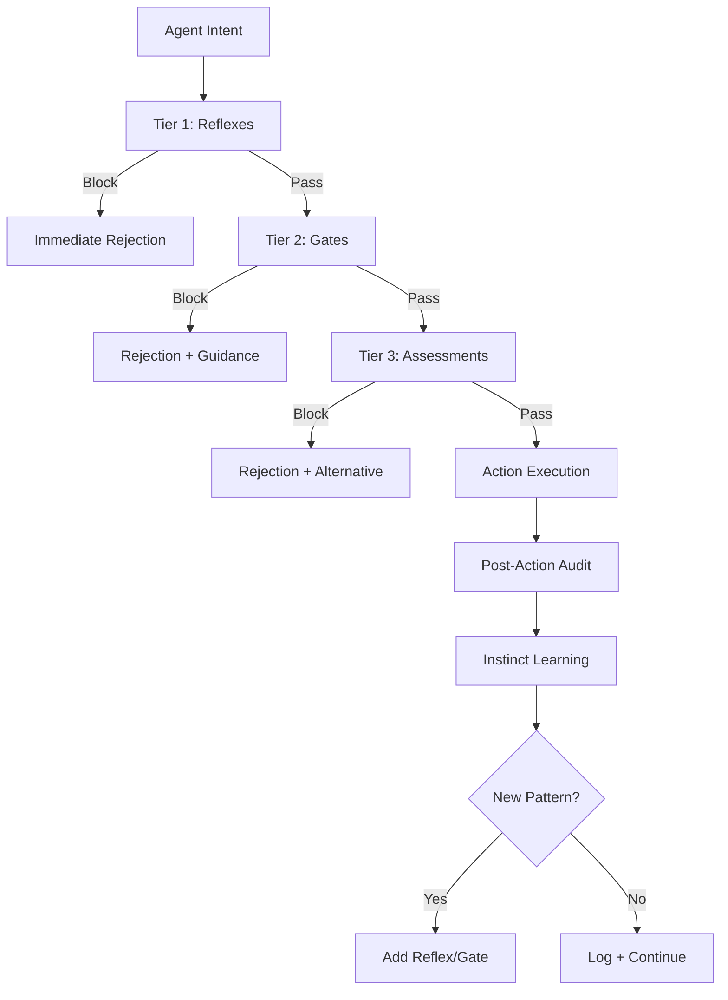

# Agent Instinct System

Part of [Agent Skills™](https://github.com/itallstartedwithaidea/agent-skills) by [googleadsagent.ai™](https://googleadsagent.ai)

## Description

The Agent Instinct System implements pre-cognitive reflexes — automatic safety checks and validations that fire before every code change, tool call, or output generation. Just as biological reflexes protect organisms from harm faster than conscious thought, agent instincts protect codebases and systems from damage faster than deliberate reasoning. These instincts operate below the level of task-specific logic, forming a universal safety layer that activates regardless of what the agent is doing.

Developed for the Buddy™ agent at [googleadsagent.ai™](https://googleadsagent.ai), where a single incorrect Google Ads API call could burn through a client's entire monthly budget, the instinct system enforces invariants that must never be violated. Budget caps are checked before bid modifications. Destructive operations require confirmation signals. File deletions are validated against protection lists. These checks happen automatically, without the agent needing to "remember" to perform them.

The instinct system is organized into three tiers: reflexes (instant, zero-cost checks like "is this file in the protected list"), gates (lightweight validations like "does this change pass the linter"), and assessments (more expensive checks like "does this modification align with the stated task"). Each tier adds latency but catches increasingly subtle issues.

## Use When

- Agents operate on production systems where mistakes have real consequences
- You need defense-in-depth beyond what a single verification step provides
- Multiple agents or team members work on the same codebase simultaneously
- The agent handles destructive operations (deletions, deployments, API mutations)
- Compliance requirements mandate pre-action validation for AI-generated changes
- You want to prevent entire categories of mistakes rather than catching them after the fact

## How It Works



When the agent forms an intent to act (write a file, call a tool, generate output), the intent passes through the instinct tiers sequentially. Tier 1 reflexes are hardcoded checks that execute in microseconds: protected file lists, forbidden operation patterns, budget ceiling checks. Tier 2 gates run lightweight validations: syntax checks, dependency verification, scope validation. Tier 3 assessments perform deeper analysis: task alignment verification, impact estimation, side-effect prediction. After execution, post-action audits feed back into the instinct system, allowing it to learn new protective patterns from near-misses.

## Implementation

**Instinct Engine Core:**

```typescript
type InstinctTier = "reflex" | "gate" | "assessment";

interface Instinct {
  name: string;
  tier: InstinctTier;
  check(intent: AgentIntent): Promise<InstinctResult>;
}

interface InstinctResult {
  allow: boolean;
  reason?: string;
  alternative?: string;
}

class InstinctEngine {
  private instincts: Map<InstinctTier, Instinct[]> = new Map([
    ["reflex", []],
    ["gate", []],
    ["assessment", []],
  ]);

  register(instinct: Instinct): void {
    this.instincts.get(instinct.tier)!.push(instinct);
  }

  async evaluate(intent: AgentIntent): Promise<InstinctResult> {
    for (const tier of ["reflex", "gate", "assessment"] as InstinctTier[]) {
      for (const instinct of this.instincts.get(tier)!) {
        const result = await instinct.check(intent);
        if (!result.allow) {
          return { ...result, reason: `[${instinct.name}] ${result.reason}` };
        }
      }
    }
    return { allow: true };
  }
}
```

**Built-In Reflexes:**

```typescript
const PROTECTED_FILES_REFLEX: Instinct = {
  name: "protected-files",
  tier: "reflex",
  async check(intent) {
    const protectedPatterns = [
      /\.env($|\.)/,
      /credentials\./,
      /secrets?\./,
      /\.pem$/,
      /id_rsa/,
      /package-lock\.json$/,
      /yarn\.lock$/,
    ];
    if (intent.type === "file_write" || intent.type === "file_delete") {
      const blocked = protectedPatterns.some(p => p.test(intent.target));
      if (blocked) {
        return { allow: false, reason: `"${intent.target}" is a protected file` };
      }
    }
    return { allow: true };
  },
};

const DESTRUCTIVE_OP_REFLEX: Instinct = {
  name: "destructive-operation",
  tier: "reflex",
  async check(intent) {
    const destructive = ["rm -rf", "DROP TABLE", "DELETE FROM", "git push --force"];
    if (intent.type === "shell_command") {
      const cmd = intent.content.toLowerCase();
      const match = destructive.find(d => cmd.includes(d.toLowerCase()));
      if (match) {
        return {
          allow: false,
          reason: `Destructive operation detected: "${match}"`,
          alternative: "Use a safer alternative or request explicit confirmation",
        };
      }
    }
    return { allow: true };
  },
};

const BUDGET_CEILING_REFLEX: Instinct = {
  name: "budget-ceiling",
  tier: "reflex",
  async check(intent) {
    if (intent.type === "api_call" && intent.metadata?.estimatedCost) {
      const sessionBudget = intent.metadata.sessionBudget || 10.0;
      const spent = intent.metadata.sessionSpent || 0;
      if (spent + intent.metadata.estimatedCost > sessionBudget) {
        return {
          allow: false,
          reason: `Would exceed session budget ($${spent} + $${intent.metadata.estimatedCost} > $${sessionBudget})`,
        };
      }
    }
    return { allow: true };
  },
};
```

**Gate: Scope Validation:**

```python
class ScopeValidationGate:
    """Ensures the agent's action is within the stated task scope."""

    def __init__(self, allowed_paths: list[str], allowed_operations: list[str]):
        self.allowed_paths = [re.compile(p) for p in allowed_paths]
        self.allowed_operations = set(allowed_operations)

    async def check(self, intent):
        if intent["type"] not in self.allowed_operations:
            return {
                "allow": False,
                "reason": f"Operation '{intent['type']}' not in allowed set: {self.allowed_operations}",
            }
        if intent.get("target"):
            if not any(p.match(intent["target"]) for p in self.allowed_paths):
                return {
                    "allow": False,
                    "reason": f"Path '{intent['target']}' outside allowed scope",
                    "alternative": f"Allowed paths: {[p.pattern for p in self.allowed_paths]}",
                }
        return {"allow": True}
```

## Best Practices

1. **Keep reflexes zero-cost** — Tier 1 reflexes must execute in under 1ms with no I/O; anything requiring network calls or model inference belongs in a higher tier.
2. **Make rejections actionable** — every blocked intent should include a reason and, when possible, an alternative action the agent can take instead.
3. **Start with a deny-list, evolve to an allow-list** — begin by blocking known-dangerous operations, then progressively tighten to only allowing explicitly safe operations.
4. **Log all instinct activations** — every blocked and allowed intent should be logged for audit and for instinct learning.
5. **Never skip instincts for "trusted" tasks** — the instinct system is a safety net; bypassing it for convenience defeats its entire purpose.
6. **Derive new instincts from incidents** — every production incident should produce at least one new reflex or gate that prevents recurrence.
7. **Test instincts with adversarial intents** — craft intents designed to bypass each instinct and verify they are caught.
8. **Version instinct configurations** — track which instincts are active per environment (dev/staging/prod) and audit changes.

## Platform Compatibility

| Feature | Claude Code | Cursor | Codex | Gemini CLI |
|---|---|---|---|---|
| Pre-action hooks | ✅ PreToolUse | ✅ Rules | ✅ Instructions | ✅ System prompts |
| File protection | ✅ Full | ✅ Full | ✅ Sandbox | ✅ Full |
| Shell command filtering | ✅ Full | ✅ Full | ✅ Sandbox | ✅ Full |
| Budget enforcement | ✅ Custom hooks | ✅ Extensions | ✅ Custom | ✅ Custom |
| Post-action audit | ✅ PostToolUse | ✅ Rules | ✅ Custom | ✅ Custom |

## Related Skills

- [Adversarial Resilience](../adversarial-resilience/) - Layered defense against prompt injection and data exfiltration that pairs with instinct-level protection
- [Verification Loops](../verification-loops/) - Post-action evaluation pipelines that validate outputs after instincts approve the action
- [Self-Healing Agents](../self-healing-agents/) - Autonomous error recovery that activates when instinct gates detect failures

## Keywords

agent-instincts, pre-flight-checks, safety-gates, reflexes, destructive-operation-prevention, scope-validation, budget-ceiling, protected-files, defense-in-depth, agent-skills

---

© 2026 [googleadsagent.ai™](https://googleadsagent.ai) | [Agent Skills™](https://github.com/itallstartedwithaidea/agent-skills) | MIT License
