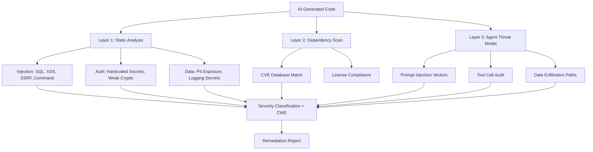

# Agent Security Scanning

Part of [Agent Skills™](https://github.com/itallstartedwithaidea/agent-skills) by [googleadsagent.ai™](https://googleadsagent.ai)

## Description

Agent Security Scanning detects vulnerabilities in AI-generated code before it reaches production. The agent applies OWASP Top 10 for LLM Applications, scans for known CVEs in dependencies, identifies prompt injection vectors, and flags insecure patterns specific to agent-generated code—such as unsanitized dynamic SQL, eval() usage, and unvalidated deserialization.

AI code generators produce code that "works" but frequently contains security vulnerabilities invisible to functional testing. Studies show that AI-generated code contains exploitable vulnerabilities at higher rates than human-written code, particularly in input validation, authentication, and cryptographic operations. This skill applies security analysis specifically calibrated for the patterns that AI agents produce.

The scanning pipeline covers three layers: static analysis of generated code (injection, XSS, SSRF), dependency vulnerability scanning (CVE database matching), and agent-specific threat modeling (prompt injection, tool misuse, data exfiltration through tool calls). Each finding includes a severity rating, CWE classification, and a concrete remediation with code example.

## Use When

- Reviewing AI-generated code before committing or deploying
- Scanning dependencies for known CVEs after `npm install` or `pip install`
- Auditing agent tool call patterns for potential misuse
- Implementing security gates in CI/CD pipelines
- The user requests security review, vulnerability scan, or penetration testing
- Building applications that handle user input, authentication, or payments

## How It Works



The three-layer scan runs in parallel. Static analysis catches code-level vulnerabilities, dependency scanning catches known CVEs, and agent threat modeling catches risks unique to AI-powered applications.

## Implementation

```python
import re
from dataclasses import dataclass

@dataclass
class SecurityFinding:
    severity: str  # CRITICAL, HIGH, MEDIUM, LOW
    cwe: str
    title: str
    file: str
    line: int
    description: str
    remediation: str

class AgentSecurityScanner:
    PATTERNS = [
        {
            "name": "SQL Injection",
            "pattern": r'f["\'].*(?:SELECT|INSERT|UPDATE|DELETE).*\{.*\}',
            "severity": "CRITICAL",
            "cwe": "CWE-89",
            "remediation": "Use parameterized queries instead of string interpolation",
        },
        {
            "name": "Command Injection",
            "pattern": r'(?:os\.system|subprocess\.call|exec)\s*\(.*(?:f["\']|\+\s*\w)',
            "severity": "CRITICAL",
            "cwe": "CWE-78",
            "remediation": "Use subprocess with list args, never shell=True with user input",
        },
        {
            "name": "Hardcoded Secret",
            "pattern": r'(?:password|secret|api_key|token)\s*=\s*["\'][^"\']{8,}["\']',
            "severity": "HIGH",
            "cwe": "CWE-798",
            "remediation": "Use environment variables or a secrets manager",
        },
        {
            "name": "Eval Usage",
            "pattern": r'\beval\s*\(',
            "severity": "HIGH",
            "cwe": "CWE-95",
            "remediation": "Use ast.literal_eval for data, or a sandboxed interpreter",
        },
        {
            "name": "Insecure Deserialization",
            "pattern": r'pickle\.loads?\s*\(',
            "severity": "HIGH",
            "cwe": "CWE-502",
            "remediation": "Use JSON or msgpack instead of pickle for untrusted data",
        },
    ]

    def scan_file(self, filepath: str, content: str) -> list[SecurityFinding]:
        findings = []
        for i, line in enumerate(content.splitlines(), 1):
            for pattern in self.PATTERNS:
                if re.search(pattern["pattern"], line, re.IGNORECASE):
                    findings.append(SecurityFinding(
                        severity=pattern["severity"],
                        cwe=pattern["cwe"],
                        title=pattern["name"],
                        file=filepath,
                        line=i,
                        description=f"Detected {pattern['name']} pattern",
                        remediation=pattern["remediation"],
                    ))
        return findings

    def scan_dependencies(self, lockfile: str) -> list[SecurityFinding]:
        """Scan package lockfile against CVE databases."""
        # Delegates to `npm audit` or `pip-audit`
        pass

    def scan_agent_threats(self, tool_calls: list[dict]) -> list[SecurityFinding]:
        findings = []
        for call in tool_calls:
            if call["tool"] == "Shell" and any(
                dangerous in call.get("command", "")
                for dangerous in ["rm -rf", "curl | sh", "wget | bash", "> /dev/"]
            ):
                findings.append(SecurityFinding(
                    severity="CRITICAL", cwe="CWE-78",
                    title="Dangerous Shell Command",
                    file="agent_session", line=0,
                    description=f"Agent issued dangerous command: {call['command'][:100]}",
                    remediation="Restrict agent shell access to an allowlist of safe commands",
                ))
        return findings
```

## Best Practices

- Run security scanning on every AI-generated code change, not just human-written code
- Classify findings by CWE for standardized tracking and reporting
- Block merges on CRITICAL and HIGH findings; track MEDIUM in follow-up tickets
- Scan dependencies weekly, not just at install time—new CVEs are published daily
- Audit agent tool calls for dangerous patterns (file deletion, network access, eval)
- Maintain a suppression list for acknowledged false positives with expiration dates

## Platform Compatibility

| Platform | Support | Notes |
|----------|---------|-------|
| Cursor | Full | Pre-commit + CI integration |
| VS Code | Full | Security extension ecosystem |
| Windsurf | Full | Security scanning support |
| Claude Code | Full | Code review + scanning |
| Cline | Full | Security-aware review |
| aider | Partial | Code-level scanning |

## Related Skills

- [CodeQL & Semgrep](../codeql-semgrep/) - Deep static analysis with data flow tracking that catches vulnerabilities regex-based scanning misses
- [Secret Protection](../secret-protection/) - Credential leak prevention across pre-commit, CI/CD, and runtime layers
- [Sandbox Hardening](../sandbox-hardening/) - Execution isolation that limits the blast radius of any vulnerability that escapes scanning
- [Code Review](../../software-dev/code-review/) - Structured quality gate that applies security review as one of its core evaluation dimensions

## Keywords

`security-scanning` `owasp` `cve` `vulnerability-detection` `prompt-injection` `agent-security` `static-analysis` `dependency-audit`

---

© 2026 googleadsagent.ai™ | Agent Skills™ | MIT License
