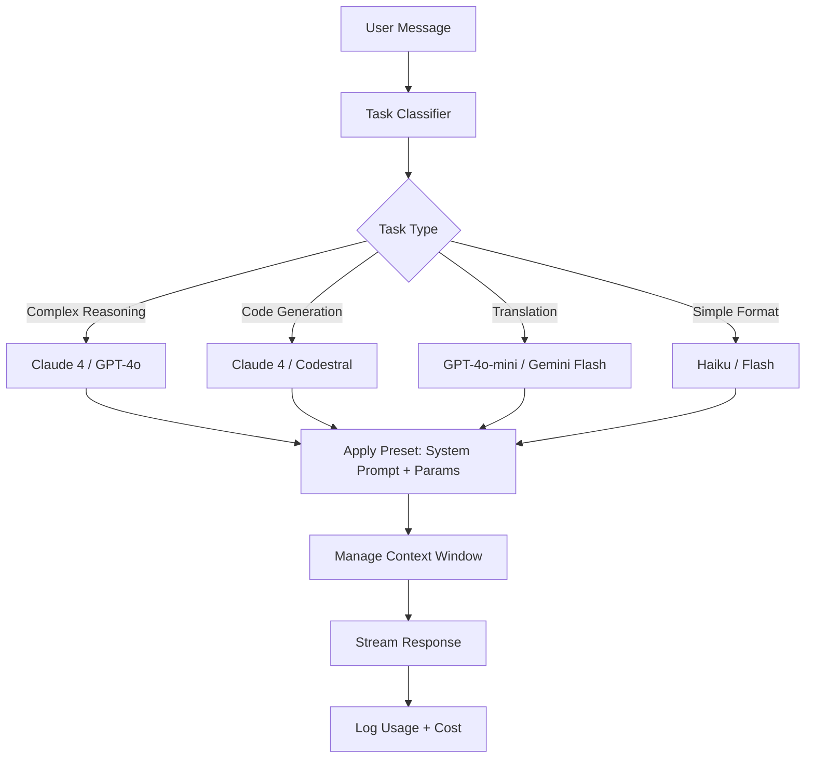

# AI Chat Studio

Part of [Agent Skills™](https://github.com/itallstartedwithaidea/agent-skills) by [googleadsagent.ai™](https://googleadsagent.ai)

## Description

AI Chat Studio provides a multi-LLM chat orchestration framework with 300+ assistant presets, intelligent model routing, and conversation management. The agent configures and manages interactions across multiple language model providers—OpenAI, Anthropic, Google, open-source models—selecting the optimal model for each task based on capability, cost, and latency requirements.

Not every task needs the most powerful model. A code review benefits from a reasoning-heavy model; a translation task runs well on a mid-tier model; a simple reformatting task wastes money on anything beyond a fast, cheap model. This skill implements intelligent routing that matches task characteristics to model capabilities, reducing cost by 40-60% while maintaining quality where it matters.

The 300+ assistant presets encode domain-specific system prompts, temperature settings, and output format constraints for common tasks: code generation, technical writing, data analysis, creative ideation, customer support, legal review, and more. Each preset is tested against a quality benchmark and tagged with the models it performs best on.

## Use When

- Configuring multi-provider LLM access in an application
- Routing tasks to the optimal model by cost-quality trade-off
- Managing conversation history and context windows
- Deploying domain-specific AI assistants with curated presets
- Building chat interfaces with streaming responses
- Comparing model outputs for the same prompt across providers

## How It Works



The task classifier analyzes the incoming message to determine complexity and domain, then routes to the most cost-effective model capable of handling it. Presets provide domain-specific system prompts and parameter tuning.

## Implementation

```typescript
interface ModelConfig {
  provider: "openai" | "anthropic" | "google" | "ollama";
  model: string;
  maxTokens: number;
  costPer1kInput: number;
  costPer1kOutput: number;
  capabilities: string[];
}

const MODEL_REGISTRY: ModelConfig[] = [
  { provider: "anthropic", model: "claude-sonnet-4-20250514", maxTokens: 8192,
    costPer1kInput: 0.003, costPer1kOutput: 0.015, capabilities: ["reasoning", "code", "analysis"] },
  { provider: "openai", model: "gpt-4o-mini", maxTokens: 4096,
    costPer1kInput: 0.00015, costPer1kOutput: 0.0006, capabilities: ["general", "translation", "format"] },
  { provider: "google", model: "gemini-2.0-flash", maxTokens: 8192,
    costPer1kInput: 0.0001, costPer1kOutput: 0.0004, capabilities: ["general", "fast", "multimodal"] },
];

interface AssistantPreset {
  id: string;
  name: string;
  systemPrompt: string;
  temperature: number;
  preferredModels: string[];
  tags: string[];
}

class ChatRouter {
  constructor(private models: ModelConfig[], private presets: Map<string, AssistantPreset>) {}

  route(message: string, presetId?: string): { model: ModelConfig; preset?: AssistantPreset } {
    const preset = presetId ? this.presets.get(presetId) : undefined;
    const taskType = this.classifyTask(message);

    const candidates = this.models.filter(m =>
      m.capabilities.some(c => taskType.requiredCapabilities.includes(c))
    );

    const selected = candidates.sort((a, b) => a.costPer1kInput - b.costPer1kInput)[0];
    return { model: selected, preset };
  }

  private classifyTask(message: string): { type: string; requiredCapabilities: string[] } {
    const lower = message.toLowerCase();
    if (lower.includes("debug") || lower.includes("refactor") || lower.includes("architect"))
      return { type: "complex", requiredCapabilities: ["reasoning", "code"] };
    if (lower.includes("translate") || lower.includes("rewrite"))
      return { type: "simple", requiredCapabilities: ["general", "translation"] };
    return { type: "general", requiredCapabilities: ["general"] };
  }
}

class ConversationManager {
  private history: Array<{ role: string; content: string }> = [];
  private maxContextTokens: number;

  constructor(maxContextTokens: number = 100_000) {
    this.maxContextTokens = maxContextTokens;
  }

  addMessage(role: string, content: string): void {
    this.history.push({ role, content });
    this.trimToContextWindow();
  }

  getHistory(): Array<{ role: string; content: string }> {
    return [...this.history];
  }

  private trimToContextWindow(): void {
    while (this.estimateTokens() > this.maxContextTokens && this.history.length > 2) {
      this.history.splice(1, 1);
    }
  }

  private estimateTokens(): number {
    return this.history.reduce((sum, m) => sum + Math.ceil(m.content.length / 4), 0);
  }
}
```

## Best Practices

- Route simple tasks to cheaper models—80% of queries do not need frontier models
- Implement streaming responses for all chat interactions to improve perceived latency
- Trim conversation history from the middle, preserving the system prompt and recent messages
- Log model selection decisions alongside cost to optimize routing rules over time
- Test presets against a benchmark dataset before deploying to production
- Provide fallback models for every route in case the primary provider is unavailable

## Platform Compatibility

| Platform | Support | Notes |
|----------|---------|-------|
| Cursor | Full | Multi-model configuration |
| VS Code | Full | Extension-based LLM access |
| Windsurf | Full | Built-in model routing |
| Claude Code | Full | Multi-provider support |
| Cline | Full | Model selection config |
| aider | Full | Multiple model backends |

## Related Skills

- [Assistant Presets](../assistant-presets/)
- [Workflow Orchestration](../workflow-orchestration/)
- [Multi-Model Routing](../../ai-agent-engineering/multi-model-routing/)
- [Knowledge Base Injection](../../ai-agent-engineering/knowledge-base-injection/)

## Keywords

`ai-chat` `multi-llm` `model-routing` `assistant-presets` `conversation-management` `streaming` `cost-optimization` `chat-studio`

---

© 2026 googleadsagent.ai™ | Agent Skills™ | MIT License
