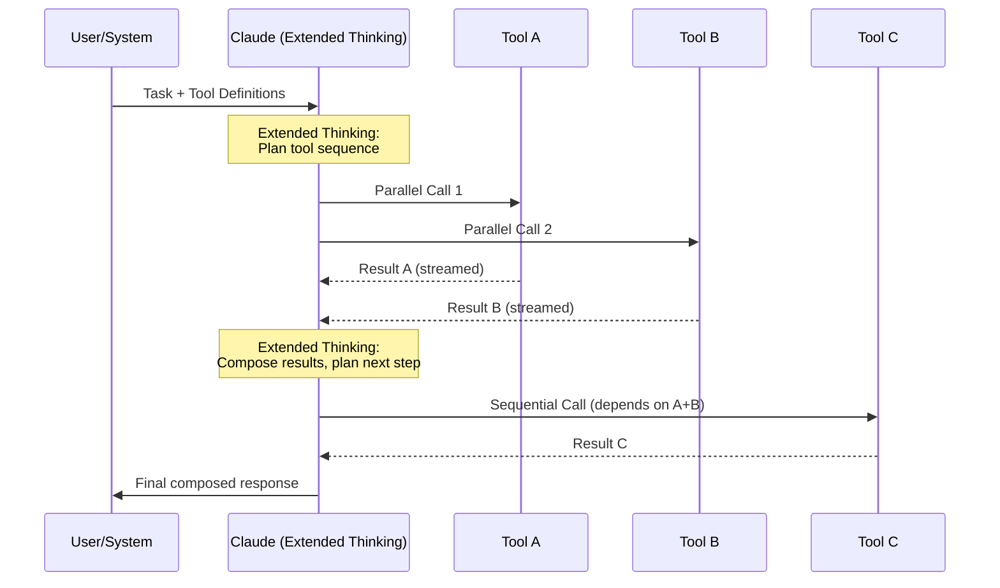

# Anthropic Tool Mastery

Part of [Agent Skills™](https://github.com/itallstartedwithaidea/agent-skills) by [googleadsagent.ai™](https://googleadsagent.ai)

## Description

Anthropic Tool Mastery is the definitive skill for leveraging Claude's native tool_use capability to its fullest potential. Claude's tool system is not merely a function-calling interface — it is a structured reasoning protocol that enables the model to decompose problems, dispatch parallel operations, handle streaming results, and chain tool outputs through extended thinking. Mastering these patterns is the difference between an agent that awkwardly calls one tool at a time and one that orchestrates complex multi-tool workflows with the fluency of a senior engineer.

This skill codifies patterns proven across the Buddy™ agent at [googleadsagent.ai™](https://googleadsagent.ai), where tool orchestration handles concurrent Google Ads API calls, web searches, file operations, and analysis computations within single reasoning turns. The techniques cover tool definition design (schema quality directly affects call accuracy), parallel dispatch (multiple independent tool calls in a single turn), result composition (combining outputs from parallel calls), and error recovery (handling partial failures in multi-tool batches).

Advanced patterns include streaming tool results for real-time feedback, extended thinking integration (using thinking blocks to plan tool sequences before execution), and tool result caching to avoid redundant calls. These techniques apply directly to Claude Code's built-in tools and extend to custom MCP server tools.

## Use When

- Building agents that need to call multiple tools per reasoning turn
- Tool call accuracy is below acceptable thresholds (wrong parameters, wrong tool selected)
- You need real-time streaming feedback from long-running tool operations
- Extended thinking should inform tool selection and parameter construction
- Multi-tool workflows require coordination and result composition
- Custom tools need to be designed for maximum model compatibility

## How It Works



Claude's tool execution model supports parallel dispatch of independent tool calls within a single assistant turn. The model uses extended thinking to plan tool sequences, identifying which calls are independent (and can be parallelized) and which are dependent (and must be sequenced). Streaming enables real-time progress feedback during long-running tools. After all tool results arrive, extended thinking composes the results into a coherent response or plans the next round of tool calls.

## Implementation

**Optimal Tool Definition Pattern:**

```json
{
  "name": "search_knowledge_base",
  "description": "Search the domain knowledge base for patterns matching a query. Returns ranked results with confidence scores. Use this BEFORE generating recommendations to ground them in verified patterns.",
  "input_schema": {
    "type": "object",
    "properties": {
      "query": {
        "type": "string",
        "description": "Natural language search query describing the pattern or information needed"
      },
      "category": {
        "type": "string",
        "enum": ["bidding", "targeting", "creative", "budget", "general"],
        "description": "Knowledge category to search within"
      },
      "max_results": {
        "type": "integer",
        "default": 5,
        "description": "Maximum number of results to return (1-20)"
      }
    },
    "required": ["query"]
  }
}
```

**Parallel Tool Dispatch Handler:**

```typescript
interface ToolCall {
  id: string;
  name: string;
  input: Record<string, unknown>;
}

interface ToolResult {
  tool_use_id: string;
  content: string;
  is_error: boolean;
}

async function executeToolCalls(calls: ToolCall[], registry: ToolRegistry): Promise<ToolResult[]> {
  const results = await Promise.allSettled(
    calls.map(async (call) => {
      const handler = registry.get(call.name);
      if (!handler) {
        return { tool_use_id: call.id, content: `Unknown tool: ${call.name}`, is_error: true };
      }
      try {
        const result = await handler.execute(call.input);
        return { tool_use_id: call.id, content: JSON.stringify(result), is_error: false };
      } catch (error) {
        return { tool_use_id: call.id, content: `Error: ${String(error)}`, is_error: true };
      }
    })
  );

  return results.map((r) =>
    r.status === "fulfilled" ? r.value : { tool_use_id: "", content: `Execution failed: ${r.reason}`, is_error: true }
  );
}
```

**Streaming Tool Result Integration:**

```python
async def stream_tool_execution(client, messages, tools):
    """Execute tools with streaming for real-time progress."""
    async with client.messages.stream(
        model="claude-sonnet-4-20250514",
        max_tokens=8096,
        tools=tools,
        messages=messages,
    ) as stream:
        tool_calls = []
        async for event in stream:
            if event.type == "content_block_start" and event.content_block.type == "tool_use":
                tool_calls.append({
                    "id": event.content_block.id,
                    "name": event.content_block.name,
                    "input_json": "",
                })
            elif event.type == "content_block_delta" and hasattr(event.delta, "partial_json"):
                tool_calls[-1]["input_json"] += event.delta.partial_json
            elif event.type == "content_block_stop" and tool_calls:
                call = tool_calls[-1]
                call["input"] = json.loads(call["input_json"])

        if tool_calls:
            results = await execute_parallel_tools(tool_calls)
            messages.append({"role": "assistant", "content": stream.get_final_message().content})
            messages.append({"role": "user", "content": results})
            return await stream_tool_execution(client, messages, tools)

        return stream.get_final_message()
```

**Tool Result Caching:**

```python
class ToolCache:
    def __init__(self, ttl_seconds=300):
        self.cache = {}
        self.ttl = ttl_seconds

    def cache_key(self, tool_name: str, params: dict) -> str:
        normalized = json.dumps(params, sort_keys=True)
        return f"{tool_name}:{hashlib.sha256(normalized.encode()).hexdigest()[:16]}"

    async def execute_with_cache(self, tool_name, params, executor):
        key = self.cache_key(tool_name, params)
        if key in self.cache:
            entry = self.cache[key]
            if time.time() - entry["timestamp"] < self.ttl:
                return entry["result"]

        result = await executor(tool_name, params)
        self.cache[key] = {"result": result, "timestamp": time.time()}
        return result
```

## Best Practices

1. **Write descriptions that explain when to use the tool** — the model selects tools based on descriptions; "Use this BEFORE generating recommendations" is more effective than "Searches a database."
2. **Use enums for constrained parameters** — when a parameter has a fixed set of valid values, always use an enum; it eliminates an entire category of parameter errors.
3. **Design for parallel dispatch** — make tools independent and side-effect-free where possible; the model will naturally parallelize independent calls.
4. **Handle partial failures gracefully** — when 3 of 4 parallel tool calls succeed, use the 3 successful results rather than failing the entire batch.
5. **Cache deterministic tool results** — if the same query against the same data yields the same result, cache it to avoid redundant computation and token spend.
6. **Keep tool result payloads compact** — large tool results consume context window; return only the fields the model needs, not entire database rows.
7. **Version tool schemas** — when tool interfaces change, update descriptions to guide the model toward new parameter formats.

## Platform Compatibility

| Feature | Claude Code | Cursor | Codex | Gemini CLI |
|---|---|---|---|---|
| Native tool_use | ✅ Full | ✅ Via API | ⚠️ Function calling | ⚠️ Function calling |
| Parallel dispatch | ✅ Native | ✅ Native | ✅ Supported | ✅ Supported |
| Streaming results | ✅ Full | ✅ Full | ✅ Supported | ✅ Supported |
| Extended thinking | ✅ Native | ⚠️ Model-dependent | ❌ Not available | ⚠️ Limited |
| Tool result caching | ✅ Custom | ✅ Custom | ✅ Custom | ✅ Custom |

## Related Skills

- [Prompt Architecture](../prompt-architecture/) - Structural prompt design that optimizes tool selection accuracy and parameter construction
- [Context Engineering](../context-engineering/) - Token budget management that ensures tool results fit within context limits
- [Multi-Harness Portability](../multi-harness-portability/) - Cross-platform tool abstraction for writing tool integrations that work across all harnesses

## Keywords

tool-use, parallel-tool-calling, streaming, extended-thinking, tool-definitions, tool-orchestration, result-composition, error-recovery, tool-caching, agent-skills

---

© 2026 [googleadsagent.ai™](https://googleadsagent.ai) | [Agent Skills™](https://github.com/itallstartedwithaidea/agent-skills) | MIT License
