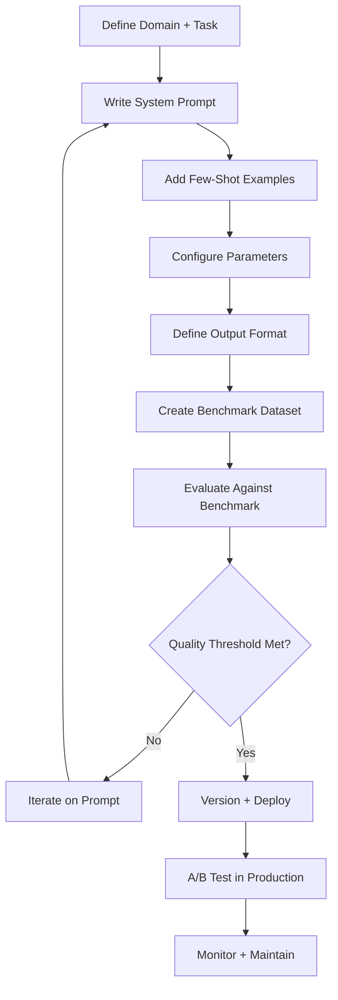

# Assistant Presets

Part of [Agent Skills™](https://github.com/itallstartedwithaidea/agent-skills) by [googleadsagent.ai™](https://googleadsagent.ai)

## Description

Assistant Presets provides a framework for creating, testing, and deploying specialized AI assistant configurations for domain-specific tasks. Each preset encapsulates a system prompt, model parameters, tool access permissions, output format constraints, and quality benchmarks into a reusable, versionable artifact that transforms a general-purpose LLM into a domain expert.

A bare LLM is a generalist. A well-crafted preset turns it into a specialist: a legal contract reviewer that flags liability clauses, a medical triage assistant that follows diagnostic protocols, a code reviewer that enforces team conventions, or a customer support agent that follows the company's tone guide. The difference between a useful AI assistant and a frustrating one is almost entirely in the preset configuration.

This skill codifies the process of building high-quality presets: defining the persona and constraints, writing few-shot examples, specifying output formats, selecting appropriate model parameters (temperature, top-p, max tokens), and validating against a benchmark of expected inputs and outputs. Presets are version-controlled and A/B tested before deployment.

## Use When

- Creating domain-specific AI assistants (legal, medical, finance, code review)
- Standardizing AI behavior across a team or organization
- Building a library of reusable assistant configurations
- Optimizing system prompts for specific use cases
- A/B testing different assistant configurations
- The user asks for a "custom assistant", "persona", or "system prompt"

## How It Works



The preset development cycle is iterative: write, benchmark, refine. Each iteration is versioned so regressions can be detected and reverted. Production presets are A/B tested against the previous version to verify improvement.

## Implementation

```typescript
interface AssistantPreset {
  id: string;
  version: string;
  name: string;
  description: string;
  domain: string;
  systemPrompt: string;
  fewShotExamples: Array<{ input: string; output: string }>;
  parameters: {
    model: string;
    temperature: number;
    topP: number;
    maxTokens: number;
    stopSequences?: string[];
  };
  outputFormat: {
    type: "text" | "json" | "markdown" | "structured";
    schema?: Record<string, unknown>;
  };
  tools: string[];
  guardrails: {
    maxResponseLength: number;
    blockedTopics: string[];
    requiredDisclaimer?: string;
  };
}

const codeReviewPreset: AssistantPreset = {
  id: "code-review-v3",
  version: "3.1.0",
  name: "Code Reviewer",
  description: "Reviews code for correctness, security, and maintainability",
  domain: "software-engineering",
  systemPrompt: `You are a senior code reviewer. Review the provided code diff with these priorities:
1. Correctness: Does it do what it claims?
2. Security: Are inputs validated? Secrets protected?
3. Performance: Any obvious bottlenecks?
4. Maintainability: Clear naming? Reasonable complexity?

Format findings as:
- [SEVERITY] file:line - Description
- Suggested fix: ...

Severities: CRITICAL, HIGH, MEDIUM, LOW`,
  fewShotExamples: [
    {
      input: "```diff\n+const data = JSON.parse(userInput)\n```",
      output: "[CRITICAL] app.ts:12 - Parsing untrusted user input without try-catch\n- Suggested fix: Wrap in try-catch with input validation",
    },
  ],
  parameters: { model: "claude-sonnet-4-20250514", temperature: 0.2, topP: 0.9, maxTokens: 4096 },
  outputFormat: { type: "markdown" },
  tools: ["read_file", "grep", "git_diff"],
  guardrails: {
    maxResponseLength: 5000,
    blockedTopics: [],
    requiredDisclaimer: undefined,
  },
};

class PresetBenchmark {
  constructor(
    private preset: AssistantPreset,
    private testCases: Array<{ input: string; expectedPatterns: string[] }>
  ) {}

  async evaluate(llm: LLMClient): Promise<{ score: number; failures: string[] }> {
    const failures: string[] = [];
    let passed = 0;

    for (const tc of this.testCases) {
      const response = await llm.generate(this.preset.systemPrompt, tc.input, this.preset.parameters);
      const allPresent = tc.expectedPatterns.every(p => response.includes(p));
      if (allPresent) passed++;
      else failures.push(`Input "${tc.input.slice(0, 50)}..." missing expected patterns`);
    }

    return { score: passed / this.testCases.length, failures };
  }
}
```

## Best Practices

- Write system prompts as instructions, not descriptions—"You review code" not "This is a code reviewer"
- Include 2-5 few-shot examples that demonstrate the exact output format expected
- Set temperature to 0.1-0.3 for factual/analytical tasks, 0.7-0.9 for creative tasks
- Define guardrails (blocked topics, max length, required disclaimers) for user-facing assistants
- Version every preset change and maintain a changelog
- Benchmark against at least 20 test cases before deploying a new version

## Platform Compatibility

| Platform | Support | Notes |
|----------|---------|-------|
| Cursor | Full | Rules + preset system |
| VS Code | Full | Custom assistant configs |
| Windsurf | Full | Cascade preset support |
| Claude Code | Full | AGENTS.md persona config |
| Cline | Full | Custom instruction sets |
| aider | Partial | Convention file support |

## Related Skills

- [AI Chat Studio](../ai-chat-studio/)
- [Workflow Orchestration](../workflow-orchestration/)
- [Multi-Model Routing](../../ai-agent-engineering/multi-model-routing/)
- [Proactive Intelligence](../../ai-agent-engineering/proactive-intelligence/)

## Keywords

`assistant-presets` `system-prompt` `persona` `domain-specific` `few-shot` `prompt-engineering` `a-b-testing` `guardrails`

---

© 2026 googleadsagent.ai™ | Agent Skills™ | MIT License
