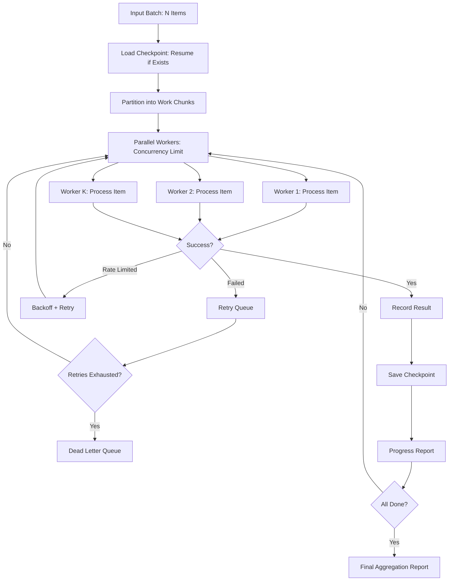

# Batch Processing

Part of [Agent Skills™](https://github.com/itallstartedwithaidea/agent-skills) by [googleadsagent.ai™](https://googleadsagent.ai)

## Description

Batch Processing enables parallel AI task execution with progress tracking, error handling, rate limiting, and result aggregation. The agent processes large collections of items—documents, images, code files, API requests—through AI pipelines concurrently, managing throughput, failures, and partial results without losing work.

Single-item AI processing is straightforward; batch processing at scale introduces failures, rate limits, memory constraints, and the need for resumability. This skill handles these production realities: configurable concurrency limits, exponential backoff on rate limit errors, checkpoint-based resumability after crashes, and structured progress reporting that shows exactly which items succeeded, failed, or are pending.

The skill supports both homogeneous batches (same operation on every item) and heterogeneous batches (different operations routed by item type). Results are aggregated into structured reports with per-item status, timing, and error details. Failed items are automatically retried with backoff, and permanently failed items are collected into a dead-letter queue for manual inspection.

## Use When

- Processing hundreds or thousands of items through an AI pipeline
- Translating, summarizing, or classifying large document collections
- Generating embeddings for a corpus of documents
- Running code analysis across an entire repository
- Batch-generating images, descriptions, or metadata
- Any task that processes items sequentially but could benefit from parallelism

## How It Works



The engine partitions work across concurrent workers, respecting rate limits and retry budgets. Checkpoints persist after each chunk, enabling crash recovery. The dead-letter queue captures permanently failed items for human review.

## Implementation

```python
import asyncio
from dataclasses import dataclass, field
from time import time
import json

@dataclass
class BatchItem:
    id: str
    input: dict
    status: str = "pending"
    result: dict | None = None
    error: str | None = None
    attempts: int = 0
    duration_ms: float = 0

@dataclass
class BatchResult:
    total: int
    succeeded: int
    failed: int
    dead_letter: int
    duration_s: float
    items: list[BatchItem] = field(default_factory=list)

class BatchProcessor:
    def __init__(self, concurrency: int = 5, max_retries: int = 3, checkpoint_file: str = "batch_checkpoint.json"):
        self.concurrency = concurrency
        self.max_retries = max_retries
        self.checkpoint_file = checkpoint_file
        self.semaphore = asyncio.Semaphore(concurrency)

    async def process(self, items: list[BatchItem], processor_fn) -> BatchResult:
        items = self._load_checkpoint(items)
        start = time()
        pending = [i for i in items if i.status == "pending"]

        tasks = [self._process_item(item, processor_fn) for item in pending]
        await asyncio.gather(*tasks, return_exceptions=True)

        return BatchResult(
            total=len(items),
            succeeded=sum(1 for i in items if i.status == "succeeded"),
            failed=sum(1 for i in items if i.status == "failed"),
            dead_letter=sum(1 for i in items if i.status == "dead_letter"),
            duration_s=time() - start,
            items=items,
        )

    async def _process_item(self, item: BatchItem, processor_fn):
        async with self.semaphore:
            while item.attempts < self.max_retries:
                item.attempts += 1
                start = time()
                try:
                    item.result = await processor_fn(item.input)
                    item.status = "succeeded"
                    item.duration_ms = (time() - start) * 1000
                    self._save_checkpoint_item(item)
                    return
                except RateLimitError:
                    await asyncio.sleep(2 ** item.attempts)
                except Exception as e:
                    item.error = str(e)
                    item.duration_ms = (time() - start) * 1000

            item.status = "dead_letter"
            self._save_checkpoint_item(item)

    def _save_checkpoint_item(self, item: BatchItem):
        try:
            data = json.loads(open(self.checkpoint_file).read()) if Path(self.checkpoint_file).exists() else {}
            data[item.id] = {"status": item.status, "result": item.result, "error": item.error}
            with open(self.checkpoint_file, "w") as f:
                json.dump(data, f)
        except Exception:
            pass

    def _load_checkpoint(self, items: list[BatchItem]) -> list[BatchItem]:
        try:
            data = json.loads(open(self.checkpoint_file).read())
            for item in items:
                if item.id in data:
                    item.status = data[item.id]["status"]
                    item.result = data[item.id]["result"]
        except FileNotFoundError:
            pass
        return items
```

## Best Practices

- Set concurrency limits based on API rate limits, not just CPU cores
- Implement checkpoint-based resumability for any batch over 100 items
- Use exponential backoff (2^attempt seconds) for rate limit retries
- Report progress at regular intervals (every 10% or every 30 seconds)
- Collect dead-letter items separately for manual review and reprocessing
- Log per-item timing to identify slow items that drag down throughput

## Platform Compatibility

| Platform | Support | Notes |
|----------|---------|-------|
| Cursor | Full | Python/TS async execution |
| VS Code | Full | Terminal-based batch runs |
| Windsurf | Full | Batch workflow support |
| Claude Code | Full | Script execution |
| Cline | Full | Batch task management |
| aider | Partial | Sequential only |

## Related Skills

- [Workflow Orchestration](../workflow-orchestration/)
- [Low-Code Generation](../low-code-generation/)
- [Parallel Agent Orchestration](../../ai-agent-engineering/parallel-agent-orchestration/)
- [Token Optimization](../../ai-agent-engineering/token-optimization/)

## Keywords

`batch-processing` `parallel-execution` `rate-limiting` `retry-logic` `checkpointing` `dead-letter-queue` `progress-tracking` `concurrency`

---

© 2026 googleadsagent.ai™ | Agent Skills™ | MIT License
