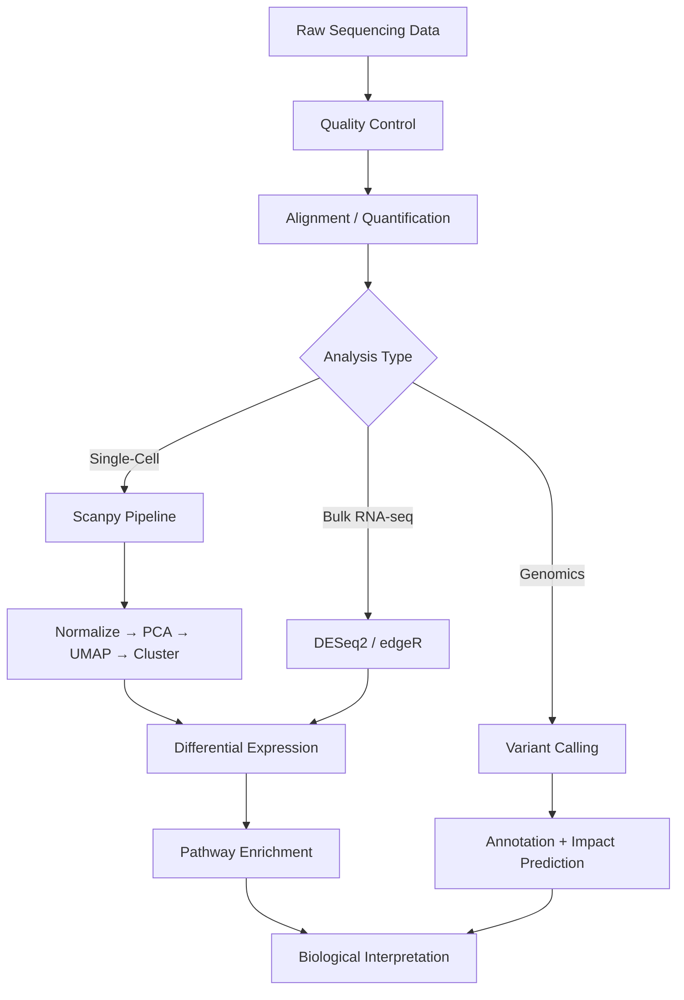

# Bioinformatics

Part of [Agent Skills™](https://github.com/itallstartedwithaidea/agent-skills) by [googleadsagent.ai™](https://googleadsagent.ai)

## Description

Bioinformatics provides computational biology workflows for sequence analysis, protein structure prediction, single-cell RNA-seq with Scanpy, gene regulatory network inference, and pathway enrichment analysis. The agent generates reproducible analysis pipelines using BioPython, Scanpy, and standard bioinformatics tools, following community best practices for each analysis type.

Modern biology generates data faster than biologists can analyze it. A single-cell RNA-seq experiment produces expression profiles for tens of thousands of cells, each with thousands of genes measured. This skill encodes the standard analysis pipelines that transform raw sequencing data into biological insights: quality control, normalization, dimensionality reduction, clustering, differential expression, and pathway enrichment.

The skill extends beyond transcriptomics to genomics (variant calling, annotation), proteomics (sequence analysis, domain prediction), and systems biology (gene regulatory networks, protein-protein interactions). Each pipeline is parameterized, documented, and reproducible—the same inputs always produce the same outputs.

## Use When

- Analyzing single-cell RNA-seq data with Scanpy
- Performing sequence alignment or homology searches
- Building gene regulatory network models
- Running pathway enrichment analysis (GO, KEGG)
- Processing FASTA/FASTQ files with BioPython
- Predicting protein structure or function from sequence

## How It Works



The pipeline branches based on data type. Single-cell data follows the Scanpy standard workflow; bulk RNA-seq uses DESeq2 or edgeR; genomic data goes through variant calling and annotation. All paths converge on biological interpretation.

## Implementation

```python
import scanpy as sc
import numpy as np

def scrna_pipeline(adata_path: str, min_genes: int = 200, min_cells: int = 3) -> sc.AnnData:
    adata = sc.read_h5ad(adata_path)

    sc.pp.filter_cells(adata, min_genes=min_genes)
    sc.pp.filter_genes(adata, min_cells=min_cells)

    adata.var["mt"] = adata.var_names.str.startswith("MT-")
    sc.pp.calculate_qc_metrics(adata, qc_vars=["mt"], inplace=True)
    adata = adata[adata.obs.pct_counts_mt < 20, :].copy()

    sc.pp.normalize_total(adata, target_sum=1e4)
    sc.pp.log1p(adata)

    sc.pp.highly_variable_genes(adata, n_top_genes=2000, flavor="seurat_v3")
    adata.raw = adata
    adata = adata[:, adata.var.highly_variable].copy()

    sc.pp.scale(adata, max_value=10)
    sc.tl.pca(adata, n_comps=50)
    sc.pp.neighbors(adata, n_pcs=30)
    sc.tl.umap(adata)
    sc.tl.leiden(adata, resolution=0.5)

    sc.tl.rank_genes_groups(adata, groupby="leiden", method="wilcoxon")

    return adata

def pathway_enrichment(gene_list: list[str], organism: str = "hsapiens") -> pd.DataFrame:
    from gprofiler import GProfiler
    gp = GProfiler(return_dataframe=True)
    results = gp.profile(
        organism=organism,
        query=gene_list,
        sources=["GO:BP", "GO:MF", "KEGG", "REAC"],
    )
    return results[results["significant"]].sort_values("p_value")
```

```python
from Bio import SeqIO, Align

def sequence_analysis(fasta_path: str) -> dict:
    records = list(SeqIO.parse(fasta_path, "fasta"))
    aligner = Align.PairwiseAligner()
    aligner.mode = "global"

    stats = {
        "num_sequences": len(records),
        "lengths": [len(r.seq) for r in records],
        "gc_content": [float(r.seq.count("G") + r.seq.count("C")) / len(r.seq) for r in records],
    }
    return stats
```

## Best Practices

- Filter cells with <200 genes and genes in <3 cells as minimum quality thresholds
- Remove cells with >20% mitochondrial reads as likely dead or dying cells
- Use the Wilcoxon rank-sum test for differential expression in single-cell data
- Apply multiple testing correction (Benjamini-Hochberg) for all gene-level tests
- Save intermediate AnnData objects at each pipeline stage for reproducibility
- Report the Scanpy, AnnData, and Python versions used in the analysis

## Platform Compatibility

| Platform | Support | Notes |
|----------|---------|-------|
| Cursor | Full | Python + Jupyter support |
| VS Code | Full | Jupyter + Scanpy integration |
| Windsurf | Full | Scientific Python |
| Claude Code | Full | Pipeline script generation |
| Cline | Full | Bioinformatics workflows |
| aider | Partial | Code-level support |

## Related Skills

- [Cheminformatics](../cheminformatics/)
- [Database Lookup](../database-lookup/)
- [Data Analysis](../data-analysis/)
- [Batch Processing](../../productivity/batch-processing/)

## Keywords

`bioinformatics` `scanpy` `single-cell` `rna-seq` `biopython` `gene-expression` `pathway-enrichment` `sequence-analysis`

---

© 2026 googleadsagent.ai™ | Agent Skills™ | MIT License
