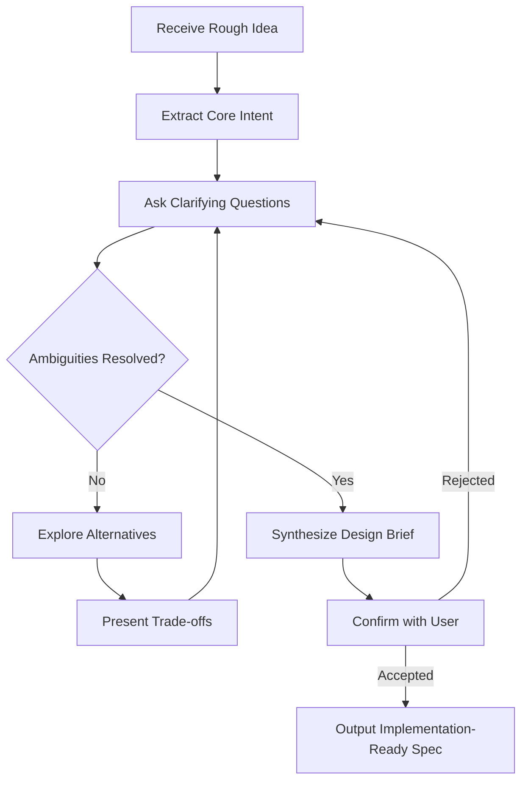

# Brainstorming

Part of [Agent Skills™](https://github.com/itallstartedwithaidea/agent-skills) by [googleadsagent.ai™](https://googleadsagent.ai)

## Description

Brainstorming is a Socratic design refinement skill that activates before any code is written. It transforms vague requirements and rough ideas into well-defined implementation plans through structured questioning, constraint discovery, and alternative exploration. The agent refuses to write code until the problem space is sufficiently mapped.

This skill enforces a deliberate pause between "I want X" and "here's the code for X." By asking targeted questions about edge cases, scalability concerns, user experience implications, and architectural trade-offs, the agent surfaces hidden requirements that would otherwise become expensive mid-implementation discoveries. The process mirrors how senior engineers naturally probe requirements before committing to an approach.

The output is a crystallized design brief: a shared understanding between human and agent of what will be built, why specific approaches were chosen, and what was explicitly deferred. This artifact becomes the contract against which all subsequent implementation is measured.

## Use When

- A user presents a feature request without detailed specifications
- The problem has multiple viable architectural approaches with meaningful trade-offs
- Requirements contain ambiguous terms that could be interpreted differently
- The scope of work is unclear or potentially unbounded
- You detect assumptions that need validation before implementation begins
- The task involves integrating with unfamiliar systems or APIs

## How It Works



The brainstorming flow begins by extracting the core intent from the user's request, stripping away implementation assumptions. The agent then enters a questioning loop, probing constraints, exploring alternatives, and presenting trade-offs until all critical ambiguities are resolved. Only when the user confirms the synthesized design brief does the agent produce an implementation-ready specification.

## Implementation

```yaml
activation:
  trigger: "before_code_generation"
  conditions:
    - task_complexity > "trivial"
    - specification_completeness < 0.7

brainstorming_phases:
  - name: "Intent Extraction"
    actions:
      - parse_user_request
      - identify_nouns_as_entities
      - identify_verbs_as_operations
      - flag_ambiguous_terms

  - name: "Constraint Discovery"
    questions:
      - "What does success look like for this feature?"
      - "Who are the users and what are their primary workflows?"
      - "What are the hard constraints (budget, timeline, platform)?"
      - "What existing systems must this integrate with?"

  - name: "Alternative Exploration"
    actions:
      - generate_minimum_3_approaches
      - score_each_on: [complexity, maintainability, performance, time_to_ship]
      - present_comparison_table

  - name: "Design Brief Synthesis"
    output:
      - problem_statement
      - chosen_approach_with_rationale
      - explicit_non_goals
      - acceptance_criteria
      - estimated_task_breakdown
```

## Best Practices

- Never skip brainstorming for tasks rated above trivial complexity
- Limit brainstorming rounds to 3-5 exchanges to avoid analysis paralysis
- Always generate at least three alternative approaches before recommending one
- Document what was explicitly excluded from scope as non-goals
- Use concrete examples and scenarios rather than abstract descriptions
- End every brainstorming session with a written design brief the user confirms

## Platform Compatibility

| Platform | Support | Notes |
|----------|---------|-------|
| Cursor | Full | Native SKILL.md activation |
| VS Code | Full | Via Copilot agent mode |
| Windsurf | Full | Via Cascade rules |
| Claude Code | Full | Via AGENTS.md |
| Cline | Full | Via .clinerules |
| aider | Partial | Via conventions file |

## Related Skills

- [Writing Plans](../writing-plans/) - Converts brainstorming design briefs into step-by-step implementation plans with verification commands
- [Executing Plans](../executing-plans/) - Drives the approved plan through batch execution with checkpoints and rollback
- [Code Review](../code-review/) - Quality gate that validates the implementation matches the brainstormed design brief

## Keywords

`brainstorming` `socratic-method` `design-refinement` `requirements-gathering` `before-coding` `alternative-exploration` `constraint-discovery` `specification`

---

© 2026 googleadsagent.ai™ | Agent Skills™ | MIT License
