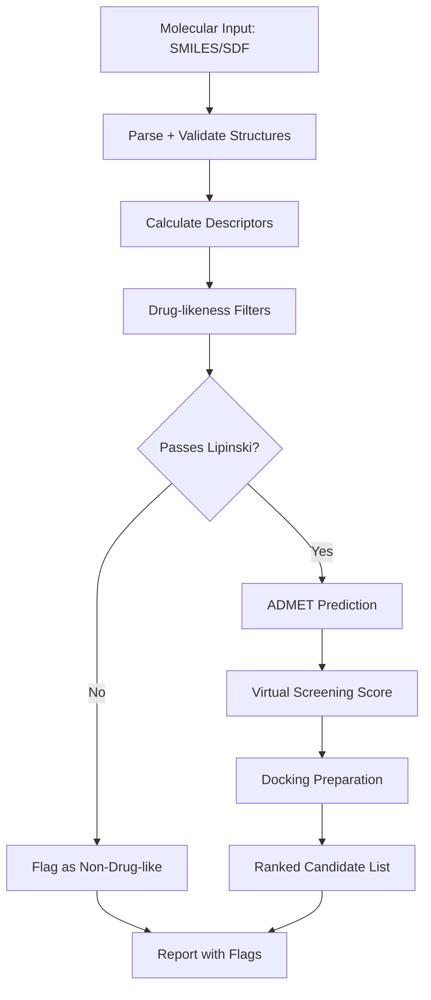

# Cheminformatics

Part of [Agent Skills™](https://github.com/itallstartedwithaidea/agent-skills) by [googleadsagent.ai™](https://googleadsagent.ai)

## Description

Cheminformatics provides computational chemistry workflows using RDKit for molecular property prediction, virtual screening, ADMET analysis, molecular docking preparation, and chemical space exploration. The agent generates reproducible cheminformatics pipelines that transform molecular structures (SMILES, SDF) into actionable predictions about drug-likeness, toxicity, and binding affinity.

Drug discovery generates vast chemical libraries that cannot all be synthesized and tested. Cheminformatics narrows the search space computationally: filtering by Lipinski's Rule of Five, predicting ADMET properties (Absorption, Distribution, Metabolism, Excretion, Toxicity), scoring docking poses, and clustering chemical space to identify diverse lead candidates. Each step eliminates compounds that would fail in later, more expensive stages.

This skill covers the molecular informatics workflow from SMILES parsing through descriptor calculation, fingerprint generation, similarity searching, property prediction, and visualization. It integrates with databases like PubChem and ChEMBL for compound retrieval and benchmarking against known actives and inactives.

## Use When

- Calculating molecular properties and descriptors
- Screening compound libraries for drug-likeness
- Predicting ADMET properties for lead compounds
- Performing molecular similarity searches
- Preparing structures for molecular docking
- Visualizing chemical space and structure-activity relationships

## How It Works



Compounds flow through increasingly selective filters. Drug-likeness removes obviously non-viable candidates, ADMET prediction flags absorption and toxicity risks, and virtual screening ranks the survivors by predicted activity.

## Implementation

```python
from rdkit import Chem
from rdkit.Chem import Descriptors, AllChem, Draw, Lipinski, DataStructs
from rdkit.Chem import rdMolDescriptors
import pandas as pd

def molecular_properties(smiles: str) -> dict:
    mol = Chem.MolFromSmiles(smiles)
    if mol is None:
        raise ValueError(f"Invalid SMILES: {smiles}")
    return {
        "smiles": smiles,
        "mw": Descriptors.MolWt(mol),
        "logp": Descriptors.MolLogP(mol),
        "hbd": Descriptors.NumHDonors(mol),
        "hba": Descriptors.NumHAcceptors(mol),
        "tpsa": Descriptors.TPSA(mol),
        "rotatable_bonds": Descriptors.NumRotatableBonds(mol),
        "rings": Descriptors.RingCount(mol),
        "lipinski_violations": sum([
            Descriptors.MolWt(mol) > 500,
            Descriptors.MolLogP(mol) > 5,
            Descriptors.NumHDonors(mol) > 5,
            Descriptors.NumHAcceptors(mol) > 10,
        ]),
    }

def lipinski_filter(df: pd.DataFrame) -> pd.DataFrame:
    return df[df["lipinski_violations"] <= 1].copy()

def similarity_search(query_smiles: str, library: list[str], threshold: float = 0.7) -> list[dict]:
    query_mol = Chem.MolFromSmiles(query_smiles)
    query_fp = AllChem.GetMorganFingerprintAsBitVect(query_mol, radius=2, nBits=2048)

    results = []
    for smi in library:
        mol = Chem.MolFromSmiles(smi)
        if mol is None:
            continue
        fp = AllChem.GetMorganFingerprintAsBitVect(mol, radius=2, nBits=2048)
        tanimoto = DataStructs.TanimotoSimilarity(query_fp, fp)
        if tanimoto >= threshold:
            results.append({"smiles": smi, "tanimoto": tanimoto})

    return sorted(results, key=lambda x: -x["tanimoto"])

def admet_flags(props: dict) -> list[str]:
    flags = []
    if props["logp"] > 5:
        flags.append("High lipophilicity: poor aqueous solubility risk")
    if props["tpsa"] > 140:
        flags.append("High TPSA: poor membrane permeability risk")
    if props["mw"] > 500:
        flags.append("High MW: poor oral absorption risk")
    if props["rotatable_bonds"] > 10:
        flags.append("High flexibility: poor oral bioavailability risk")
    return flags
```

## Best Practices

- Always validate SMILES parsing before computing descriptors—invalid structures produce silent errors
- Use Morgan fingerprints (radius=2, 2048 bits) as the default for similarity calculations
- Apply Lipinski's Rule of Five as a first-pass filter, not an absolute cutoff
- Report Tanimoto similarity thresholds used in all similarity searches
- Standardize molecules (desalt, neutralize, canonicalize) before comparison
- Visualize chemical space with t-SNE or UMAP on fingerprint representations

## Platform Compatibility

| Platform | Support | Notes |
|----------|---------|-------|
| Cursor | Full | Python + RDKit environment |
| VS Code | Full | Jupyter + molecular viz |
| Windsurf | Full | Scientific Python |
| Claude Code | Full | Pipeline generation |
| Cline | Full | Cheminformatics workflows |
| aider | Partial | Code generation only |

## Related Skills

- [Bioinformatics](../bioinformatics/)
- [Database Lookup](../database-lookup/)
- [Machine Learning](../machine-learning/)
- [Batch Processing](../../productivity/batch-processing/)

## Keywords

`cheminformatics` `rdkit` `molecular-properties` `virtual-screening` `admet` `lipinski` `drug-discovery` `molecular-similarity`

---

© 2026 googleadsagent.ai™ | Agent Skills™ | MIT License
