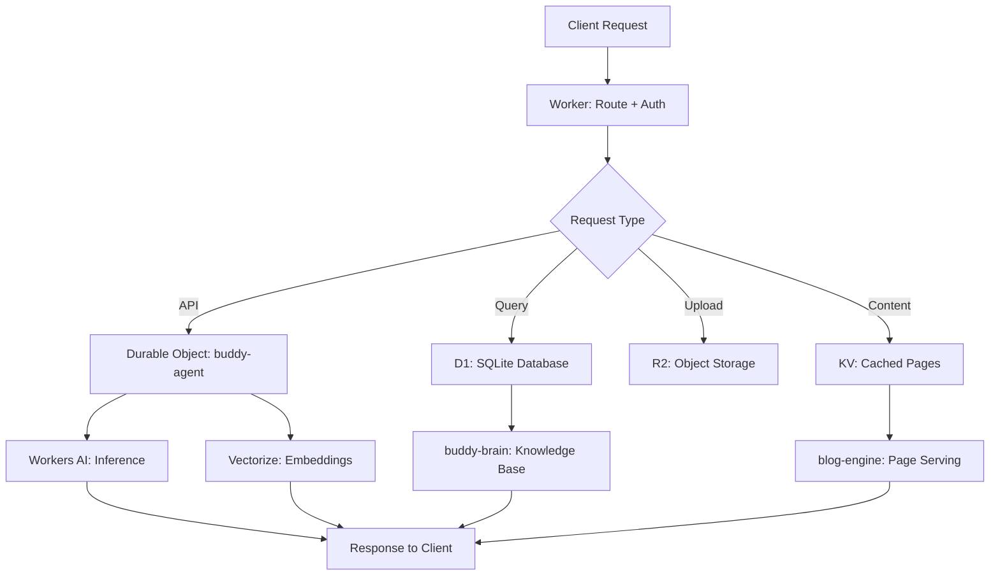

# Cloudflare Workers

Part of [Agent Skills™](https://github.com/itallstartedwithaidea/agent-skills) by [googleadsagent.ai™](https://googleadsagent.ai)

## Description

Cloudflare Workers provides comprehensive guidance for building edge-first applications using Durable Objects, KV, R2, D1, AI bindings, and Vectorize. This skill encodes production patterns from real Workers powering googleadsagent.ai™, including buddy-agent (AI orchestration), buddy-brain (knowledge storage with D1/Vectorize), and blog-engine (static content generation at the edge).

Workers run in V8 isolates at 300+ edge locations with sub-millisecond cold starts and no container overhead. This fundamentally changes application architecture: computation moves to the user, state lives in globally distributed storage, and traditional server concepts (processes, threads, file systems) do not apply. The agent must understand these constraints to produce correct, performant Worker code.

Durable Objects provide the stateful coordination layer that Workers alone lack. Each Durable Object instance is a single-threaded actor with transactional SQLite storage, WebSocket support, and alarm scheduling. The combination of stateless Workers for routing and stateful Durable Objects for coordination is the foundational pattern for all non-trivial edge applications.

## Use When

- Building serverless APIs on Cloudflare Workers
- Implementing stateful coordination with Durable Objects
- Storing data in KV, R2, D1, or Vectorize
- Using Workers AI for inference at the edge
- Deploying applications similar to googleadsagent.ai™'s architecture
- Migrating from traditional server architectures to edge-first

## How It Works



The Worker acts as the stateless router. It authenticates requests, determines the appropriate binding, and delegates to the specialized storage or compute layer. Durable Objects handle coordination that requires strong consistency (sessions, queues, rate limiting).

## Implementation

```typescript
export default {
  async fetch(request: Request, env: Env): Promise<Response> {
    const url = new URL(request.url);

    if (url.pathname.startsWith("/api/chat")) {
      const id = env.BUDDY_AGENT.idFromName("default");
      const agent = env.BUDDY_AGENT.get(id);
      return agent.fetch(request);
    }

    const cached = await env.PAGE_CACHE.get(url.pathname);
    if (cached) return new Response(cached, {
      headers: { "Content-Type": "text/html", "Cache-Control": "public, max-age=3600" },
    });

    return new Response("Not Found", { status: 404 });
  },
} satisfies ExportedHandler<Env>;

export class BuddyAgent extends DurableObject {
  async fetch(request: Request): Promise<Response> {
    const body = await request.json<{ message: string }>();

    const embedding = await this.env.AI.run("@cf/baai/bge-base-en-v1.5", {
      text: [body.message],
    });

    const similar = await this.env.VECTORIZE.query(embedding.data[0], {
      topK: 5,
      returnMetadata: "all",
    });

    const context = similar.matches.map(m => m.metadata?.text).join("\n");
    const response = await this.env.AI.run("@cf/meta/llama-3.1-8b-instruct", {
      messages: [
        { role: "system", content: `Context: ${context}` },
        { role: "user", content: body.message },
      ],
    });

    return Response.json({ reply: response.response });
  }
}
```

```jsonc
// wrangler.jsonc
{
  "name": "buddy-agent",
  "main": "src/index.ts",
  "compatibility_date": "2026-04-01",
  "durable_objects": {
    "bindings": [{ "name": "BUDDY_AGENT", "class_name": "BuddyAgent" }]
  },
  "kv_namespaces": [{ "binding": "PAGE_CACHE", "id": "abc123" }],
  "vectorize": [{ "binding": "VECTORIZE", "index_name": "buddy-brain" }],
  "ai": { "binding": "AI" }
}
```

## Best Practices

- Never use global mutable state in Workers—isolates may be recycled between requests
- Stream large responses instead of buffering them in memory (128MB limit)
- Use `waitUntil()` for background work that should not block the response
- Pin `compatibility_date` and advance it deliberately, not automatically
- Place Durable Objects in a `locationHint` near your primary user base
- Store secrets in Wrangler secrets (`wrangler secret put`), never in `vars`

## Platform Compatibility

| Platform | Support | Notes |
|----------|---------|-------|
| Cursor | Full | Wrangler CLI integration |
| VS Code | Full | Cloudflare extension available |
| Windsurf | Full | Workers-aware deployment |
| Claude Code | Full | Shell + wrangler access |
| Cline | Full | Terminal-based development |
| aider | Partial | Config file generation |

## Related Skills

- [Edge Rendering](../edge-rendering/)
- [Observability](../observability/)
- [Service Discovery](../service-discovery/)
- [Sandbox Hardening](../../security/sandbox-hardening/)

## Keywords

`cloudflare-workers` `durable-objects` `kv` `r2` `d1` `workers-ai` `vectorize` `edge-computing` `serverless` `buddy-agent`

---

© 2026 googleadsagent.ai™ | Agent Skills™ | MIT License
