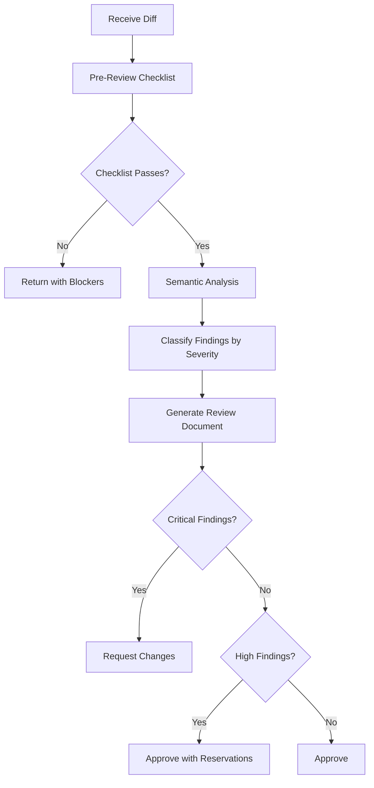

# Code Review

Part of [Agent Skills™](https://github.com/itallstartedwithaidea/agent-skills) by [googleadsagent.ai™](https://googleadsagent.ai)

## Description

Code Review enforces a structured pre-merge quality gate with a checklist-driven evaluation, severity-classified findings, and mandatory resolution tracking. The agent reviews every diff against a configurable set of quality dimensions before approving changes, ensuring consistent standards regardless of reviewer fatigue or time pressure.

Unlike ad-hoc review comments, this skill produces a standardized review document with findings categorized by severity: Critical (must fix before merge), High (should fix before merge), Medium (fix in follow-up), and Low (optional improvement). Each finding includes the file, line range, category, description, and a concrete suggested fix. The review document becomes part of the permanent record.

The pre-review checklist catches common oversights before deep analysis begins: missing tests, uncommitted files, linter errors, type errors, and documentation gaps. Only after the checklist passes does the agent proceed to semantic review of logic, architecture, security, and performance.

## Use When

- A pull request or diff is ready for review
- The user asks for feedback on code changes
- Before merging any branch into main
- After a subagent completes a task (Stage 2 review)
- Code has been refactored and needs validation
- A new contributor's code needs onboarding-level review

## How It Works



The workflow gates progression: the checklist catches mechanical issues instantly, while semantic analysis evaluates design, correctness, and maintainability. The severity classification ensures critical issues block the merge while minor improvements do not.

## Implementation

```yaml
pre_review_checklist:
  - name: "Tests exist for changed code"
    command: "check_test_coverage_delta"
    severity: "critical"
  - name: "No linter errors introduced"
    command: "run_linter --diff-only"
    severity: "critical"
  - name: "Type checking passes"
    command: "run_typecheck"
    severity: "critical"
  - name: "No secrets in diff"
    command: "scan_secrets --diff"
    severity: "critical"
  - name: "Documentation updated"
    command: "check_doc_staleness"
    severity: "medium"

severity_levels:
  critical:
    label: "🔴 Critical"
    action: "Must fix before merge"
    examples: ["Security vulnerability", "Data loss risk", "Broken tests"]
  high:
    label: "🟠 High"
    action: "Should fix before merge"
    examples: ["Missing error handling", "Performance regression", "API contract violation"]
  medium:
    label: "🟡 Medium"
    action: "Fix in follow-up PR"
    examples: ["Code duplication", "Unclear naming", "Missing edge case test"]
  low:
    label: "🔵 Low"
    action: "Optional improvement"
    examples: ["Style preference", "Minor refactor opportunity", "Comment improvement"]

review_dimensions:
  - correctness: "Does the code do what it claims?"
  - security: "Are inputs validated? Are secrets protected?"
  - performance: "Are there N+1 queries, unnecessary re-renders, or blocking calls?"
  - maintainability: "Can another developer understand this in 6 months?"
  - testing: "Are edge cases covered? Are tests deterministic?"
  - architecture: "Does this follow established patterns? Is coupling appropriate?"
```

## Best Practices

- Run the pre-review checklist before spending time on semantic review
- Limit findings to actionable items—avoid stylistic nitpicks unless egregious
- Always provide a suggested fix alongside each finding
- Separate critical blockers from nice-to-have improvements
- Review the test changes as carefully as the production code
- Acknowledge good patterns and design decisions, not just defects

## Platform Compatibility

| Platform | Support | Notes |
|----------|---------|-------|
| Cursor | Full | Reads diffs via Shell tool |
| VS Code | Full | Git diff integration |
| Windsurf | Full | PR review workflow |
| Claude Code | Full | `git diff` and `gh pr` access |
| Cline | Full | Diff-based review |
| aider | Partial | Limited to file-level review |

## Related Skills

- [Test-Driven Development](../test-driven-development/) - RED-GREEN-REFACTOR discipline that ensures reviewed code has corresponding test coverage
- [Systematic Debugging](../systematic-debugging/) - Root cause analysis methodology applied when code review uncovers defects
- [Agent Security Scanning](../../security/agent-security-scanning/) - Automated vulnerability detection that complements the security dimension of code review

## Keywords

`code-review` `quality-gate` `pre-merge-checklist` `severity-classification` `pull-request-review` `security-review` `performance-review` `review-document`

---

© 2026 googleadsagent.ai™ | Agent Skills™ | MIT License
