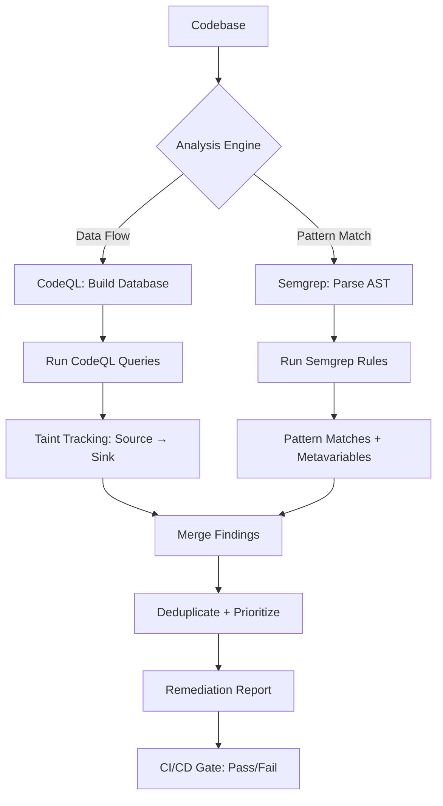

# CodeQL & Semgrep

Part of [Agent Skills™](https://github.com/itallstartedwithaidea/agent-skills) by [googleadsagent.ai™](https://googleadsagent.ai)

## Description

CodeQL & Semgrep integrates production-grade static analysis into agent workflows for deep vulnerability detection, custom rule authoring, and automated code review enforcement. The agent writes CodeQL queries and Semgrep rules tailored to project-specific patterns, runs them against codebases, and interprets results with actionable remediation guidance.

Pattern-matching security scanners catch surface-level issues. CodeQL and Semgrep operate at a deeper level: CodeQL builds a relational database of the program's structure and evaluates queries that trace data flow from sources (user input) to sinks (dangerous operations). Semgrep matches syntactic patterns with type-aware analysis. Together, they catch vulnerabilities that regex-based scanners miss entirely.

This skill goes beyond running default rulesets. The agent writes custom rules for project-specific patterns: ensuring all database queries use the project's ORM wrapper, verifying that authentication middleware is applied to every route, or confirming that error responses never leak stack traces. Custom rules encode institutional security knowledge that persists beyond any individual reviewer.

## Use When

- Running static analysis on AI-generated or human-written code
- Writing custom security rules for project-specific patterns
- Integrating security scanning into CI/CD pipelines
- Tracing data flow from user input to dangerous operations
- Enforcing architectural security constraints (auth on all routes, ORM usage)
- The user requests "static analysis", "CodeQL", or "Semgrep"

## How It Works



CodeQL excels at data flow analysis (tracing tainted input through the program); Semgrep excels at pattern matching (finding structural anti-patterns). Running both provides comprehensive coverage.

## Implementation

### Semgrep Rules

```yaml
# .semgrep/agent-rules.yml
rules:
  - id: sql-injection-f-string
    patterns:
      - pattern: |
          $CURSOR.execute(f"...", ...)
    message: >
      SQL query uses f-string interpolation, which is vulnerable to SQL injection.
      Use parameterized queries instead.
    severity: ERROR
    languages: [python]
    metadata:
      cwe: ["CWE-89"]
      confidence: HIGH

  - id: missing-auth-middleware
    patterns:
      - pattern: |
          @app.route($PATH, ...)
          def $FUNC(...):
              ...
      - pattern-not-inside: |
          @require_auth
          @app.route($PATH, ...)
          def $FUNC(...):
              ...
    message: >
      Route handler $FUNC lacks @require_auth decorator.
      All routes must be authenticated unless explicitly exempted.
    severity: WARNING
    languages: [python]
    metadata:
      cwe: ["CWE-306"]

  - id: no-eval-user-input
    patterns:
      - pattern: eval($X)
      - pattern-where-python: |
          not $X.startswith('"')
    message: "eval() called with potentially dynamic input"
    severity: ERROR
    languages: [python]
    metadata:
      cwe: ["CWE-95"]
```

### CodeQL Query

```ql
/**
 * @name SQL injection from request parameter
 * @description Finds SQL queries constructed from HTTP request parameters
 * @kind path-problem
 * @severity error
 * @id agent-skills/sql-injection
 * @tags security
 *       cwe-089
 */

import python
import semmle.python.dataflow.new.TaintTracking
import semmle.python.ApiGraphs

class SqlInjectionConfig extends TaintTracking::Configuration {
  SqlInjectionConfig() { this = "SqlInjectionConfig" }

  override predicate isSource(DataFlow::Node source) {
    exists(API::CallNode call |
      call = API::moduleImport("flask").getMember("request").getMember("args").getMember("get").getACall() and
      source = call
    )
  }

  override predicate isSink(DataFlow::Node sink) {
    exists(API::CallNode call |
      call = API::moduleImport("sqlite3").getMember("Cursor").getMember("execute").getACall() and
      sink = call.getArg(0)
    )
  }
}

from SqlInjectionConfig config, DataFlow::PathNode source, DataFlow::PathNode sink
where config.hasFlowPath(source, sink)
select sink.getNode(), source, sink, "SQL query depends on $@.", source.getNode(), "user input"
```

### CI/CD Integration

```yaml
# GitHub Actions
- name: Semgrep Scan
  uses: semgrep/semgrep-action@v1
  with:
    config: >-
      p/owasp-top-ten
      p/r2c-security-audit
      .semgrep/agent-rules.yml

- name: CodeQL Analysis
  uses: github/codeql-action/analyze@v3
  with:
    languages: python, javascript
    queries: +.codeql/custom-queries
```

## Best Practices

- Run both CodeQL (data flow) and Semgrep (pattern matching) for complementary coverage
- Write custom rules for project-specific security invariants (auth, ORM, input validation)
- Add rules incrementally—start with high-confidence, low-false-positive patterns
- Include CWE IDs in every rule for standardized vulnerability classification
- Run scans on every PR and block merges on ERROR-severity findings
- Review and update custom rules quarterly as the codebase architecture evolves

## Platform Compatibility

| Platform | Support | Notes |
|----------|---------|-------|
| Cursor | Full | Rule authoring + CI config |
| VS Code | Full | Semgrep extension |
| Windsurf | Full | Static analysis integration |
| Claude Code | Full | Query/rule generation |
| Cline | Full | Security rule authoring |
| aider | Partial | YAML/QL file editing |

## Related Skills

- [Agent Security Scanning](../agent-security-scanning/) - Broader vulnerability detection covering dependency CVEs and agent-specific threat models
- [Secret Protection](../secret-protection/) - Credential leak scanning that complements static analysis with secret-specific pattern matching
- [CI/CD Pipelines](../../infrastructure/ci-cd-pipelines/) - Pipeline configuration where CodeQL and Semgrep scans run as automated quality gates

## Keywords

`codeql` `semgrep` `static-analysis` `sast` `taint-tracking` `custom-rules` `vulnerability-detection` `ci-cd-security`

---

© 2026 googleadsagent.ai™ | Agent Skills™ | MIT License
