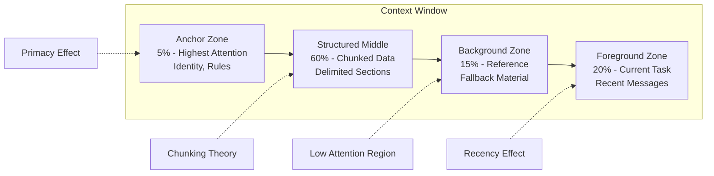

# Cognitive Scaffolding

Part of [Agent Skills™](https://github.com/itallstartedwithaidea/agent-skills) by [googleadsagent.ai™](https://googleadsagent.ai)

## Description

Cognitive Scaffolding structures an agent's context window using principles from cognitive science — primacy effects, recency bias, chunking, and attention allocation. Language models, like human working memory, are not uniform processors. Information placed at the beginning and end of the context receives disproportionate attention (primacy and recency effects), while content in the middle can be effectively invisible. Cognitive Scaffolding exploits these properties to ensure the most critical information receives maximum model attention.

This skill was developed through extensive experimentation on the Buddy™ agent at [googleadsagent.ai™](https://googleadsagent.ai), where analysis accuracy improved by measurable margins simply by restructuring how information was arranged in the context window. Campaign performance data placed at strategic positions within the prompt produced significantly better recommendations than the same data placed arbitrarily. The same principle applies to code context, documentation, and any other information an agent must reason over.

The cognitive scaffolding framework organizes context into four zones: the anchor zone (first 5% of context — highest attention, used for identity and immutable rules), the foreground zone (last 20% — high attention, used for the current task and recent context), the structured middle (60% — moderate attention, organized into clearly delimited chunks), and the background zone (15% — lowest attention, used for reference material and fallbacks). Each zone has specific content strategies that maximize the model's ability to utilize the information placed there.

## Use When

- Agent accuracy varies inconsistently despite using the same information
- Long context windows degrade performance compared to shorter interactions
- Critical instructions or constraints are occasionally ignored by the agent
- You need to present large amounts of reference data without overwhelming the agent
- Multi-document reasoning requires the agent to attend to specific sections
- You are optimizing agent behavior for specific model architectures

## How It Works



The scaffolding exploits well-documented attention patterns in transformer architectures. The anchor zone leverages primacy — the model attends strongly to the earliest tokens, making this the ideal location for identity statements and non-negotiable rules. The foreground zone leverages recency — the most recent tokens receive high attention, making this the best place for the current task and recent conversation. The structured middle uses explicit delimiters and headers to create navigable chunks that compensate for the "lost in the middle" effect. The background zone stores material the model can reference but doesn't need to actively attend to.

## Implementation

**Cognitive Zone Builder:**

```typescript
interface CognitiveZone {
  name: string;
  position: "anchor" | "middle" | "background" | "foreground";
  budgetPercent: number;
  content: string;
  delimiter: string;
}

class CognitiveScaffold {
  private totalBudget: number;
  private zones: Map<string, CognitiveZone> = new Map();

  constructor(totalTokenBudget: number) {
    this.totalBudget = totalTokenBudget;
  }

  setAnchor(content: string): void {
    this.zones.set("anchor", {
      name: "Identity & Rules",
      position: "anchor",
      budgetPercent: 5,
      content,
      delimiter: "",
    });
  }

  addMiddleChunk(name: string, content: string): void {
    const key = `middle_${this.zones.size}`;
    this.zones.set(key, {
      name,
      position: "middle",
      budgetPercent: 0,
      content,
      delimiter: `\n<section name="${name}">\n`,
    });
  }

  setForeground(content: string): void {
    this.zones.set("foreground", {
      name: "Current Task",
      position: "foreground",
      budgetPercent: 20,
      content,
      delimiter: "\n<current_task>\n",
    });
  }

  assemble(): string {
    const sections: string[] = [];
    const anchor = this.zones.get("anchor");
    if (anchor) sections.push(anchor.content);

    const middle = [...this.zones.entries()]
      .filter(([_, z]) => z.position === "middle")
      .map(([_, z]) => `${z.delimiter}${z.content}\n</section>`);
    sections.push(...middle);

    const bg = [...this.zones.entries()]
      .filter(([_, z]) => z.position === "background");
    for (const [_, zone] of bg) {
      sections.push(`<reference name="${zone.name}">\n${zone.content}\n</reference>`);
    }

    const fg = this.zones.get("foreground");
    if (fg) sections.push(`${fg.delimiter}${fg.content}\n</current_task>`);

    return sections.join("\n\n");
  }
}
```

**Attention-Aware Content Placement:**

```python
class AttentionOptimizer:
    """Place content based on importance and model attention patterns."""

    ATTENTION_CURVE = {
        "anchor": 0.95,
        "early_middle": 0.60,
        "deep_middle": 0.40,
        "late_middle": 0.55,
        "foreground": 0.90,
    }

    def optimize_placement(self, items: list[dict]) -> list[dict]:
        """Sort items into optimal positions based on importance score."""
        sorted_items = sorted(items, key=lambda x: x["importance"], reverse=True)
        zones = {zone: [] for zone in self.ATTENTION_CURVE}
        zone_order = sorted(self.ATTENTION_CURVE.keys(), key=lambda z: self.ATTENTION_CURVE[z], reverse=True)

        for item in sorted_items:
            best_zone = min(zone_order, key=lambda z: abs(self.ATTENTION_CURVE[z] - item["importance"]))
            zones[best_zone].append(item)

        placement = []
        for zone in ["anchor", "early_middle", "deep_middle", "late_middle", "foreground"]:
            for item in zones[zone]:
                placement.append({**item, "zone": zone, "expected_attention": self.ATTENTION_CURVE[zone]})
        return placement
```

**Chunking Strategy for Structured Data:**

```python
def chunk_for_middle_zone(data: list[dict], chunk_size: int = 5) -> list[str]:
    """Break data into cognitively manageable chunks with clear boundaries."""
    chunks = []
    for i in range(0, len(data), chunk_size):
        batch = data[i:i + chunk_size]
        header = f"--- Chunk {i // chunk_size + 1} of {(len(data) + chunk_size - 1) // chunk_size} ---"
        body = "\n".join(format_item(item) for item in batch)
        summary = f"Summary: {len(batch)} items, key values: {extract_key_values(batch)}"
        chunks.append(f"{header}\n{body}\n{summary}")
    return chunks


def build_scaffolded_prompt(task, data, rules):
    scaffold = CognitiveScaffold(total_token_budget=150000)

    scaffold.set_anchor(f"""You are Buddy™, a Google Ads analysis agent.
RULES (always enforced):
{chr(10).join(f'- {r}' for r in rules)}""")

    for i, chunk in enumerate(chunk_for_middle_zone(data)):
        scaffold.add_middle_chunk(f"data_chunk_{i}", chunk)

    scaffold.set_foreground(f"""CURRENT TASK:
{task}

Analyze the data in the sections above and provide your recommendation.""")

    return scaffold.assemble()
```

## Best Practices

1. **Place non-negotiable rules in the anchor zone** — system identity, safety constraints, and output format rules belong in the first 5% of context where primacy effect is strongest.
2. **Keep the current task in the foreground** — the user's actual request and most recent messages should be the last content the model sees before generating.
3. **Chunk middle content with explicit delimiters** — use XML tags, markdown headers, or section boundaries to create navigable structure in the "lost in the middle" zone.
4. **Add per-chunk summaries** — a one-line summary at the end of each middle chunk gives the model a retrieval cue without requiring it to re-read the full chunk.
5. **Measure attention empirically** — test the same question with data in different positions to quantify your specific model's attention curve.
6. **Avoid critical-only-in-middle placement** — if information is essential to the task, place it in anchor or foreground, not solely in the middle zone.
7. **Adapt chunking to content type** — code files chunk by function/class, data tables chunk by row groups, documents chunk by section; one-size-fits-all chunking is suboptimal.
8. **Reinforce instructions via repetition** — for very long contexts, repeat critical instructions at both the anchor and foreground boundaries.

## Platform Compatibility

| Feature | Claude Code | Cursor | Codex | Gemini CLI |
|---|---|---|---|---|
| Context structuring | ✅ Full | ✅ Full | ✅ Full | ✅ Full |
| XML delimiters | ✅ Preferred | ✅ Supported | ✅ Supported | ✅ Supported |
| Token budget control | ✅ Full | ✅ Full | ✅ Full | ✅ Full |
| Attention optimization | ✅ Claude-tuned | ✅ Model-dependent | ✅ Model-dependent | ✅ Gemini-tuned |
| Zone-based assembly | ✅ Full | ✅ Full | ✅ Full | ✅ Full |

## Related Skills

- [Context Engineering](../context-engineering/) - Token budget enforcement and compression that works within the cognitive scaffold zones
- [Prompt Architecture](../prompt-architecture/) - Three-layer prompt design that maps directly to cognitive scaffold anchor and foreground zones
- [Session Archaeology](../session-archaeology/) - Mining past sessions to empirically calibrate attention curves and zone effectiveness

## Keywords

cognitive-scaffolding, primacy-effect, recency-bias, chunking, attention-allocation, working-memory, context-structure, lost-in-the-middle, information-placement, agent-skills

---

© 2026 [googleadsagent.ai™](https://googleadsagent.ai) | [Agent Skills™](https://github.com/itallstartedwithaidea/agent-skills) | MIT License
