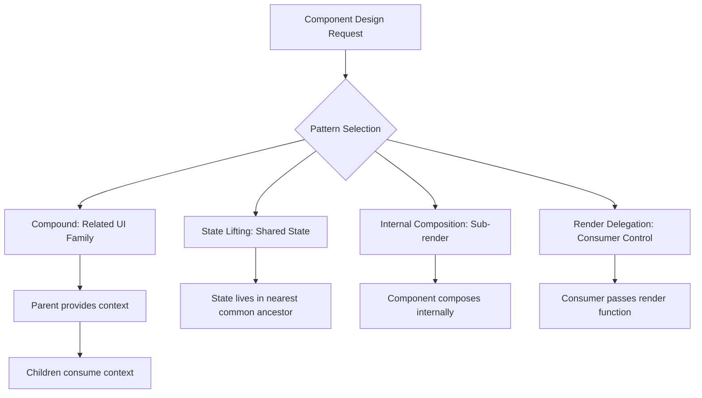

# Composition Patterns

Part of [Agent Skills™](https://github.com/itallstartedwithaidea/agent-skills) by [googleadsagent.ai™](https://googleadsagent.ai)

## Description

Composition Patterns teaches agents to build flexible, maintainable React components using compound components, state lifting, internal composition, and the elimination of boolean prop proliferation. These patterns replace rigid, prop-heavy APIs with composable interfaces that scale gracefully as requirements evolve.

The most common agent mistake in React is building monolithic components with dozens of boolean props: `showHeader`, `showFooter`, `isCompact`, `isLoading`, `hasSearch`, `enableDarkMode`. Each boolean doubles the component's state space, creating an exponential testing surface and making the component impossible to extend without modifying its internals. Composition patterns replace these booleans with structural composition, where the consumer assembles the component from smaller pieces.

This skill addresses four complementary patterns: compound components for related UI families, state lifting for shared cross-component state, internal composition for encapsulated sub-rendering, and render delegation for maximum consumer flexibility. Applied together, these patterns produce components that are simple to use, powerful to customize, and trivial to test.

## Use When

- A component has more than 3 boolean configuration props
- Related components need to share implicit state (tabs, accordions, selects)
- The consumer needs to control layout or ordering of sub-elements
- A component needs to support use cases not anticipated at design time
- Refactoring a "god component" into composable pieces
- Building a component library or design system

## How It Works



The agent selects the appropriate pattern based on the relationship between components, the degree of consumer control needed, and the complexity of shared state.

## Implementation

### Compound Components

```tsx
const TabsContext = createContext<TabsState | null>(null);

function Tabs({ defaultValue, children }: TabsProps) {
  const [active, setActive] = useState(defaultValue);
  return (
    <TabsContext.Provider value={{ active, setActive }}>
      <div role="tablist">{children}</div>
    </TabsContext.Provider>
  );
}

function Tab({ value, children }: TabProps) {
  const { active, setActive } = useContext(TabsContext)!;
  return (
    <button
      role="tab"
      aria-selected={active === value}
      onClick={() => setActive(value)}
    >
      {children}
    </button>
  );
}

function TabPanel({ value, children }: TabPanelProps) {
  const { active } = useContext(TabsContext)!;
  if (active !== value) return null;
  return <div role="tabpanel">{children}</div>;
}

Tabs.Tab = Tab;
Tabs.Panel = TabPanel;

// Usage: consumer controls structure
<Tabs defaultValue="a">
  <Tabs.Tab value="a">Tab A</Tabs.Tab>
  <Tabs.Tab value="b">Tab B</Tabs.Tab>
  <Tabs.Panel value="a">Content A</Tabs.Panel>
  <Tabs.Panel value="b">Content B</Tabs.Panel>
</Tabs>
```

### Eliminating Boolean Props

```tsx
// BAD: Boolean prop explosion
<Card
  showHeader={true}
  showFooter={false}
  isCompact={true}
  hasAvatar={true}
  showActions={true}
/>

// GOOD: Compositional API
<Card compact>
  <Card.Header>
    <Avatar src={user.avatar} />
    <Card.Title>{user.name}</Card.Title>
  </Card.Header>
  <Card.Body>{content}</Card.Body>
  <Card.Actions>
    <Button>Edit</Button>
    <Button>Delete</Button>
  </Card.Actions>
</Card>
```

## Best Practices

- Use compound components when sub-elements share implicit state
- Expose composable APIs instead of adding boolean flags for new features
- Keep context providers narrow—one context per concern, not one mega-context
- Provide sensible defaults so simple use cases remain simple
- Document the compositional API with usage examples, not just prop tables
- Use TypeScript discriminated unions instead of boolean prop combinations

## Platform Compatibility

| Platform | Support | Notes |
|----------|---------|-------|
| Cursor | Full | Component generation + refactoring |
| VS Code | Full | TypeScript-aware refactoring |
| Windsurf | Full | React pattern recognition |
| Claude Code | Full | Component design guidance |
| Cline | Full | Pattern-based generation |
| aider | Partial | Limited compositional awareness |

## Related Skills

- [React Best Practices](../react-best-practices/)
- [View Transitions](../view-transitions/)
- [Web Design Guidelines](../web-design-guidelines/)
- [Edge Rendering](../../infrastructure/edge-rendering/)

## Keywords

`composition` `compound-components` `react-patterns` `state-lifting` `boolean-props` `render-delegation` `design-system` `composable-api`

---

© 2026 googleadsagent.ai™ | Agent Skills™ | MIT License
