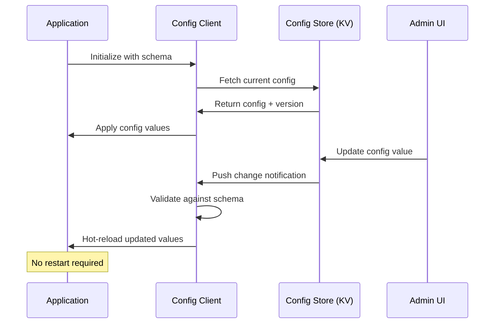

# Configuration Management

Part of [Agent Skills™](https://github.com/itallstartedwithaidea/agent-skills) by [googleadsagent.ai™](https://googleadsagent.ai)

## Description

Configuration Management implements dynamic configuration with hot-reload capability, inspired by Nacos configuration management patterns. Applications fetch their configuration from a centralized store, subscribe to change notifications, and apply updates without restarting. This eliminates the traditional deploy-to-change-config cycle and enables runtime tuning of feature flags, rate limits, and behavior parameters.

Static configuration files (`.env`, `config.yaml`) force a deployment for every parameter change. In production systems handling real traffic, this creates unnecessary risk and delay. Dynamic configuration separates deployment (code changes) from tuning (parameter changes), allowing operators to adjust rate limits, enable feature flags, rotate credentials, and modify routing rules without touching the deployment pipeline.

This skill covers the full configuration lifecycle: schema definition with validation, centralized storage with versioning, push-based change notification, client-side caching with TTL, and rollback to any previous version. Configuration changes are treated as auditable events with the same rigor as code deployments.

## Use When

- Managing feature flags across multiple environments
- Tuning rate limits or throttling parameters without deploying
- Implementing A/B testing configuration
- Centralizing configuration for microservice architectures
- Supporting configuration rollback for incident response
- Building multi-tenant applications with per-tenant configuration

## How It Works



The config client maintains a local cache synchronized with the centralized store. Changes are pushed via long-polling or WebSocket, validated against the schema, and applied to the running application without restart.

## Implementation

```typescript
interface ConfigSchema {
  rateLimitPerMinute: { type: "number"; min: 1; max: 10000; default: 100 };
  featureFlags: {
    type: "object";
    properties: {
      newDashboard: { type: "boolean"; default: false };
      aiAssistant: { type: "boolean"; default: true };
    };
  };
  maintenanceMode: { type: "boolean"; default: false };
}

class ConfigClient<T extends Record<string, unknown>> {
  private cache: T;
  private version: number = 0;
  private listeners = new Map<keyof T, Set<(value: unknown) => void>>();

  constructor(
    private store: KVNamespace,
    private schema: ConfigSchema,
    private namespace: string
  ) {
    this.cache = this.buildDefaults(schema) as T;
  }

  async initialize(): Promise<void> {
    const raw = await this.store.get(`${this.namespace}:current`, "json");
    if (raw) {
      this.validate(raw as Partial<T>);
      this.cache = { ...this.cache, ...raw } as T;
    }
  }

  get<K extends keyof T>(key: K): T[K] {
    return this.cache[key];
  }

  async set<K extends keyof T>(key: K, value: T[K]): Promise<void> {
    this.validateField(key as string, value);
    const previous = { ...this.cache };
    this.cache[key] = value;
    this.version++;

    await Promise.all([
      this.store.put(`${this.namespace}:current`, JSON.stringify(this.cache)),
      this.store.put(
        `${this.namespace}:v${this.version}`,
        JSON.stringify({ from: previous, to: this.cache, timestamp: Date.now() })
      ),
    ]);

    this.notify(key, value);
  }

  onChange<K extends keyof T>(key: K, callback: (value: T[K]) => void): void {
    if (!this.listeners.has(key)) this.listeners.set(key, new Set());
    this.listeners.get(key)!.add(callback as (value: unknown) => void);
  }

  async rollback(targetVersion: number): Promise<void> {
    const snapshot = await this.store.get(
      `${this.namespace}:v${targetVersion}`, "json"
    ) as { from: T } | null;
    if (!snapshot) throw new Error(`Version ${targetVersion} not found`);
    this.cache = snapshot.from;
    await this.store.put(`${this.namespace}:current`, JSON.stringify(this.cache));
  }

  private notify<K extends keyof T>(key: K, value: T[K]): void {
    this.listeners.get(key)?.forEach(cb => cb(value));
  }

  private buildDefaults(schema: ConfigSchema): Record<string, unknown> {
    return Object.fromEntries(
      Object.entries(schema).map(([k, v]) => [k, (v as { default: unknown }).default])
    );
  }

  private validate(partial: Partial<T>): void { /* schema validation */ }
  private validateField(key: string, value: unknown): void { /* field validation */ }
}
```

## Best Practices

- Define a schema with types, ranges, and defaults for every configuration key
- Version every configuration change for auditability and rollback capability
- Validate configuration changes against the schema before applying them
- Implement change notifications so applications react to updates immediately
- Cache configuration locally with a TTL to survive temporary store outages
- Separate secrets (credentials, API keys) from configuration—use a secrets manager

## Platform Compatibility

| Platform | Support | Notes |
|----------|---------|-------|
| Cursor | Full | Config schema + client generation |
| VS Code | Full | JSON/YAML config editing |
| Windsurf | Full | Configuration-aware |
| Claude Code | Full | Schema + client code generation |
| Cline | Full | Configuration management |
| aider | Partial | Code-level support only |

## Related Skills

- [Service Discovery](../service-discovery/)
- [Observability](../observability/)
- [CI/CD Pipelines](../ci-cd-pipelines/)
- [Secret Protection](../../security/secret-protection/)

## Keywords

`configuration-management` `hot-reload` `feature-flags` `dynamic-config` `nacos` `config-versioning` `rollback` `schema-validation`

---

© 2026 googleadsagent.ai™ | Agent Skills™ | MIT License
