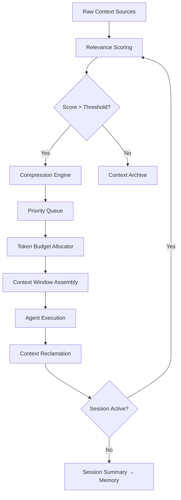

# Context Engineering

Part of [Agent Skills™](https://github.com/itallstartedwithaidea/agent-skills) by [googleadsagent.ai™](https://googleadsagent.ai)

## Description

Context Engineering is the discipline of maximizing agent output quality while minimizing token expenditure. In a world where every token carries cost and latency implications, the ability to surgically curate what enters an agent's context window separates production-grade systems from expensive toys. This skill codifies the techniques pioneered across the [googleadsagent.ai™](https://googleadsagent.ai) platform, where Buddy™ routinely operates within 200k-token windows while maintaining domain-expert-level accuracy.

The core insight is that context is not merely "what you send to the model" — it is working memory, and it must be engineered with the same rigor as any other system resource. Information density optimization, structured loading sequences, and progressive disclosure patterns ensure the agent receives precisely the right information at precisely the right moment. Poorly engineered context leads to hallucination, instruction drift, and ballooning costs.

This skill teaches agents to treat context as a finite, managed resource: measure it, compress it, prioritize it, and reclaim it. The techniques here apply universally across Claude Code, Cursor, Codex, and Gemini harnesses.

## Use When

- Agent responses degrade in quality as conversations grow longer
- Token costs are exceeding budget thresholds for production workloads
- The agent needs to reason over large codebases without losing focus
- You need to inject domain knowledge without consuming the entire context window
- Multi-step workflows require carrying forward only essential state between steps
- The agent is hallucinating due to context window saturation or dilution

## How It Works



The context lifecycle begins with raw sources — files, previous messages, tool outputs, knowledge bases — flowing through a relevance scoring pass. Items scoring below the threshold are archived rather than discarded, available for retrieval if needed. High-relevance items enter a compression engine that reduces token footprint while preserving semantic content. A priority queue orders compressed items by recency, importance, and task relevance. The token budget allocator enforces hard limits, ensuring the assembled context window never exceeds the target budget. After agent execution, context reclamation identifies items that are no longer needed for subsequent turns.

## Implementation

**Token Budget Enforcement:**

```javascript
class ContextBudget {
  constructor(maxTokens = 180000) {
    this.maxTokens = maxTokens;
    this.reservedForOutput = 20000;
    this.reservedForSystem = 5000;
    this.available = maxTokens - this.reservedForOutput - this.reservedForSystem;
    this.allocations = new Map();
  }

  allocate(category, tokens) {
    const currentUsage = this.currentUsage();
    if (currentUsage + tokens > this.available) {
      return this.evictAndAllocate(category, tokens);
    }
    this.allocations.set(category, (this.allocations.get(category) || 0) + tokens);
    return true;
  }

  evictAndAllocate(category, needed) {
    const sorted = [...this.allocations.entries()]
      .sort((a, b) => a[1] - b[1]);
    for (const [cat, tokens] of sorted) {
      if (cat === category) continue;
      this.allocations.delete(cat);
      if (this.available - this.currentUsage() >= needed) break;
    }
    return this.allocate(category, needed);
  }

  currentUsage() {
    return [...this.allocations.values()].reduce((sum, t) => sum + t, 0);
  }
}
```

**Progressive Disclosure Pattern:**

```javascript
function buildProgressiveContext(task, depth = 0) {
  const layers = [
    { level: 0, content: getTaskSummary(task), tokens: 200 },
    { level: 1, content: getRelevantFiles(task), tokens: 2000 },
    { level: 2, content: getFileContents(task), tokens: 10000 },
    { level: 3, content: getFullDependencyTree(task), tokens: 40000 },
  ];
  return layers
    .filter(layer => layer.level <= depth)
    .map(layer => layer.content);
}
```

**Context Compression via Summarization:**

```python
def compress_context(messages, budget_tokens):
    """Compress conversation history to fit within token budget."""
    total = count_tokens(messages)
    if total <= budget_tokens:
        return messages

    system_msgs = [m for m in messages if m["role"] == "system"]
    recent = messages[-4:]
    middle = messages[len(system_msgs):-4]

    summary = summarize_messages(middle)
    compressed = system_msgs + [{"role": "system", "content": f"Prior conversation summary: {summary}"}] + recent

    if count_tokens(compressed) > budget_tokens:
        return system_msgs + recent[-2:]
    return compressed
```

## Best Practices

1. **Measure before optimizing** — instrument token usage per category (system prompt, conversation history, tool outputs, knowledge) before applying compression techniques.
2. **Reserve output headroom** — always allocate 15-20% of the context window for the model's response; running the window to capacity guarantees truncation.
3. **Prefer structured over narrative** — JSON, YAML, and tabular formats carry higher information density per token than prose descriptions.
4. **Apply progressive disclosure** — start with summaries and load detail on demand; most agent turns need only a fraction of available context.
5. **Implement context reclamation** — after each tool call, evaluate whether the full tool output is still needed or can be replaced with a summary.
6. **Separate hot and cold context** — keep frequently referenced items (system instructions, current task) in every turn; archive infrequently accessed items behind retrieval.
7. **Version your context schemas** — as prompts and knowledge bases evolve, track which context configuration produced which quality outcomes.
8. **Test at the margins** — validate agent behavior at 50%, 80%, and 95% context utilization to understand degradation curves.

## Platform Compatibility

| Feature | Claude Code | Cursor | Codex | Gemini CLI |
|---|---|---|---|---|
| Context budget enforcement | ✅ Full | ✅ Full | ✅ Full | ✅ Full |
| Progressive disclosure | ✅ Native | ✅ Via skills | ✅ Via prompts | ✅ Via prompts |
| Token counting | ✅ Anthropic API | ✅ Via extensions | ✅ tiktoken | ✅ Vertex API |
| Context compression | ✅ Full | ✅ Full | ✅ Full | ✅ Full |
| Session summarization | ✅ Hooks | ✅ Rules | ✅ Instructions | ✅ System prompts |

## Mythos Preview Reference

In [Mythos Preview](https://red.anthropic.com/2026/mythos-preview/) evaluation, Anthropic **ranks each file 1–5** by how likely it is to contain interesting, vulnerability-relevant logic (e.g., constants-only files vs. network parsing or auth). They then **process the highest-ranked files first** instead of burning budget on every path equally.

Adopt the same idea for any large corpus: score likely signal density up front, sort descending, and load or assign work in that order so the context window and agent time go to the **most promising** sources first. Source: [Mythos Preview](https://red.anthropic.com/2026/mythos-preview/).

## Related Skills

- [Cognitive Scaffolding](../cognitive-scaffolding/) - Attention-aware content placement that maximizes the value of each token in the context budget
- [Prompt Architecture](../prompt-architecture/) - Layered prompt design that integrates with progressive disclosure and token budget allocation
- [Anthropic Tool Mastery](../anthropic-tool-mastery/) - Tool result management that requires context-aware caching and compression strategies

## Keywords

context-engineering, token-optimization, context-window, information-density, progressive-disclosure, context-compression, working-memory, token-budget, context-lifecycle, agent-skills

---

© 2026 [googleadsagent.ai™](https://googleadsagent.ai) | [Agent Skills™](https://github.com/itallstartedwithaidea/agent-skills) | MIT License
