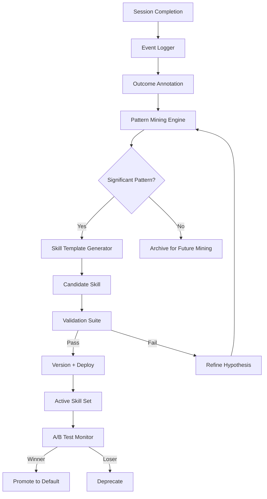

# Continuous Learning

Part of [Agent Skills™](https://github.com/itallstartedwithaidea/agent-skills) by [googleadsagent.ai™](https://googleadsagent.ai)

## Description

Continuous Learning enables agents to automatically extract successful patterns from completed sessions and codify them into reusable skills, rules, and prompt refinements. Rather than relying on manual skill authoring, a Continuous Learning system treats every agent session as a potential source of new capability. When the agent discovers an effective approach, solves a novel problem, or recovers from an error in a replicable way, the system captures that behavior and integrates it into the agent's skill repertoire.

This skill encodes the learning flywheel built into Buddy™ at [googleadsagent.ai™](https://googleadsagent.ai), where cross-session pattern mining has generated dozens of specialized Google Ads analysis techniques that no human engineer explicitly programmed. The system observes which tool sequences produce high-quality outcomes, which prompt modifications improve accuracy, and which error recovery strategies succeed — then packages these observations into structured skills that future sessions can leverage.

The learning pipeline operates in four stages: observation (logging session events with outcome annotations), mining (identifying statistically significant patterns across sessions), validation (testing candidate skills against held-out sessions), and integration (deploying validated skills into the agent's active skill set). This mirrors the scientific method applied to agent behavior: observe, hypothesize, test, deploy.

## Use When

- You want agent capabilities to improve automatically over time without manual intervention
- The agent performs repetitive domain-specific tasks where patterns emerge across sessions
- New team members need to benefit from patterns discovered by experienced users
- You need to maintain a living knowledge base that reflects actual best practices
- A/B testing different agent approaches and promoting winners automatically
- Reducing reliance on manual prompt engineering by automating skill derivation

## How It Works



The learning loop begins after each session completes. The event logger captures the full execution trace with outcome annotations (success, partial, failure, user satisfaction signals). The pattern mining engine runs periodically across accumulated sessions, searching for statistically significant correlations between agent behaviors and positive outcomes. Candidate patterns are transformed into skill templates — structured SKILL.md files with instructions, examples, and constraints. Validation runs the candidate skill against held-out sessions to verify it improves outcomes. Validated skills are versioned and deployed, with A/B testing monitoring comparative performance.

## Implementation

**Outcome-Annotated Event Logger:**

```python
@dataclass
class AnnotatedEvent:
    session_id: str
    event_type: str
    content: dict
    outcome_score: float  # 0.0 = failure, 1.0 = success
    user_feedback: str | None = None

class SessionLogger:
    def __init__(self, store):
        self.store = store
        self.buffer = []

    def log(self, event: AnnotatedEvent):
        self.buffer.append(event)

    async def flush(self, session_outcome: float):
        for event in self.buffer:
            if event.outcome_score == 0.0:
                event.outcome_score = session_outcome
            await self.store.append(event.session_id, asdict(event))
        self.buffer.clear()
```

**Pattern Mining Engine:**

```python
class PatternMiner:
    def __init__(self, min_occurrences=5, min_success_rate=0.8):
        self.min_occurrences = min_occurrences
        self.min_success_rate = min_success_rate

    async def mine(self, sessions: list[list[AnnotatedEvent]]) -> list[dict]:
        tool_sequences = self.extract_tool_sequences(sessions)
        prompt_patterns = self.extract_prompt_patterns(sessions)
        recovery_strategies = self.extract_recovery_patterns(sessions)

        candidates = []
        for pattern_set in [tool_sequences, prompt_patterns, recovery_strategies]:
            for pattern in pattern_set:
                if (pattern["occurrences"] >= self.min_occurrences
                        and pattern["success_rate"] >= self.min_success_rate):
                    candidates.append(pattern)

        return sorted(candidates, key=lambda p: p["success_rate"] * p["occurrences"], reverse=True)

    def extract_tool_sequences(self, sessions):
        sequences = {}
        for session in sessions:
            tools = [e for e in session if e.event_type == "tool_call"]
            for window in range(2, 5):
                for i in range(len(tools) - window + 1):
                    seq = tuple(t.content.get("name", "") for t in tools[i:i+window])
                    outcome = sum(t.outcome_score for t in tools[i:i+window]) / window
                    if seq not in sequences:
                        sequences[seq] = {"occurrences": 0, "success_sum": 0}
                    sequences[seq]["occurrences"] += 1
                    sequences[seq]["success_sum"] += outcome

        return [
            {"type": "tool_sequence", "pattern": seq, "occurrences": s["occurrences"],
             "success_rate": s["success_sum"] / s["occurrences"]}
            for seq, s in sequences.items()
        ]
```

**Skill Template Generator:**

```python
SKILL_TEMPLATE = """# {name}

Part of [Agent Skills™](https://github.com/itallstartedwithaidea/agent-skills) by [googleadsagent.ai™](https://googleadsagent.ai)

<!-- AUTO-GENERATED from pattern mining | v{version} | confidence: {confidence:.0%} -->

## Description
{description}

## Use When
{use_when}

## Implementation
{implementation}

## Derived From
- Sessions analyzed: {sessions_analyzed}
- Pattern frequency: {frequency}
- Success rate: {success_rate:.0%}
- Generated: {generated_date}
"""

class SkillGenerator:
    def __init__(self, model):
        self.model = model

    async def generate_skill(self, pattern: dict, examples: list) -> str:
        prompt = f"""Generate a SKILL.md for the following discovered pattern:

Pattern type: {pattern['type']}
Pattern: {pattern['pattern']}
Success rate: {pattern['success_rate']:.0%}
Occurrences: {pattern['occurrences']}

Example sessions where this pattern succeeded:
{json.dumps(examples[:3], indent=2)}

Write a clear, actionable description, use-when conditions, and implementation guidance."""

        content = await self.model.generate(prompt)
        return SKILL_TEMPLATE.format(
            name=pattern.get("name", "Discovered Pattern"),
            version="1.0.0",
            confidence=pattern["success_rate"],
            description=content,
            use_when="(see description)",
            implementation="(see description)",
            sessions_analyzed=pattern.get("sessions_analyzed", "N/A"),
            frequency=pattern["occurrences"],
            success_rate=pattern["success_rate"],
            generated_date=datetime.utcnow().isoformat(),
        )
```

**A/B Testing Framework:**

```typescript
interface SkillVariant {
  id: string;
  skillContent: string;
  version: string;
  metrics: { invocations: number; successes: number; avgScore: number };
}

class SkillABTest {
  constructor(
    private control: SkillVariant,
    private treatment: SkillVariant,
    private minSamples: number = 50,
  ) {}

  selectVariant(sessionId: string): SkillVariant {
    const hash = simpleHash(sessionId);
    return hash % 2 === 0 ? this.control : this.treatment;
  }

  recordOutcome(variant: SkillVariant, score: number): void {
    variant.metrics.invocations++;
    variant.metrics.successes += score >= 0.8 ? 1 : 0;
    variant.metrics.avgScore =
      (variant.metrics.avgScore * (variant.metrics.invocations - 1) + score) /
      variant.metrics.invocations;
  }

  getWinner(): SkillVariant | null {
    if (this.control.metrics.invocations < this.minSamples) return null;
    if (this.treatment.metrics.invocations < this.minSamples) return null;

    const controlRate = this.control.metrics.successes / this.control.metrics.invocations;
    const treatRate = this.treatment.metrics.successes / this.treatment.metrics.invocations;
    const diff = Math.abs(controlRate - treatRate);

    if (diff > 0.05) {
      return controlRate > treatRate ? this.control : this.treatment;
    }
    return null;
  }
}
```

## Best Practices

1. **Annotate outcomes, not just events** — raw event logs without success/failure labels are useless for mining; attach outcome scores to every significant event.
2. **Require statistical significance** — a pattern observed 3 times is anecdotal; require at least 5-10 occurrences with consistent success rates before promoting to candidate skill.
3. **Validate on held-out data** — never test a skill only on the sessions it was derived from; use held-out sessions to verify generalization.
4. **Version every generated skill** — auto-generated skills evolve as new data arrives; version them to track improvements and enable rollback.
5. **A/B test before full deployment** — run new skills against the current default on a subset of sessions; promote only after demonstrable improvement.
6. **Cap auto-generated skill count** — too many overlapping skills confuse the agent; limit the active set and deprecate underperformers.
7. **Human review for high-impact skills** — auto-generated skills for critical domains should be reviewed by a domain expert before deployment.

## Platform Compatibility

| Feature | Claude Code | Cursor | Codex | Gemini CLI |
|---|---|---|---|---|
| Session logging | ✅ Hooks | ✅ Extensions | ✅ Custom | ✅ Custom |
| Pattern mining | ✅ External scripts | ✅ External scripts | ✅ External scripts | ✅ External scripts |
| Skill generation | ✅ SKILL.md compat | ✅ SKILL.md native | ✅ Instructions | ✅ System prompts |
| A/B testing | ✅ Custom | ✅ Custom | ✅ Custom | ✅ Custom |
| Auto-deployment | ✅ File write hooks | ✅ Skill directory | ⚠️ Manual | ⚠️ Manual |

## Related Skills

- [Memory Persistence](../memory-persistence/) - Session data persistence provides the raw material for cross-session pattern mining
- [Knowledge Base Injection](../knowledge-base-injection/) - Mined patterns are deployed as injectable knowledge for future agent sessions
- [Entity Memory Management](../entity-memory-management/) - Entity extraction feeds the pattern mining pipeline with structured observations
- [PMax Optimization](../../google-ads/pmax-optimization/) - Auto-discovers optimization patterns from Performance Max campaign data

## Keywords

continuous-learning, pattern-mining, skill-generation, a-b-testing, feedback-loops, auto-improvement, session-analysis, knowledge-derivation, skill-versioning, agent-skills

---

© 2026 [googleadsagent.ai™](https://googleadsagent.ai) | [Agent Skills™](https://github.com/itallstartedwithaidea/agent-skills) | MIT License
