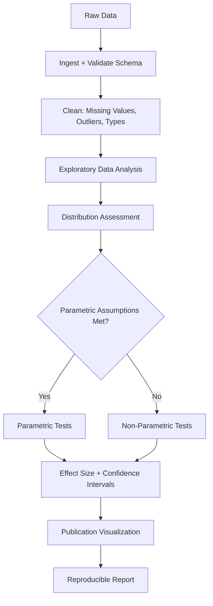

# Data Analysis

Part of [Agent Skills™](https://github.com/itallstartedwithaidea/agent-skills) by [googleadsagent.ai™](https://googleadsagent.ai)

## Description

Data Analysis provides a structured framework for statistical analysis using pandas, numpy, and scipy, with visualization through matplotlib, seaborn, and plotly. The agent follows a rigorous pipeline from data ingestion and cleaning through exploratory analysis, statistical testing, and publication-quality visualization, ensuring reproducibility at every step.

Scientific data analysis is not exploratory coding—it is a disciplined process where every transformation is justified, every statistical test has verified assumptions, and every visualization accurately represents the underlying data. This skill enforces that discipline by requiring the agent to document data provenance, validate distributions before applying parametric tests, and report effect sizes alongside p-values.

The visualization layer produces figures suitable for journal submission: proper axis labels with units, colorblind-safe palettes, appropriate figure sizes for single or double-column layouts, and vector output formats (SVG, PDF). Interactive plotly visualizations are generated for exploratory work; static matplotlib/seaborn figures for publication.

## Use When

- Performing statistical analysis on experimental or observational data
- Cleaning and transforming datasets for downstream analysis
- Creating publication-quality figures and plots
- Running hypothesis tests with proper assumption checking
- Exploratory data analysis on new datasets
- Building reproducible analysis pipelines

## How It Works



The pipeline enforces assumption checking before test selection. Parametric tests (t-test, ANOVA) require normality and homoscedasticity; when assumptions fail, the agent automatically selects non-parametric alternatives (Mann-Whitney, Kruskal-Wallis).

## Implementation

```python
import pandas as pd
import numpy as np
from scipy import stats
import seaborn as sns
import matplotlib.pyplot as plt

def analysis_pipeline(filepath: str) -> dict:
    df = pd.read_csv(filepath)

    report = {
        "shape": df.shape,
        "missing": df.isnull().sum().to_dict(),
        "dtypes": df.dtypes.astype(str).to_dict(),
    }

    numeric_cols = df.select_dtypes(include=[np.number]).columns
    for col in numeric_cols:
        stat, p = stats.shapiro(df[col].dropna()[:5000])
        report[f"{col}_normality"] = {"statistic": stat, "p_value": p, "normal": p > 0.05}

    return report

def compare_groups(df: pd.DataFrame, value_col: str, group_col: str) -> dict:
    groups = [g[value_col].dropna() for _, g in df.groupby(group_col)]

    normality_ok = all(stats.shapiro(g[:5000]).pvalue > 0.05 for g in groups)
    _, levene_p = stats.levene(*groups)
    homoscedastic = levene_p > 0.05

    if normality_ok and homoscedastic:
        stat, p = stats.f_oneway(*groups) if len(groups) > 2 else stats.ttest_ind(*groups)
        test_name = "ANOVA" if len(groups) > 2 else "t-test"
    else:
        stat, p = stats.kruskal(*groups)
        test_name = "Kruskal-Wallis"

    effect = compute_cohens_d(groups[0], groups[1]) if len(groups) == 2 else compute_eta_squared(groups)

    return {"test": test_name, "statistic": stat, "p_value": p, "effect_size": effect}

def publication_figure(df: pd.DataFrame, x: str, y: str, output: str):
    fig, ax = plt.subplots(figsize=(3.5, 3))  # Single-column journal width
    sns.boxplot(data=df, x=x, y=y, palette="colorblind", ax=ax)
    ax.set_xlabel(x.replace("_", " ").title())
    ax.set_ylabel(y.replace("_", " ").title())
    sns.despine()
    fig.tight_layout()
    fig.savefig(output, dpi=300, bbox_inches="tight")
    plt.close(fig)
```

## Best Practices

- Always check normality and homoscedasticity before selecting parametric tests
- Report effect sizes (Cohen's d, eta-squared) alongside p-values—significance without magnitude is meaningless
- Use colorblind-safe palettes (`colorblind`, `viridis`) for all visualizations
- Set random seeds for any stochastic operation to ensure reproducibility
- Document every data transformation with inline comments explaining the rationale
- Export figures as vector formats (SVG, PDF) for publication, raster (PNG) for web

## Platform Compatibility

| Platform | Support | Notes |
|----------|---------|-------|
| Cursor | Full | Jupyter + Python execution |
| VS Code | Full | Jupyter notebook support |
| Windsurf | Full | Python environment |
| Claude Code | Full | Script execution |
| Cline | Full | Data analysis workflows |
| aider | Partial | Code generation only |

## Related Skills

- [Machine Learning](../machine-learning/)
- [Scientific Writing](../scientific-writing/)
- [Research Methodology](../research-methodology/)
- [Knowledge Base RAG](../../productivity/knowledge-base-rag/)

## Keywords

`data-analysis` `statistics` `pandas` `scipy` `visualization` `matplotlib` `seaborn` `hypothesis-testing` `publication-figures`

---

© 2026 googleadsagent.ai™ | Agent Skills™ | MIT License
