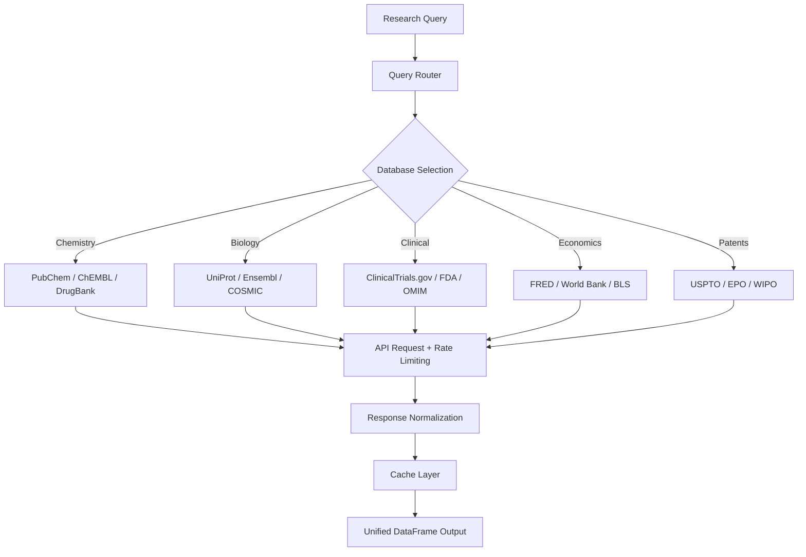

# Database Lookup

Part of [Agent Skills™](https://github.com/itallstartedwithaidea/agent-skills) by [googleadsagent.ai™](https://googleadsagent.ai)

## Description

Database Lookup provides unified programmatic access to 78+ scientific and public databases spanning chemistry (PubChem, ChEMBL), biology (UniProt, COSMIC, Ensembl), clinical (ClinicalTrials.gov, FDA), economics (FRED, World Bank), and intellectual property (USPTO, EPO). The agent constructs API queries, handles pagination, normalizes responses, and caches results for reproducible research workflows.

Scientific research increasingly depends on integrating data from multiple heterogeneous databases. A drug discovery project might query ChEMBL for bioactivity data, UniProt for target protein information, PubChem for compound properties, ClinicalTrials.gov for related clinical studies, and FRED for healthcare spending trends—all for a single research question. This skill abstracts the API differences into a unified query interface.

Each database connector handles authentication, rate limiting, response parsing, and error recovery. Results are normalized into consistent schemas (DataFrames with typed columns) regardless of the source API's format (REST JSON, XML, CSV, SPARQL). Caching prevents redundant API calls and enables offline analysis of previously retrieved data.

## Use When

- Retrieving compound data from PubChem or ChEMBL
- Querying protein sequences or annotations from UniProt
- Searching clinical trials on ClinicalTrials.gov
- Fetching economic indicators from FRED or World Bank
- Looking up patent information from USPTO
- Integrating data across multiple scientific databases

## How It Works



The query router identifies the appropriate database based on the query type and entity. All responses pass through normalization to produce consistent DataFrames with standardized column names and types.

## Implementation

```python
import requests
import pandas as pd
from functools import lru_cache
from time import sleep

class DatabaseClient:
    BASE_URLS = {
        "pubchem": "https://pubchem.ncbi.nlm.nih.gov/rest/pug",
        "chembl": "https://www.ebi.ac.uk/chembl/api/data",
        "uniprot": "https://rest.uniprot.org/uniprotkb",
        "clinicaltrials": "https://clinicaltrials.gov/api/v2/studies",
        "fred": "https://api.stlouisfed.org/fred/series/observations",
    }

    def __init__(self, cache_dir: str = ".db_cache"):
        self.session = requests.Session()
        self.session.headers["User-Agent"] = "AgentSkills/1.0 (research)"

    def pubchem_compound(self, name: str) -> dict:
        url = f"{self.BASE_URLS['pubchem']}/compound/name/{name}/JSON"
        resp = self._get(url)
        props = resp["PC_Compounds"][0]["props"]
        return {
            "cid": resp["PC_Compounds"][0]["id"]["id"]["cid"],
            "name": name,
            "properties": {p["urn"]["label"]: p["value"] for p in props},
        }

    def chembl_target(self, uniprot_id: str) -> pd.DataFrame:
        url = f"{self.BASE_URLS['chembl']}/target.json"
        resp = self._get(url, params={
            "target_components__accession": uniprot_id,
            "limit": 100,
        })
        return pd.json_normalize(resp["targets"])

    def uniprot_search(self, query: str, limit: int = 25) -> pd.DataFrame:
        url = f"{self.BASE_URLS['uniprot']}/search"
        resp = self._get(url, params={
            "query": query,
            "format": "json",
            "size": limit,
            "fields": "accession,id,protein_name,organism_name,length,sequence",
        })
        return pd.json_normalize(resp["results"])

    def clinical_trials(self, condition: str, status: str = "RECRUITING") -> pd.DataFrame:
        url = self.BASE_URLS["clinicaltrials"]
        resp = self._get(url, params={
            "query.cond": condition,
            "filter.overallStatus": status,
            "pageSize": 50,
        })
        return pd.json_normalize(resp["studies"])

    def fred_series(self, series_id: str, api_key: str) -> pd.DataFrame:
        url = self.BASE_URLS["fred"]
        resp = self._get(url, params={
            "series_id": series_id,
            "api_key": api_key,
            "file_type": "json",
        })
        df = pd.DataFrame(resp["observations"])
        df["value"] = pd.to_numeric(df["value"], errors="coerce")
        df["date"] = pd.to_datetime(df["date"])
        return df

    def _get(self, url: str, params: dict = None) -> dict:
        sleep(0.25)
        resp = self.session.get(url, params=params, timeout=30)
        resp.raise_for_status()
        return resp.json()
```

## Best Practices

- Respect rate limits: 5 req/s for PubChem, 1 req/s for ChEMBL, 3 req/s for UniProt
- Cache all API responses locally to enable offline analysis and reduce server load
- Normalize identifiers (CID, ChEMBL ID, UniProt accession) before cross-database joins
- Handle pagination for large result sets—never assume all results fit in one response
- Log every API query for reproducibility, including timestamp and response hash
- Set a User-Agent header identifying your tool and contact information

## Platform Compatibility

| Platform | Support | Notes |
|----------|---------|-------|
| Cursor | Full | Python + HTTP client |
| VS Code | Full | REST client integration |
| Windsurf | Full | API query support |
| Claude Code | Full | Database query generation |
| Cline | Full | API integration |
| aider | Partial | Code-level support |

## Related Skills

- [Bioinformatics](../bioinformatics/)
- [Cheminformatics](../cheminformatics/)
- [Data Analysis](../data-analysis/)
- [Knowledge Base RAG](../../productivity/knowledge-base-rag/)

## Keywords

`database-lookup` `pubchem` `chembl` `uniprot` `clinical-trials` `fred` `scientific-databases` `api-integration` `data-retrieval`

---

© 2026 googleadsagent.ai™ | Agent Skills™ | MIT License
