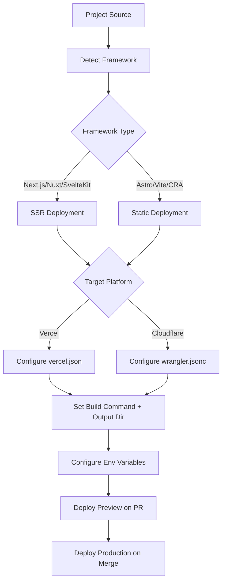

# Edge Deployment

Part of [Agent Skills™](https://github.com/itallstartedwithaidea/agent-skills) by [googleadsagent.ai™](https://googleadsagent.ai)

## Description

Edge Deployment automates the deployment of frontend applications to Vercel and Cloudflare with auto-detection of 40+ frameworks, intelligent build configuration, and environment-specific settings. The agent identifies the framework, configures the build pipeline, sets up environment variables, and deploys with zero manual configuration for standard projects.

Modern edge platforms eliminate the need for traditional server provisioning. This skill encodes the deployment patterns for both static (SSG) and server-rendered (SSR) applications across Vercel and Cloudflare Pages/Workers. The agent selects the optimal deployment strategy based on the framework's rendering capabilities, the project's data requirements, and the target platform's runtime constraints.

The skill handles the full deployment lifecycle: initial setup, preview deployments for pull requests, production deployments on merge, custom domain configuration, and environment variable management. It understands the differences between Vercel's serverless functions and Cloudflare Workers' edge runtime, routing to the appropriate platform based on project needs.

## Use When

- Deploying a new frontend project for the first time
- Configuring CI/CD for preview and production deployments
- Migrating between deployment platforms (Vercel to Cloudflare or vice versa)
- Setting up custom domains and SSL certificates
- Configuring environment variables for different deployment stages
- Optimizing build settings for faster deploys

## How It Works



Framework detection examines `package.json` dependencies, config files, and directory structure. The agent maps each framework to its optimal build command, output directory, and runtime configuration.

## Implementation

### Vercel Deployment

```json
{
  "framework": "nextjs",
  "buildCommand": "next build",
  "outputDirectory": ".next",
  "regions": ["iad1", "sfo1", "lhr1"],
  "env": {
    "DATABASE_URL": "@database-url",
    "API_KEY": "@api-key"
  }
}
```

```bash
# Deploy to Vercel
npx vercel --prod

# Preview deployment
npx vercel

# Set environment variable
npx vercel env add DATABASE_URL production
```

### Cloudflare Pages Deployment

```jsonc
// wrangler.jsonc
{
  "name": "my-app",
  "pages_build_output_dir": "./dist",
  "compatibility_date": "2026-04-01",
  "vars": {
    "ENVIRONMENT": "production"
  }
}
```

```bash
# Deploy to Cloudflare Pages
npx wrangler pages deploy ./dist --project-name=my-app

# Preview deployment
npx wrangler pages deploy ./dist --project-name=my-app --branch=feature-x
```

### GitHub Actions CI/CD

```yaml
name: Deploy
on:
  push:
    branches: [main]
  pull_request:
    branches: [main]

jobs:
  deploy:
    runs-on: ubuntu-latest
    steps:
      - uses: actions/checkout@v4
      - uses: actions/setup-node@v4
        with: { node-version: "20" }
      - run: npm ci
      - run: npm run build
      - if: github.event_name == 'push'
        run: npx wrangler pages deploy ./dist --project-name=my-app
        env:
          CLOUDFLARE_API_TOKEN: ${{ secrets.CF_API_TOKEN }}
```

## Best Practices

- Use preview deployments for every PR to catch issues before production
- Store secrets in the platform's encrypted environment variable system, never in code
- Pin framework and runtime versions to avoid build drift between environments
- Configure caching headers at the edge for static assets (1 year for hashed files)
- Use platform-specific adapters (e.g., `@sveltejs/adapter-cloudflare`) for SSR
- Monitor build times and set alerts for regressions above your baseline

## Platform Compatibility

| Platform | Support | Notes |
|----------|---------|-------|
| Cursor | Full | Shell tool for CLI deploys |
| VS Code | Full | Vercel/CF extensions available |
| Windsurf | Full | Deployment workflow support |
| Claude Code | Full | CLI-based deployments |
| Cline | Full | Terminal integration |
| aider | Partial | Config file generation only |

## Related Skills

- [React Best Practices](../react-best-practices/)
- [Web Design Guidelines](../web-design-guidelines/)
- [CI/CD Pipelines](../../infrastructure/ci-cd-pipelines/)
- [Cloudflare Workers](../../infrastructure/cloudflare-workers/)

## Keywords

`edge-deployment` `vercel` `cloudflare-pages` `ci-cd` `framework-detection` `static-deployment` `ssr-deployment` `preview-deployment`

---

© 2026 googleadsagent.ai™ | Agent Skills™ | MIT License
