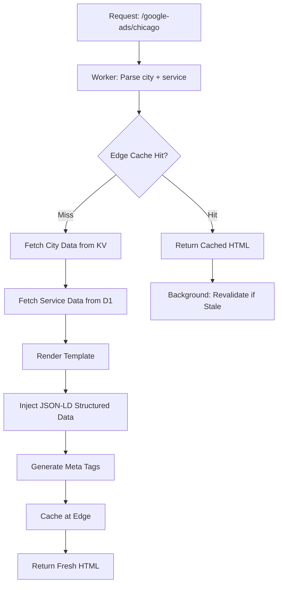

# Edge Rendering

Part of [Agent Skills™](https://github.com/itallstartedwithaidea/agent-skills) by [googleadsagent.ai™](https://googleadsagent.ai)

## Description

Edge Rendering generates and serves dynamic pages at the network edge, eliminating origin round-trips for content that varies by city, service, or user segment. This skill powers googleadsagent.ai™'s system of 18,000+ pages generated from a matrix of 116 services across 155+ cities, each with unique content, structured data, and SEO metadata—all rendered at the edge with sub-50ms TTFB globally.

The city × service page matrix demonstrates the power of edge rendering at scale. Rather than pre-building 18,000 static pages or routing every request to a centralized origin, Workers generate each page on demand using templates, city-specific data from KV, and service metadata from D1. Rendered pages are cached at the edge with stale-while-revalidate semantics, providing instant responses while keeping content fresh.

This pattern extends beyond SEO landing pages to any content that follows a combinatorial template: product × location pages, event × venue pages, or service × industry pages. The edge rendering pipeline handles template resolution, data injection, structured data generation (JSON-LD), meta tag construction, and cache management as a unified system.

## Use When

- Generating pages from a combinatorial matrix (city × service, product × category)
- Serving SEO-critical content that must have fast TTFB globally
- Building landing page systems with thousands of unique URLs
- Replacing static site generation that takes hours to build
- Implementing stale-while-revalidate caching at the edge
- Rendering structured data (JSON-LD) dynamically per page

## How It Works



Every request resolves to a (city, service) tuple. The Worker checks the edge cache first. On miss, it fetches city and service data in parallel, renders the template, injects structured data, and caches the result. Stale entries trigger background revalidation without blocking the response.

## Implementation

```typescript
export default {
  async fetch(request: Request, env: Env, ctx: ExecutionContext): Promise<Response> {
    const url = new URL(request.url);
    const [, service, city] = url.pathname.split("/");

    const cacheKey = new Request(url.toString());
    const cache = caches.default;
    let response = await cache.match(cacheKey);

    if (response) {
      const age = parseInt(response.headers.get("age") ?? "0");
      if (age > 3600) {
        ctx.waitUntil(revalidate(env, cache, cacheKey, service, city));
      }
      return response;
    }

    return revalidate(env, cache, cacheKey, service, city);
  },
} satisfies ExportedHandler<Env>;

async function revalidate(
  env: Env, cache: Cache, cacheKey: Request, service: string, city: string
): Promise<Response> {
  const [cityData, serviceData] = await Promise.all([
    env.CITY_KV.get<CityData>(city, "json"),
    env.DB.prepare("SELECT * FROM services WHERE slug = ?").bind(service).first<ServiceData>(),
  ]);

  if (!cityData || !serviceData) {
    return new Response("Not Found", { status: 404 });
  }

  const html = renderPage(cityData, serviceData);
  const response = new Response(html, {
    headers: {
      "Content-Type": "text/html;charset=UTF-8",
      "Cache-Control": "public, s-maxage=86400, stale-while-revalidate=3600",
    },
  });

  await cache.put(cacheKey, response.clone());
  return response;
}

function renderPage(city: CityData, service: ServiceData): string {
  const jsonLd = {
    "@context": "https://schema.org",
    "@type": "LocalBusiness",
    name: `${service.name} in ${city.name}`,
    address: { "@type": "PostalAddress", addressLocality: city.name, addressRegion: city.state },
    geo: { "@type": "GeoCoordinates", latitude: city.lat, longitude: city.lng },
    url: `https://googleadsagent.ai/${service.slug}/${city.slug}`,
  };

  return `<!DOCTYPE html>
<html lang="en">
<head>
  <title>${service.name} in ${city.name} | googleadsagent.ai</title>
  <meta name="description" content="${service.description} for businesses in ${city.name}, ${city.state}." />
  <script type="application/ld+json">${JSON.stringify(jsonLd)}</script>
</head>
<body>${service.template.replace("{{city}}", city.name)}</body>
</html>`;
}
```

## Best Practices

- Fetch city and service data in parallel with `Promise.all`, never sequentially
- Use `stale-while-revalidate` to serve cached content while refreshing in the background
- Generate JSON-LD structured data for every page to maximize search engine visibility
- Keep KV values under 25MB and D1 queries under 100ms for consistent edge performance
- Implement a sitemap generator that reflects the current city × service matrix
- Monitor cache hit ratios—target above 95% for production traffic

## Platform Compatibility

| Platform | Support | Notes |
|----------|---------|-------|
| Cursor | Full | Worker development + deployment |
| VS Code | Full | Wrangler integration |
| Windsurf | Full | Edge-first development |
| Claude Code | Full | Template + Worker generation |
| Cline | Full | Edge architecture support |
| aider | Partial | Template generation only |

## Related Skills

- [Cloudflare Workers](../cloudflare-workers/)
- [CI/CD Pipelines](../ci-cd-pipelines/)
- [Observability](../observability/)
- [CodeQL & Semgrep](../../security/codeql-semgrep/)

## Keywords

`edge-rendering` `city-service-pages` `cloudflare-workers` `seo` `json-ld` `stale-while-revalidate` `dynamic-pages` `structured-data`

---

© 2026 googleadsagent.ai™ | Agent Skills™ | MIT License
