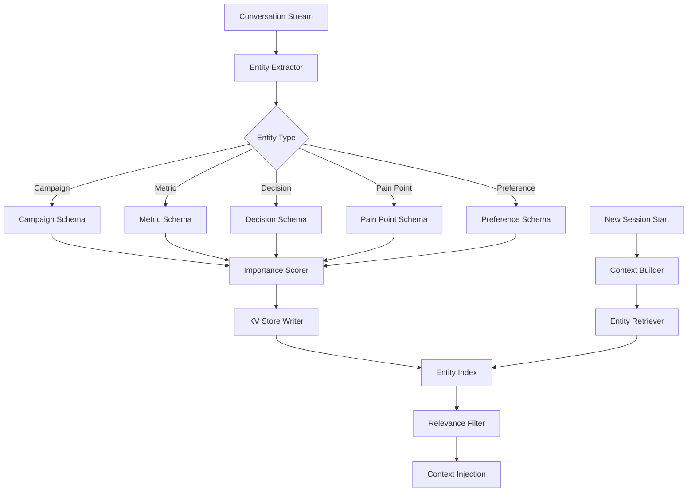

# Entity Memory Management

Part of [Agent Skills™](https://github.com/itallstartedwithaidea/agent-skills) by [googleadsagent.ai™](https://googleadsagent.ai)

## Description

Entity Memory Management is the systematic extraction, persistence, and retrieval of named entities across agent sessions, enabling long-term contextual awareness that transforms transient conversations into persistent relationships. While generic memory systems store session summaries, entity memory operates at a granular level — tracking specific campaigns, metrics, decisions, user pain points, and preferences as discrete, queryable objects. This precision enables agents to recall that "Campaign Alpha switched to Target CPA last Tuesday" rather than merely "we discussed bidding changes recently."

This skill is the production entity memory architecture powering Buddy™ at [googleadsagent.ai™](https://googleadsagent.ai), where entity memory tracks thousands of named entities across hundreds of user sessions. The system maintains entities of defined types — campaigns (with their strategies, budgets, and performance trajectories), metrics (specific KPIs and their historical values), decisions (changes made and their rationale), and pain points (recurring issues the user has expressed frustration about). Each entity is extracted, typed, scored for importance, stored in Cloudflare KV, and retrieved contextually in future sessions.

The result is an agent that genuinely "remembers" its users — not through conversation replay, but through structured, typed knowledge that persists and evolves. This creates a fundamentally different user experience where the agent builds on prior context rather than starting fresh.

## Use When

- The agent serves repeat users who expect continuity across sessions
- Domain entities (campaigns, accounts, projects) need tracking over time
- Decisions made in past sessions should inform future recommendations
- User preferences and pain points should persist without re-explanation
- You need to detect trends across sessions (improving metrics, recurring issues)
- Compliance or audit requirements demand a structured record of agent-user interactions

## How It Works



The entity extraction pipeline processes the conversation stream through a type-aware extractor that identifies named entities and classifies them into predefined schemas. Each extracted entity receives an importance score based on conversational emphasis, actionability, and novelty (new information scores higher than repeated information). Scored entities are written to Cloudflare KV with structured keys that enable efficient retrieval. At the start of each new session, the context builder queries the entity index for the current user, filters by relevance to the new task, and injects the most relevant entities into the agent's context.

## Implementation

**Entity Type Schemas:**

```typescript
interface BaseEntity {
  id: string;
  userId: string;
  type: EntityType;
  name: string;
  content: string;
  importance: number;
  createdAt: number;
  updatedAt: number;
  sessionId: string;
  version: number;
}

type EntityType = "campaign" | "metric" | "decision" | "pain_point" | "preference";

interface CampaignEntity extends BaseEntity {
  type: "campaign";
  metadata: {
    campaignId?: string;
    strategy?: string;
    budget?: number;
    status?: string;
    lastPerformance?: Record<string, number>;
  };
}

interface DecisionEntity extends BaseEntity {
  type: "decision";
  metadata: {
    action: string;
    rationale: string;
    affectedEntities: string[];
    reversible: boolean;
    outcome?: string;
  };
}

interface PainPointEntity extends BaseEntity {
  type: "pain_point";
  metadata: {
    severity: "low" | "medium" | "high";
    frequency: number;
    resolved: boolean;
    relatedCampaigns: string[];
  };
}

interface PreferenceEntity extends BaseEntity {
  type: "preference";
  metadata: {
    category: "communication" | "analysis" | "risk" | "reporting";
    value: string;
    confidence: number;
  };
}
```

**Entity Extraction Prompt:**

```python
EXTRACTION_PROMPT = """Analyze this conversation and extract structured entities.

Entity types and what to capture:
- CAMPAIGN: Campaign names, strategies, budgets, performance data, status changes
- METRIC: Specific KPI values mentioned (CPA, ROAS, CTR, etc.) with context
- DECISION: Choices made or agreed upon, with rationale and affected entities
- PAIN_POINT: Frustrations, recurring issues, or problems the user expressed
- PREFERENCE: Stated preferences for communication style, risk tolerance, analysis depth

Conversation:
{conversation}

Extract entities as JSON:
{{
  "entities": [
    {{
      "type": "campaign|metric|decision|pain_point|preference",
      "name": "short identifier",
      "content": "full description of the entity",
      "importance": 0.0-1.0,
      "metadata": {{}}
    }}
  ]
}}

Rules:
- Only extract entities with clear evidence in the conversation
- Importance 0.9+: explicit decisions, critical metrics, stated preferences
- Importance 0.5-0.8: mentioned campaigns, context metrics, implied preferences
- Importance <0.5: background information, passing mentions
- Merge with existing entities when updating rather than creating duplicates"""
```

**Entity Store with Cloudflare KV:**

```typescript
class EntityStore {
  constructor(private kv: KVNamespace) {}

  async upsert(entity: BaseEntity): Promise<void> {
    const key = `entity:${entity.userId}:${entity.type}:${entity.id}`;
    const existing = await this.kv.get<BaseEntity>(key, "json");

    if (existing) {
      entity.version = existing.version + 1;
      entity.createdAt = existing.createdAt;
      if (entity.importance < existing.importance) {
        entity.importance = (entity.importance + existing.importance) / 2;
      }
    }

    await this.kv.put(key, JSON.stringify(entity), {
      expirationTtl: 60 * 60 * 24 * 180,
      metadata: {
        type: entity.type,
        importance: entity.importance,
        updatedAt: entity.updatedAt,
      },
    });

    await this.updateIndex(entity);
  }

  private async updateIndex(entity: BaseEntity): Promise<void> {
    const indexKey = `index:${entity.userId}:entities`;
    const index = await this.kv.get<EntityIndex>(indexKey, "json") || { entries: [] };

    const existingIdx = index.entries.findIndex(
      (e) => e.id === entity.id && e.type === entity.type
    );
    const entry = {
      id: entity.id,
      type: entity.type,
      name: entity.name,
      importance: entity.importance,
      updatedAt: entity.updatedAt,
    };

    if (existingIdx >= 0) {
      index.entries[existingIdx] = entry;
    } else {
      index.entries.push(entry);
    }
    await this.kv.put(indexKey, JSON.stringify(index));
  }

  async retrieveForContext(userId: string, taskContext: string, limit = 20): Promise<BaseEntity[]> {
    const indexKey = `index:${userId}:entities`;
    const index = await this.kv.get<EntityIndex>(indexKey, "json");
    if (!index) return [];

    const ranked = index.entries
      .map((entry) => ({
        ...entry,
        score: this.contextRelevance(entry, taskContext) * 0.6 + entry.importance * 0.3 + this.recencyScore(entry.updatedAt) * 0.1,
      }))
      .sort((a, b) => b.score - a.score)
      .slice(0, limit);

    const entities: BaseEntity[] = [];
    for (const entry of ranked) {
      const key = `entity:${userId}:${entry.type}:${entry.id}`;
      const entity = await this.kv.get<BaseEntity>(key, "json");
      if (entity) entities.push(entity);
    }
    return entities;
  }

  private contextRelevance(entry: { name: string; type: string }, context: string): number {
    const contextLower = context.toLowerCase();
    const nameWords = entry.name.toLowerCase().split(/\s+/);
    const matches = nameWords.filter((w) => contextLower.includes(w)).length;
    return Math.min(1, matches / Math.max(nameWords.length, 1));
  }

  private recencyScore(timestamp: number): number {
    const ageMs = Date.now() - timestamp;
    const ageDays = ageMs / (1000 * 60 * 60 * 24);
    return Math.max(0, 1 - ageDays / 180);
  }
}
```

**Context Assembly from Entities:**

```python
def assemble_entity_context(entities: list[dict], max_tokens: int = 4000) -> str:
    grouped = {}
    for entity in entities:
        grouped.setdefault(entity["type"], []).append(entity)

    type_labels = {
        "campaign": "Known Campaigns",
        "metric": "Historical Metrics",
        "decision": "Prior Decisions",
        "pain_point": "Known Pain Points",
        "preference": "User Preferences",
    }

    sections = ["<entity_memory>"]
    token_count = 0

    for entity_type in ["preference", "pain_point", "decision", "campaign", "metric"]:
        items = grouped.get(entity_type, [])
        if not items:
            continue
        label = type_labels.get(entity_type, entity_type.title())
        section = f"\n### {label}\n"
        for item in items[:5]:
            entry = f"- **{item['name']}**: {item['content']}\n"
            entry_tokens = len(entry.split()) * 1.3
            if token_count + entry_tokens > max_tokens:
                break
            section += entry
            token_count += entry_tokens
        sections.append(section)

    sections.append("</entity_memory>")
    return "\n".join(sections)
```

## Best Practices

1. **Define entity types upfront** — a fixed taxonomy (campaign, metric, decision, pain_point, preference) produces more consistent extraction than open-ended entity recognition.
2. **Upsert, don't duplicate** — when the same entity appears in a new session, update the existing record rather than creating a new one; track version history for audit.
3. **Score importance at extraction time** — importance scoring is most accurate when the model has the full conversational context; don't defer scoring to retrieval time.
4. **Prioritize preferences and pain points for injection** — these entity types have the highest impact on user experience; always inject them when available.
5. **Set entity TTLs by type** — preferences may persist for 180 days, while specific metrics may expire after 30 days; match TTL to the entity's useful lifespan.
6. **Retrieve contextually, not exhaustively** — inject only entities relevant to the current task; a full entity dump wastes context window budget.
7. **Detect entity contradictions** — when a new extraction conflicts with a stored entity (e.g., strategy changed), update the stored entity and flag the change.

## Platform Compatibility

| Feature | Claude Code | Cursor | Codex | Gemini CLI |
|---|---|---|---|---|
| Entity extraction | ✅ Full | ✅ Full | ✅ Full | ✅ Full |
| KV storage | ✅ Any KV/file | ✅ Any KV/file | ✅ Any KV/file | ✅ Any KV/file |
| Session hooks | ✅ Stop hooks | ✅ Extensions | ⚠️ Custom | ⚠️ Custom |
| Context injection | ✅ CLAUDE.md | ✅ Skills | ✅ Instructions | ✅ System prompts |
| Index management | ✅ Full | ✅ Full | ✅ Full | ✅ Full |

## Related Skills

- [Memory Persistence](../memory-persistence/) - Provides the underlying storage and retrieval layer for entity persistence
- [Knowledge Base Injection](../knowledge-base-injection/) - Entity context is assembled and injected alongside domain knowledge patterns
- [Continuous Learning](../continuous-learning/) - Extracted entities feed pattern mining for automated skill derivation
- [Google Ads Audit](../../google-ads/google-ads-audit/) - Campaign, metric, and decision entities track audit findings across sessions

## Keywords

entity-memory, named-entities, cross-session-continuity, cloudflare-kv, entity-extraction, entity-types, importance-scoring, contextual-retrieval, user-preferences, agent-skills

---

© 2026 [googleadsagent.ai™](https://googleadsagent.ai) | [Agent Skills™](https://github.com/itallstartedwithaidea/agent-skills) | MIT License
