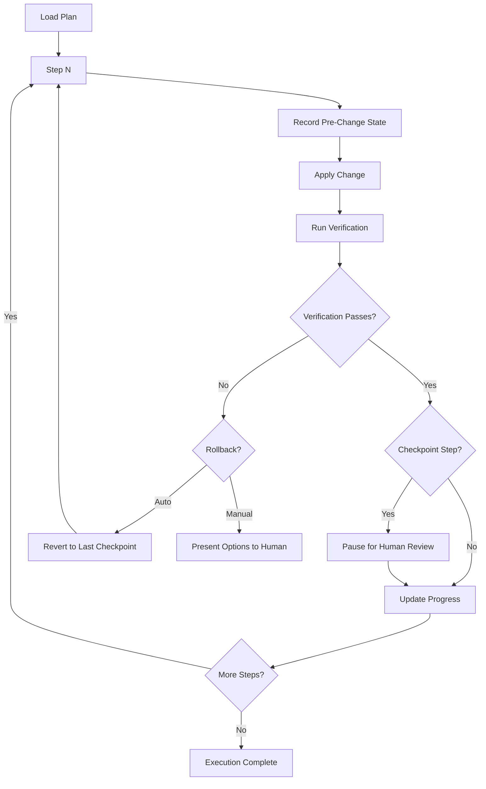

# Executing Plans

Part of [Agent Skills™](https://github.com/itallstartedwithaidea/agent-skills) by [googleadsagent.ai™](https://googleadsagent.ai)

## Description

Executing Plans takes a written plan and drives it through batch execution with human checkpoints, progress tracking, and rollback capability. The agent follows the plan step by step, verifying each step's success before proceeding, pausing at designated checkpoints for human confirmation, and maintaining the ability to reverse any step that fails.

Plans without disciplined execution degrade into wishful thinking. This skill enforces the contract: every step runs in order, every verification command must pass, and any failure halts forward progress until resolved. The agent tracks completion percentage, elapsed time, and remaining estimates, giving the human operator clear visibility into progress.

Rollback capability is built into the execution model. Before applying each step, the agent records the pre-change state. If a step fails verification, the agent can revert to the last known-good checkpoint automatically or present the human with options: retry, skip, modify, or abort.

## Use When

- A written plan exists and is approved for execution
- Multi-file changes must be applied in a specific order
- The user wants oversight at key decision points during execution
- Changes carry risk and need rollback capability
- Execution spans multiple sessions or agents
- Progress tracking is needed for transparency

## How It Works



The execution engine maintains a state machine for each step: pending, in-progress, verified, failed, rolled-back. Human checkpoints are configurable—the default places them after every 3 steps and before any destructive operation.

## Implementation

```python
class PlanExecutor:
    def __init__(self, plan, checkpoint_interval=3):
        self.plan = plan
        self.checkpoint_interval = checkpoint_interval
        self.snapshots = {}
        self.progress = []

    def execute(self):
        for i, step in enumerate(self.plan.steps):
            self.snapshots[i] = self.capture_state(step.affected_files)
            self.update_status(step, "in_progress")

            try:
                self.apply_change(step)
                result = self.run_verification(step.verify_command)

                if not result.success:
                    raise VerificationError(step, result.output)

                self.update_status(step, "verified")
                self.report_progress(i + 1, len(self.plan.steps))

                if self.is_checkpoint(i):
                    self.pause_for_human_review(step)

            except (ApplyError, VerificationError) as e:
                self.update_status(step, "failed")
                self.handle_failure(i, e)

    def handle_failure(self, step_index, error):
        self.rollback_to(step_index)
        options = [
            "retry: Re-attempt this step",
            "modify: Edit the step and retry",
            "skip: Mark as skipped and continue",
            "abort: Stop execution entirely",
        ]
        return self.prompt_human(error, options)

    def rollback_to(self, step_index):
        for path, content in self.snapshots[step_index].items():
            self.restore_file(path, content)

    def report_progress(self, completed, total):
        pct = (completed / total) * 100
        print(f"Progress: {completed}/{total} ({pct:.0f}%) | "
              f"Elapsed: {self.elapsed()} | "
              f"Remaining: ~{self.estimate_remaining(completed, total)}")
```

## Best Practices

- Always verify plan approval before starting execution
- Capture file state before every modification for rollback safety
- Place checkpoints before destructive operations (deletes, migrations, deploys)
- Report progress after each step, not just at the end
- If a step fails twice, escalate to the human rather than retrying indefinitely
- Commit after each verified step to create restore points in version control

## Platform Compatibility

| Platform | Support | Notes |
|----------|---------|-------|
| Cursor | Full | Shell + TodoWrite for progress |
| VS Code | Full | Terminal-based execution |
| Windsurf | Full | Cascade step execution |
| Claude Code | Full | Shell + checkpoint prompts |
| Cline | Full | Task runner integration |
| aider | Partial | No native checkpoint support |

## Related Skills

- [Writing Plans](../writing-plans/) - Plan authoring that produces the step-by-step specifications this skill executes
- [Subagent-Driven Development](../subagent-driven-development/) - Parallel task dispatch that delegates plan steps to isolated subagents
- [Git Worktrees](../git-worktrees/) - Isolated workspaces that provide clean baselines for verifying each execution step

## Keywords

`plan-execution` `batch-execution` `human-checkpoints` `rollback` `progress-tracking` `verification` `state-machine` `step-by-step-execution`

---

© 2026 googleadsagent.ai™ | Agent Skills™ | MIT License
