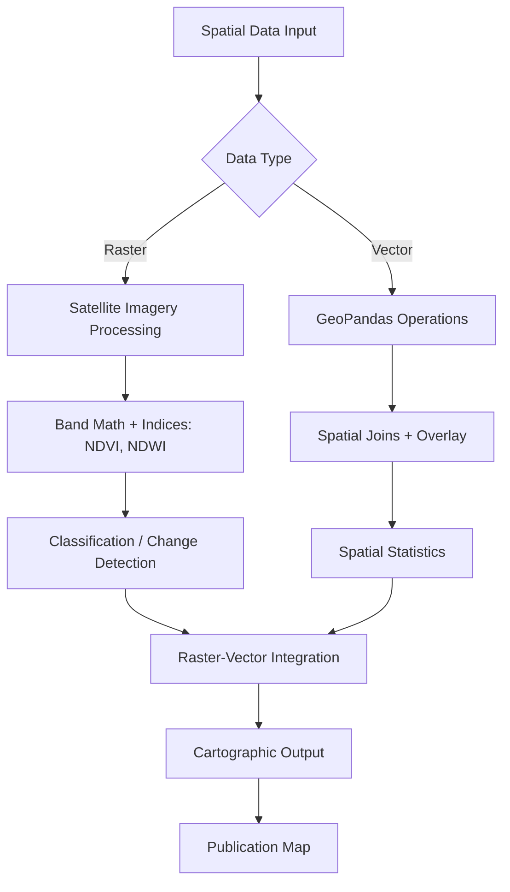

# Geospatial Analysis

Part of [Agent Skills™](https://github.com/itallstartedwithaidea/agent-skills) by [googleadsagent.ai™](https://googleadsagent.ai)

## Description

Geospatial Analysis provides workflows for satellite imagery processing, GIS operations with GeoPandas, spatial statistics, and Earth observation data analysis. The agent builds reproducible geospatial pipelines that transform raw spatial data into actionable geographic intelligence, from raster processing through vector operations to publication-quality cartographic output.

Geospatial data is fundamentally different from tabular data: it has coordinate reference systems that must be respected, spatial relationships that affect statistical independence, and scale-dependent patterns that change with resolution. This skill encodes the domain knowledge needed to handle these challenges correctly: CRS transformations, spatial joins, buffer operations, raster-vector interoperability, and spatial autocorrelation tests.

The skill integrates satellite imagery analysis (Sentinel, Landsat) with vector data processing (shapefiles, GeoJSON), enabling workflows like land use classification from multispectral imagery, urban heat island analysis from thermal bands, and environmental change detection from temporal image stacks.

## Use When

- Processing satellite imagery (Sentinel-2, Landsat, MODIS)
- Performing spatial joins, buffers, or overlay operations
- Computing spatial statistics (Moran's I, hot spot analysis)
- Creating publication-quality maps and cartographic outputs
- Analyzing land use, land cover, or environmental change
- Working with coordinate reference systems and projections

## How It Works



Raster and vector paths converge at the integration step, where classified imagery is combined with administrative boundaries, point observations, or infrastructure data to produce the final analytical product.

## Implementation

```python
import geopandas as gpd
import rasterio
from rasterio.mask import mask
from shapely.geometry import Point
import numpy as np
from pysal.explore import esda
from pysal.lib import weights
import matplotlib.pyplot as plt
import contextily as cx

def load_and_reproject(filepath: str, target_crs: str = "EPSG:4326") -> gpd.GeoDataFrame:
    gdf = gpd.read_file(filepath)
    return gdf.to_crs(target_crs)

def spatial_join_points_to_polygons(
    points: gpd.GeoDataFrame, polygons: gpd.GeoDataFrame
) -> gpd.GeoDataFrame:
    assert points.crs == polygons.crs, "CRS mismatch: reproject before joining"
    return gpd.sjoin(points, polygons, how="inner", predicate="within")

def compute_ndvi(nir_path: str, red_path: str) -> np.ndarray:
    with rasterio.open(nir_path) as nir_src, rasterio.open(red_path) as red_src:
        nir = nir_src.read(1).astype(np.float32)
        red = red_src.read(1).astype(np.float32)
    ndvi = np.where((nir + red) > 0, (nir - red) / (nir + red), 0)
    return ndvi

def spatial_autocorrelation(gdf: gpd.GeoDataFrame, column: str) -> dict:
    w = weights.Queen.from_dataframe(gdf)
    w.transform = "r"
    moran = esda.Moran(gdf[column], w)
    return {
        "morans_i": moran.I,
        "p_value": moran.p_sim,
        "z_score": moran.z_sim,
        "significant": moran.p_sim < 0.05,
        "interpretation": "Clustered" if moran.I > 0 and moran.p_sim < 0.05 else
                         "Dispersed" if moran.I < 0 and moran.p_sim < 0.05 else
                         "Random",
    }

def publication_map(gdf: gpd.GeoDataFrame, column: str, title: str, output: str):
    fig, ax = plt.subplots(1, 1, figsize=(10, 8))
    gdf.plot(column=column, ax=ax, legend=True, cmap="YlOrRd", edgecolor="0.5", linewidth=0.3)
    cx.add_basemap(ax, crs=gdf.crs.to_string(), source=cx.providers.CartoDB.Positron)
    ax.set_title(title, fontsize=14, fontweight="bold")
    ax.set_axis_off()
    fig.tight_layout()
    fig.savefig(output, dpi=300, bbox_inches="tight")
    plt.close(fig)
```

## Best Practices

- Always verify CRS alignment before spatial operations—mismatched CRS produce silent errors
- Use projected CRS (meters) for distance and area calculations, geographic CRS (degrees) for display
- Apply Moran's I to test for spatial autocorrelation before using non-spatial statistics
- Validate NDVI and other index ranges (NDVI should be -1 to 1) as a data quality check
- Include scale bars, north arrows, and CRS labels on all published maps
- Store geospatial data in GeoParquet for performance; use GeoJSON only for interchange

## Platform Compatibility

| Platform | Support | Notes |
|----------|---------|-------|
| Cursor | Full | Python + geospatial libs |
| VS Code | Full | Jupyter + map rendering |
| Windsurf | Full | Scientific Python |
| Claude Code | Full | Pipeline generation |
| Cline | Full | GIS workflows |
| aider | Partial | Code generation only |

## Related Skills

- [Data Analysis](../data-analysis/)
- [Machine Learning](../machine-learning/)
- [Research Methodology](../research-methodology/)
- [Batch Processing](../../productivity/batch-processing/)

## Keywords

`geospatial` `geopandas` `satellite-imagery` `ndvi` `spatial-statistics` `gis` `rasterio` `cartography` `earth-observation`

---

© 2026 googleadsagent.ai™ | Agent Skills™ | MIT License
