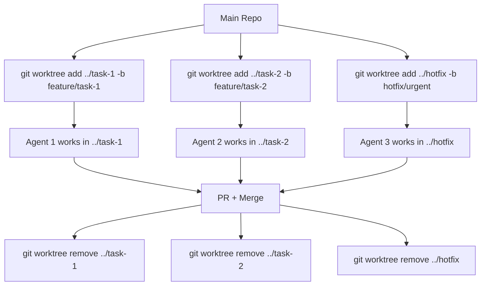

# Git Worktrees

Part of [Agent Skills™](https://github.com/itallstartedwithaidea/agent-skills) by [googleadsagent.ai™](https://googleadsagent.ai)

## Description

Git Worktrees enables parallel development by maintaining multiple checked-out branches simultaneously in separate directories. Instead of stashing changes and switching branches, the agent creates isolated worktrees for each task, providing clean test baselines and eliminating context-switching overhead. Each worktree is a fully independent workspace tied to its own branch.

This skill is essential for subagent-driven development, where multiple agents work on different tasks concurrently. Without worktrees, agents would clobber each other's uncommitted changes. With worktrees, each agent operates in its own directory with its own branch, and the orchestrator merges completed work back into the main line.

Worktrees also provide clean baselines for testing. When you need to verify that tests pass on a clean checkout—without build artifacts, local config, or uncommitted changes—a fresh worktree gives you exactly that. The worktree lifecycle is managed explicitly: create when a task starts, verify when it completes, and prune when it merges.

## Use When

- Multiple tasks must be developed in parallel without interference
- Subagents need isolated filesystems for concurrent work
- You need a clean checkout to run tests without local artifacts
- Hotfix work must happen while a feature branch is in progress
- Best-of-N implementations need separate workspaces
- You want to compare behavior across branches side by side

## How It Works



Each worktree is a real directory on disk with its own checked-out branch. Changes in one worktree do not affect others. The `.git` metadata is shared, so branch operations (push, fetch, log) work normally from any worktree.

## Implementation

```bash
# Create a worktree for a new feature
git worktree add ../feature-auth -b feature/user-auth
cd ../feature-auth
npm install  # Dependencies may differ per branch

# List active worktrees
git worktree list
# /home/user/project        abc1234 [main]
# /home/user/feature-auth   def5678 [feature/user-auth]

# Run tests in a clean worktree
git worktree add ../clean-test --detach HEAD
cd ../clean-test
npm ci && npm test
cd ../project
git worktree remove ../clean-test

# Prune stale worktrees (after branch deletion)
git worktree prune
```

```python
class WorktreeManager:
    def __init__(self, repo_root):
        self.repo_root = repo_root
        self.worktree_base = Path(repo_root).parent

    def create(self, task_name, base_branch="main"):
        branch = f"feature/{task_name}"
        path = self.worktree_base / task_name
        subprocess.run(
            ["git", "worktree", "add", str(path), "-b", branch, base_branch],
            cwd=self.repo_root, check=True
        )
        return WorktreeContext(path, branch)

    def remove(self, task_name):
        path = self.worktree_base / task_name
        subprocess.run(
            ["git", "worktree", "remove", str(path)],
            cwd=self.repo_root, check=True
        )

    def list_active(self):
        result = subprocess.run(
            ["git", "worktree", "list", "--porcelain"],
            cwd=self.repo_root, capture_output=True, text=True
        )
        return self.parse_worktree_list(result.stdout)
```

## Best Practices

- Always create worktrees from the main repository, not from another worktree
- Run `npm ci` or equivalent in each new worktree—`node_modules` are not shared
- Remove worktrees promptly after merging to avoid disk bloat
- Use `git worktree prune` periodically to clean up stale references
- Name worktree directories descriptively to match their branch purpose
- Never checkout the same branch in two worktrees simultaneously

## Platform Compatibility

| Platform | Support | Notes |
|----------|---------|-------|
| Cursor | Full | best-of-n-runner uses worktrees natively |
| VS Code | Full | Multi-root workspace support |
| Windsurf | Full | Shell-based worktree management |
| Claude Code | Full | Direct git access |
| Cline | Full | Terminal git commands |
| aider | Full | Works from any worktree directory |

## Related Skills

- [Subagent-Driven Development](../subagent-driven-development/) - Parallel task dispatch that relies on worktrees for filesystem isolation between agents
- [Executing Plans](../executing-plans/) - Plan execution with rollback that uses worktrees for clean verification baselines
- [Code Review](../code-review/) - Pre-merge quality gate applied to each worktree branch before merging

## Keywords

`git-worktrees` `parallel-development` `isolated-workspace` `clean-baseline` `concurrent-branches` `subagent-isolation` `best-of-n` `branch-management`

---

© 2026 googleadsagent.ai™ | Agent Skills™ | MIT License
