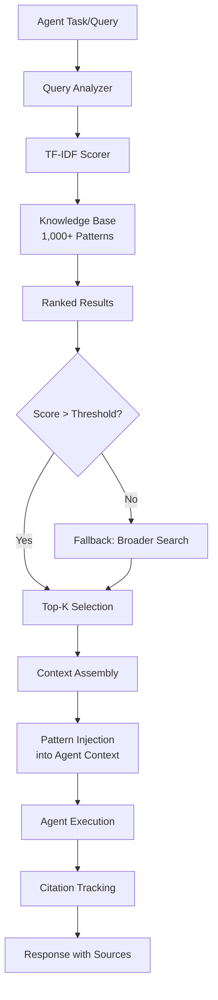

# Knowledge Base Injection

Part of [Agent Skills™](https://github.com/itallstartedwithaidea/agent-skills) by [googleadsagent.ai™](https://googleadsagent.ai)

## Description

Knowledge Base Injection is the technique of dynamically injecting domain expertise into an agent's context at the moment it is most relevant, using TF-IDF pattern matching and semantic scoring. Generic language models lack the deep domain knowledge required for specialized tasks like Google Ads optimization, medical coding, or financial compliance. Rather than fine-tuning (expensive, slow, brittle) or bloating system prompts with everything the model might need (wasteful, dilutes attention), Knowledge Base Injection retrieves and injects only the specific patterns relevant to the current task.

This skill is built on the production knowledge base system powering Buddy™ at [googleadsagent.ai™](https://googleadsagent.ai), specifically the `gads-knowledge.js` module containing over 1,000 curated Google Ads optimization patterns. Each pattern includes a trigger condition (when to apply it), a recommendation (what to do), evidence (why it works), and a confidence score. When Buddy™ analyzes a campaign, the knowledge base engine scores all patterns against the current context using TF-IDF and injects the top-K most relevant patterns into the agent's context, transforming a general-purpose model into a domain expert.

The injection system operates on a retrieval-augmented generation (RAG) paradigm, but with a critical distinction: rather than retrieving raw documents, it retrieves structured action patterns with built-in confidence scores and applicability conditions. This produces more actionable, more reliable agent outputs than document-level RAG.

## Use When

- The agent needs domain expertise that general-purpose models lack
- You have a curated knowledge base of patterns, rules, or best practices
- Fine-tuning is too expensive, too slow, or creates model version lock-in
- Different queries require different subsets of domain knowledge
- You want to update the agent's expertise without retraining or redeploying
- The agent must ground its recommendations in verified, authoritative sources

## How It Works



When a task arrives, the query analyzer extracts key terms and concepts. The TF-IDF scorer computes relevance scores between the query and every pattern in the knowledge base. Patterns scoring above the threshold are ranked and the top-K are selected for injection. The selected patterns are assembled into a structured context block with clear formatting and injected into the agent's prompt. After execution, citation tracking links the agent's recommendations back to the specific patterns that informed them, providing auditability.

## Implementation

**Knowledge Pattern Structure:**

```typescript
interface KnowledgePattern {
  id: string;
  category: "bidding" | "targeting" | "creative" | "budget" | "structure" | "general";
  trigger: string;
  recommendation: string;
  evidence: string;
  confidence: number;
  terms: string[];
  tf_idf_vector?: number[];
}

const SAMPLE_PATTERNS: KnowledgePattern[] = [
  {
    id: "bid-001",
    category: "bidding",
    trigger: "Campaign using manual CPC with more than 30 conversions/month",
    recommendation: "Switch to Target CPA or Maximize Conversions bidding strategy",
    evidence: "Campaigns with 30+ monthly conversions have sufficient data for Smart Bidding algorithms. Google's internal data shows 15-20% CPA improvement on average after switching.",
    confidence: 0.92,
    terms: ["manual", "cpc", "conversions", "bidding", "strategy", "target", "cpa"],
  },
  {
    id: "budget-003",
    category: "budget",
    trigger: "Campaign limited by budget for more than 7 consecutive days",
    recommendation: "Increase daily budget by 20-30% or reduce bids/targeting to fit within budget",
    evidence: "Budget-limited campaigns miss high-value impressions during peak hours. Impression share lost to budget directly correlates with missed conversions.",
    confidence: 0.88,
    terms: ["budget", "limited", "daily", "impressions", "share", "lost"],
  },
];
```

**TF-IDF Scoring Engine:**

```python
import math
from collections import Counter

class TFIDFEngine:
    def __init__(self, patterns: list[dict]):
        self.patterns = patterns
        self.idf = self.compute_idf()

    def compute_idf(self) -> dict[str, float]:
        n = len(self.patterns)
        doc_freq = Counter()
        for pattern in self.patterns:
            unique_terms = set(pattern["terms"])
            for term in unique_terms:
                doc_freq[term] += 1
        return {term: math.log(n / (1 + freq)) for term, freq in doc_freq.items()}

    def score(self, query_terms: list[str], pattern: dict) -> float:
        query_tf = Counter(query_terms)
        pattern_terms = set(pattern["terms"])
        score = 0.0
        for term in query_terms:
            if term in pattern_terms:
                tf = query_tf[term] / len(query_terms)
                idf = self.idf.get(term, 0)
                score += tf * idf
        return score * pattern.get("confidence", 1.0)

    def search(self, query: str, top_k: int = 10, threshold: float = 0.1) -> list[dict]:
        query_terms = self.tokenize(query)
        scored = []
        for pattern in self.patterns:
            s = self.score(query_terms, pattern)
            if s >= threshold:
                scored.append({**pattern, "relevance_score": s})
        scored.sort(key=lambda x: x["relevance_score"], reverse=True)
        return scored[:top_k]

    def tokenize(self, text: str) -> list[str]:
        return [w.lower().strip(".,!?;:") for w in text.split() if len(w) > 2]
```

**Knowledge Injection into Agent Context:**

```python
def inject_knowledge(query: str, engine: TFIDFEngine, max_patterns: int = 8, max_tokens: int = 3000) -> str:
    relevant = engine.search(query, top_k=max_patterns)
    if not relevant:
        return ""

    sections = ["<domain_knowledge>"]
    token_count = 0

    for pattern in relevant:
        entry = f"""[{pattern['id']}] (confidence: {pattern['confidence']:.0%}, relevance: {pattern['relevance_score']:.2f})
Trigger: {pattern['trigger']}
Recommendation: {pattern['recommendation']}
Evidence: {pattern['evidence']}"""

        entry_tokens = len(entry.split()) * 1.3  # rough estimate
        if token_count + entry_tokens > max_tokens:
            break
        sections.append(entry)
        token_count += entry_tokens

    sections.append("</domain_knowledge>")
    sections.append("Use the patterns above to ground your analysis. Cite pattern IDs when making recommendations.")
    return "\n\n".join(sections)
```

**Full Integration Example:**

```python
async def analyze_with_knowledge(campaign_data: dict, user_query: str):
    engine = TFIDFEngine(load_knowledge_base("gads-knowledge.js"))

    context_query = f"{user_query} {campaign_data.get('strategy', '')} {campaign_data.get('status', '')}"
    knowledge_block = inject_knowledge(context_query, engine)

    messages = [
        {"role": "system", "content": f"""You are Buddy™, a Google Ads expert agent by googleadsagent.ai™.

{knowledge_block}

Analyze the campaign data below and provide actionable recommendations.
Cite knowledge pattern IDs (e.g., [bid-001]) when your recommendations are based on domain patterns."""},
        {"role": "user", "content": f"Campaign data:\n{json.dumps(campaign_data, indent=2)}\n\nQuery: {user_query}"},
    ]

    response = await model.generate(messages)
    citations = extract_citations(response, engine.patterns)
    return {"analysis": response, "citations": citations, "patterns_used": len(citations)}
```

## Best Practices

1. **Curate patterns with confidence scores** — every knowledge pattern should have a confidence score based on evidence strength; the agent should weight high-confidence patterns more heavily.
2. **Keep patterns atomic** — each pattern should address one specific situation; compound patterns reduce retrieval precision.
3. **Update the knowledge base continuously** — domain knowledge evolves; schedule regular reviews to add new patterns, update confidence scores, and retire outdated ones.
4. **Limit injection to top-K relevant patterns** — injecting too many patterns dilutes the agent's attention; 5-10 highly relevant patterns outperform 50 loosely relevant ones.
5. **Require citation tracking** — instruct the agent to cite pattern IDs in its recommendations; this creates an audit trail and lets you measure which patterns drive the most value.
6. **Categorize patterns for efficient retrieval** — pre-filtering by category (bidding, targeting, creative) before scoring reduces computation and improves precision.
7. **Benchmark against no-injection baselines** — regularly compare agent performance with and without knowledge injection to quantify the value of the knowledge base.

## Platform Compatibility

| Feature | Claude Code | Cursor | Codex | Gemini CLI |
|---|---|---|---|---|
| Dynamic injection | ✅ Hooks/MCP | ✅ Skills/MCP | ✅ Custom | ✅ Custom |
| TF-IDF scoring | ✅ Full | ✅ Full | ✅ Full | ✅ Full |
| Pattern retrieval | ✅ Full | ✅ Full | ✅ Full | ✅ Full |
| Citation tracking | ✅ Full | ✅ Full | ✅ Full | ✅ Full |
| Knowledge updates | ✅ File reload | ✅ Skill reload | ✅ Restart | ✅ Restart |

## Related Skills

- [Token Optimization](../token-optimization/) - Knowledge injection must respect context window budgets; top-K selection minimizes token waste
- [Entity Memory Management](../entity-memory-management/) - Entity context is assembled alongside knowledge patterns for comprehensive agent context
- [Continuous Learning](../continuous-learning/) - Auto-generated skills feed back into the knowledge base as new injectable patterns
- [Google Ads Audit](../../google-ads/google-ads-audit/) - The 1,000-pattern knowledge base powers the audit's pattern-matching engine

## Keywords

knowledge-base, tf-idf, pattern-matching, domain-expertise, retrieval-augmented-generation, knowledge-injection, confidence-scoring, citation-tracking, gads-knowledge, agent-skills

---

© 2026 [googleadsagent.ai™](https://googleadsagent.ai) | [Agent Skills™](https://github.com/itallstartedwithaidea/agent-skills) | MIT License
