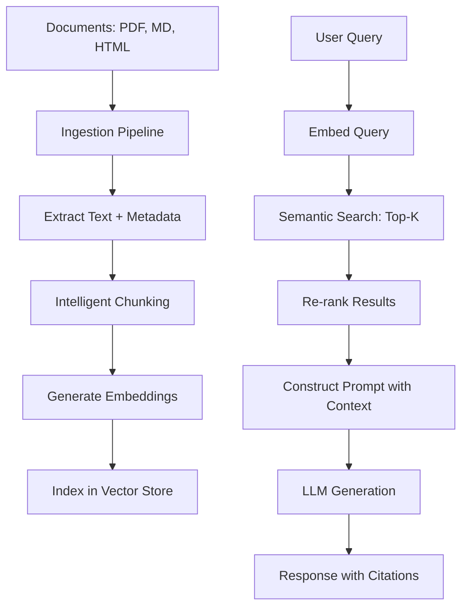

# Knowledge Base RAG

Part of [Agent Skills™](https://github.com/itallstartedwithaidea/agent-skills) by [googleadsagent.ai™](https://googleadsagent.ai)

## Description

Knowledge Base RAG implements the complete Retrieval-Augmented Generation pipeline: document ingestion, intelligent chunking, embedding generation, vector store indexing, semantic retrieval, and grounded response generation. The agent builds RAG systems that answer questions from private knowledge bases with cited sources and reduced hallucination.

RAG solves the fundamental limitation of large language models: they cannot access information created after their training cutoff or proprietary information they were never trained on. By retrieving relevant documents from a vector store and injecting them into the prompt context, RAG grounds the model's responses in factual, up-to-date, organization-specific knowledge.

The quality of a RAG system depends on chunking strategy more than model choice. This skill encodes production-tested chunking approaches: semantic chunking that preserves paragraph coherence, recursive splitting that respects document structure (headings, code blocks, tables), and overlap windows that maintain context across chunk boundaries. Each strategy is matched to the document type for optimal retrieval quality.

## Use When

- Building question-answering systems over private documents
- Creating a searchable knowledge base from documentation, wikis, or PDFs
- Reducing hallucination by grounding LLM responses in retrieved facts
- Implementing semantic search across large document collections
- Building customer support bots with product-specific knowledge
- The user asks about RAG, vector search, or document embedding

## How It Works



The pipeline has two phases: offline ingestion (documents to vectors) and online retrieval (query to answer). The re-ranking step applies a cross-encoder to refine the initial vector search results, improving precision before the generation step.

## Implementation

```python
from dataclasses import dataclass
import hashlib

@dataclass
class Chunk:
    text: str
    metadata: dict
    embedding: list[float] | None = None

    @property
    def id(self) -> str:
        return hashlib.sha256(self.text.encode()).hexdigest()[:16]

class RecursiveChunker:
    def __init__(self, max_tokens: int = 512, overlap: int = 64):
        self.max_tokens = max_tokens
        self.overlap = overlap
        self.separators = ["\n## ", "\n### ", "\n\n", "\n", ". ", " "]

    def chunk(self, text: str, metadata: dict) -> list[Chunk]:
        chunks = self._split(text, self.separators)
        return [
            Chunk(text=c.strip(), metadata={**metadata, "chunk_index": i})
            for i, c in enumerate(chunks) if c.strip()
        ]

    def _split(self, text: str, separators: list[str]) -> list[str]:
        if not separators or self._token_count(text) <= self.max_tokens:
            return [text]

        sep = separators[0]
        parts = text.split(sep)
        chunks, current = [], ""

        for part in parts:
            candidate = current + sep + part if current else part
            if self._token_count(candidate) > self.max_tokens and current:
                chunks.append(current)
                overlap_text = current[-self.overlap * 4:]
                current = overlap_text + sep + part
            else:
                current = candidate

        if current:
            chunks.append(current)

        result = []
        for chunk in chunks:
            if self._token_count(chunk) > self.max_tokens:
                result.extend(self._split(chunk, separators[1:]))
            else:
                result.append(chunk)
        return result

    def _token_count(self, text: str) -> int:
        return len(text) // 4

class RAGPipeline:
    def __init__(self, embedder, vector_store, llm):
        self.embedder = embedder
        self.store = vector_store
        self.llm = llm
        self.chunker = RecursiveChunker()

    async def ingest(self, documents: list[dict]) -> int:
        all_chunks = []
        for doc in documents:
            chunks = self.chunker.chunk(doc["text"], doc["metadata"])
            for chunk in chunks:
                chunk.embedding = await self.embedder.embed(chunk.text)
            all_chunks.extend(chunks)

        await self.store.upsert(all_chunks)
        return len(all_chunks)

    async def query(self, question: str, top_k: int = 5) -> dict:
        query_embedding = await self.embedder.embed(question)
        results = await self.store.search(query_embedding, top_k=top_k)

        context = "\n\n".join(
            f"[Source: {r.metadata.get('source', 'unknown')}]\n{r.text}" for r in results
        )

        prompt = f"""Answer the question based on the provided context. Cite sources.
If the context does not contain the answer, say so explicitly.

Context:
{context}

Question: {question}"""

        response = await self.llm.generate(prompt)
        return {"answer": response, "sources": [r.metadata for r in results]}
```

## Best Practices

- Use recursive chunking that respects document structure (headings, paragraphs, code blocks)
- Set chunk size to 256-512 tokens with 10-15% overlap for most use cases
- Re-rank vector search results with a cross-encoder before passing to the LLM
- Include source metadata in every chunk for citation generation
- Deduplicate chunks by content hash before indexing to avoid retrieval noise
- Instruct the LLM to say "I don't know" when the context lacks the answer

## Platform Compatibility

| Platform | Support | Notes |
|----------|---------|-------|
| Cursor | Full | Pipeline code generation |
| VS Code | Full | Python/TS RAG implementation |
| Windsurf | Full | RAG workflow support |
| Claude Code | Full | End-to-end RAG building |
| Cline | Full | Vector store integration |
| aider | Partial | Code-level support |

## Related Skills

- [AI Chat Studio](../ai-chat-studio/)
- [Workflow Orchestration](../workflow-orchestration/)
- [Knowledge Base Injection](../../ai-agent-engineering/knowledge-base-injection/)
- [Entity Memory Management](../../ai-agent-engineering/entity-memory-management/)

## Keywords

`rag` `retrieval-augmented-generation` `vector-search` `embeddings` `chunking` `knowledge-base` `semantic-search` `document-qa`

---

© 2026 googleadsagent.ai™ | Agent Skills™ | MIT License
