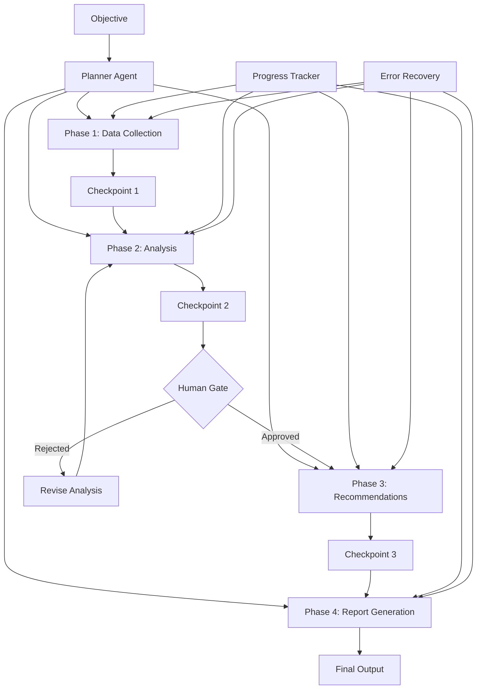

# Long-Horizon Workflows

Part of [Agent Skills™](https://github.com/itallstartedwithaidea/agent-skills) by [googleadsagent.ai™](https://googleadsagent.ai)

## Description

Long-Horizon Workflows enable AI agents to execute multi-hour, multi-phase autonomous pipelines that far exceed the scope of a single conversation turn. Inspired by the DeerFlow architecture and production patterns from [googleadsagent.ai™](https://googleadsagent.ai), these workflows decompose complex objectives into staged execution plans with checkpoints, progress tracking, error recovery, and human-in-the-loop gates at critical decision points. A long-horizon workflow might analyze an entire Google Ads account (dozens of campaigns, thousands of keywords), generate a comprehensive optimization report, and prepare implementation-ready change sets — all autonomously over several hours.

The core challenge of long-horizon execution is reliability. A workflow that takes 3 hours but fails at hour 2.5 with no recovery is worse than useless — it wastes time and compute. Checkpoint management ensures that work completed before a failure is preserved and can be resumed. Progress tracking provides visibility into what the agent is doing and how far along it is. Human-in-the-loop gates allow a human to validate critical decisions (like budget changes) before the agent proceeds, preventing catastrophic errors in unattended operation.

DeerFlow's contribution to this pattern is the concept of hierarchical task decomposition — a planner agent breaks the objective into phases, each phase into tasks, and each task into atomic operations. Each level of the hierarchy has its own checkpoint, timeout, and error handling policy. This creates a robust execution model that can survive individual task failures without losing the broader workflow state.

## Use When

- The objective requires more computation than fits in a single agent conversation
- Multi-campaign or multi-account analysis needs to run unattended
- The workflow has natural phases with different tool and data requirements
- Critical decisions require human approval before proceeding
- Long-running workflows must survive interruptions and resume cleanly
- You need audit trails showing what the agent did, decided, and produced at each stage

## How It Works



The planner agent receives a high-level objective and decomposes it into ordered phases. Each phase executes a distinct part of the workflow (data collection, analysis, recommendation generation, report writing). Checkpoints between phases persist the intermediate state so the workflow can resume after interruptions. Human gates pause execution at high-stakes decision points, waiting for explicit approval before proceeding. A progress tracker provides real-time visibility into the workflow's status. Error recovery at each phase can retry failed tasks, skip non-critical tasks, or escalate to the human operator.

## Implementation

**Workflow Definition:**

```typescript
interface WorkflowPhase {
  id: string;
  name: string;
  tasks: WorkflowTask[];
  checkpoint: boolean;
  humanGate: boolean;
  timeout_ms: number;
  onError: "retry" | "skip" | "abort" | "escalate";
}

interface WorkflowTask {
  id: string;
  name: string;
  execute: (context: WorkflowContext) => Promise<TaskResult>;
  retries: number;
  critical: boolean;
}

interface WorkflowContext {
  objective: string;
  checkpointData: Record<string, unknown>;
  progress: ProgressTracker;
  humanApprovals: Map<string, boolean>;
}

const accountAuditWorkflow: WorkflowPhase[] = [
  {
    id: "data_collection",
    name: "Collect Account Data",
    tasks: [
      { id: "fetch_campaigns", name: "Fetch all campaigns", execute: fetchCampaigns, retries: 3, critical: true },
      { id: "fetch_keywords", name: "Fetch keyword performance", execute: fetchKeywords, retries: 3, critical: true },
      { id: "fetch_ads", name: "Fetch ad creative data", execute: fetchAds, retries: 2, critical: false },
    ],
    checkpoint: true,
    humanGate: false,
    timeout_ms: 30 * 60 * 1000,
    onError: "retry",
  },
  {
    id: "analysis",
    name: "Analyze Performance",
    tasks: [
      { id: "campaign_analysis", name: "Campaign-level analysis", execute: analyzeCampaigns, retries: 2, critical: true },
      { id: "keyword_analysis", name: "Keyword opportunity analysis", execute: analyzeKeywords, retries: 2, critical: true },
      { id: "competitor_analysis", name: "Competitive positioning", execute: analyzeCompetitors, retries: 1, critical: false },
    ],
    checkpoint: true,
    humanGate: true,
    timeout_ms: 60 * 60 * 1000,
    onError: "escalate",
  },
];
```

**Workflow Engine:**

```python
class WorkflowEngine:
    def __init__(self, checkpoint_store, notifier):
        self.checkpoint_store = checkpoint_store
        self.notifier = notifier

    async def execute(self, workflow: list, context: dict) -> dict:
        start_phase = await self.find_resume_point(workflow, context["workflow_id"])

        for phase in workflow[start_phase:]:
            context["progress"].update_phase(phase["id"], "running")
            self.notifier.notify(f"Starting phase: {phase['name']}")

            for task in phase["tasks"]:
                result = await self.execute_task(task, context)
                if not result["success"] and task["critical"]:
                    if phase["onError"] == "abort":
                        return {"status": "aborted", "phase": phase["id"], "task": task["id"]}
                    elif phase["onError"] == "escalate":
                        await self.notifier.escalate(f"Critical task failed: {task['name']}")
                        return {"status": "escalated", "phase": phase["id"]}

            if phase.get("checkpoint"):
                await self.save_checkpoint(context["workflow_id"], phase["id"], context)

            if phase.get("humanGate"):
                approved = await self.wait_for_approval(context["workflow_id"], phase["id"])
                if not approved:
                    return {"status": "rejected", "phase": phase["id"]}

            context["progress"].update_phase(phase["id"], "completed")

        return {"status": "completed", "context": context}

    async def execute_task(self, task: dict, context: dict) -> dict:
        for attempt in range(task.get("retries", 1) + 1):
            try:
                result = await task["execute"](context)
                context["checkpointData"][task["id"]] = result
                return {"success": True, "result": result}
            except Exception as e:
                if attempt < task.get("retries", 1):
                    await asyncio.sleep(2 ** attempt)
                    continue
                return {"success": False, "error": str(e)}

    async def find_resume_point(self, workflow, workflow_id):
        checkpoint = await self.checkpoint_store.get(workflow_id)
        if not checkpoint:
            return 0
        for i, phase in enumerate(workflow):
            if phase["id"] == checkpoint["last_completed_phase"]:
                return i + 1
        return 0

    async def save_checkpoint(self, workflow_id, phase_id, context):
        await self.checkpoint_store.put(workflow_id, {
            "last_completed_phase": phase_id,
            "data": context["checkpointData"],
            "timestamp": time.time(),
        })
```

**Progress Tracker:**

```python
class ProgressTracker:
    def __init__(self, workflow_id: str, total_phases: int):
        self.workflow_id = workflow_id
        self.total_phases = total_phases
        self.phases = {}
        self.start_time = time.time()

    def update_phase(self, phase_id: str, status: str):
        self.phases[phase_id] = {
            "status": status,
            "timestamp": time.time(),
        }

    def summary(self) -> dict:
        completed = sum(1 for p in self.phases.values() if p["status"] == "completed")
        elapsed = time.time() - self.start_time
        return {
            "workflow_id": self.workflow_id,
            "progress_pct": (completed / self.total_phases) * 100,
            "completed_phases": completed,
            "total_phases": self.total_phases,
            "elapsed_seconds": elapsed,
            "estimated_remaining": (elapsed / max(completed, 1)) * (self.total_phases - completed),
            "phase_details": self.phases,
        }
```

## Best Practices

1. **Decompose into resumable phases** — each phase should produce a self-contained checkpoint that enables resume without re-executing prior phases.
2. **Mark tasks as critical or non-critical** — non-critical task failures (e.g., competitor analysis) should not abort the entire workflow.
3. **Set per-phase timeouts** — a phase that exceeds its expected duration is likely stuck; timeouts trigger escalation rather than infinite waiting.
4. **Place human gates before irreversible actions** — budget changes, ad pauses, and bid modifications should always require human approval in unattended workflows.
5. **Provide progress visibility** — long-running workflows must communicate progress; a 3-hour silent process causes user anxiety and support tickets.
6. **Log every phase transition** — complete audit trails of what the agent did, when, and what data it used are essential for compliance and debugging.
7. **Test resume paths explicitly** — kill workflows at each checkpoint and verify they resume correctly; resume bugs are insidious and often untested.

## Platform Compatibility

| Feature | Claude Code | Cursor | Codex | Gemini CLI |
|---|---|---|---|---|
| Multi-phase workflows | ✅ Subagents | ✅ Background tasks | ✅ Async | ✅ Async |
| Checkpointing | ✅ File-based | ✅ File-based | ✅ File-based | ✅ File-based |
| Human gates | ✅ Permission prompts | ✅ UI prompts | ✅ CLI prompts | ✅ CLI prompts |
| Progress tracking | ✅ Status updates | ✅ Status bar | ✅ Stdout | ✅ Stdout |
| Timeout management | ✅ Full | ✅ Full | ✅ Full | ✅ Full |

## Related Skills

- [Parallel Agent Orchestration](../parallel-agent-orchestration/) - Phases within long-horizon workflows can dispatch parallel subagents for acceleration
- [Memory Persistence](../memory-persistence/) - Checkpoint data persistence enables workflow resume after interruptions
- [MCP Server Creation](../mcp-server-creation/) - MCP tools provide standardized access to external APIs during workflow phases
- [Google Ads Audit](../../google-ads/google-ads-audit/) - Full account audits across 20 categories are a canonical long-horizon workflow

## Keywords

long-horizon-workflows, multi-phase-pipelines, checkpointing, human-in-the-loop, progress-tracking, task-decomposition, error-recovery, deerflow, autonomous-execution, agent-skills

---

© 2026 [googleadsagent.ai™](https://googleadsagent.ai) | [Agent Skills™](https://github.com/itallstartedwithaidea/agent-skills) | MIT License
