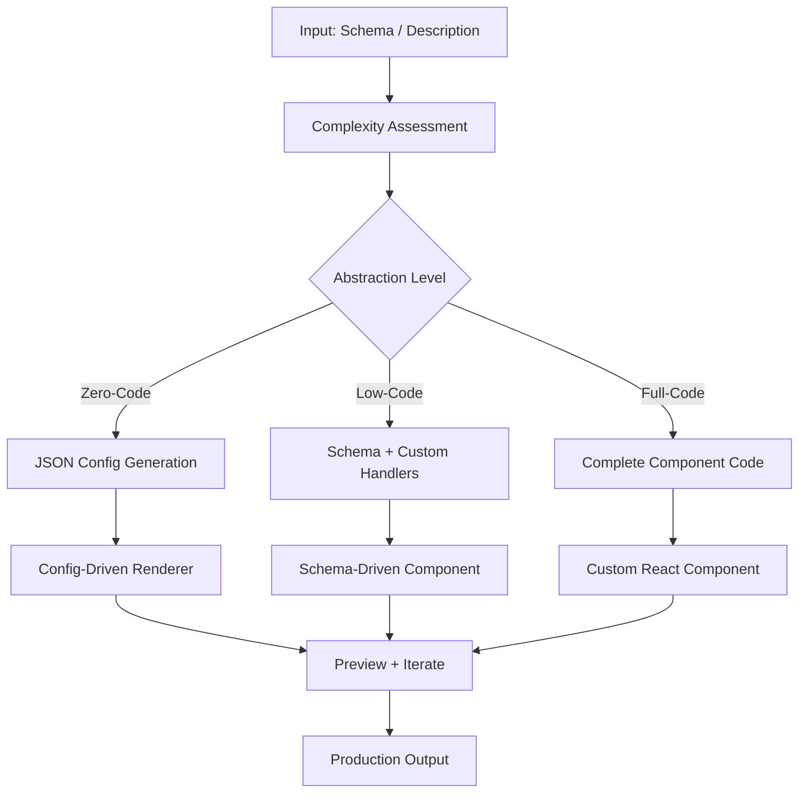

# Low-Code Generation

Part of [Agent Skills™](https://github.com/itallstartedwithaidea/agent-skills) by [googleadsagent.ai™](https://googleadsagent.ai)

## Description

Low-Code Generation uses AI to produce forms, tables, dashboards, and workflow UIs from natural language descriptions or schema definitions. The agent generates production-ready components spanning the zero-code to full-code spectrum: from drag-and-drop JSON configurations to fully custom React components, always producing the simplest artifact that meets the requirement.

The spectrum principle is key: not everything needs custom code, and not everything can be configured. A CRUD table for an admin panel is best served by a JSON-driven table component with sort, filter, and pagination built in. A complex multi-step form with conditional logic benefits from a form schema with validation rules. A bespoke analytics dashboard with custom visualizations requires full code. The agent selects the appropriate abstraction level based on complexity.

This skill draws from enterprise low-code platforms like JeecgBoot, encoding patterns for rapid UI generation: schema-driven forms with validation, configurable data tables with server-side operations, workflow builders with drag-and-drop nodes, and report generators with chart composition. Each pattern reduces a multi-day development task to minutes.

## Use When

- Generating admin panels or CRUD interfaces rapidly
- Building forms from database schemas or API specifications
- Creating data tables with sorting, filtering, and pagination
- Producing dashboard layouts with configurable widgets
- Scaffolding entire applications from entity-relationship diagrams
- The user requests "quick UI", "admin panel", or "form builder"

## How It Works



The complexity assessment evaluates the number of fields, conditional logic, custom validation, and visual requirements to select the appropriate abstraction level. Zero-code handles 60% of admin UI needs; low-code handles 30%; full-code is reserved for the remaining 10%.

## Implementation

```typescript
interface FormSchema {
  title: string;
  fields: FormField[];
  layout: "vertical" | "horizontal" | "grid";
  submitAction: string;
}

interface FormField {
  name: string;
  label: string;
  type: "text" | "number" | "email" | "select" | "date" | "textarea" | "switch";
  required?: boolean;
  validation?: { min?: number; max?: number; pattern?: string; message?: string };
  options?: Array<{ label: string; value: string }>;
  dependsOn?: { field: string; value: unknown };
}

function generateForm(schema: FormSchema): string {
  const fields = schema.fields.map(f => {
    const rules = [];
    if (f.required) rules.push(`{ required: true, message: "${f.label} is required" }`);
    if (f.validation?.pattern) rules.push(`{ pattern: /${f.validation.pattern}/, message: "${f.validation.message}" }`);

    const condition = f.dependsOn
      ? `{form.getFieldValue("${f.dependsOn.field}") === ${JSON.stringify(f.dependsOn.value)} && (`
      : "";
    const conditionClose = f.dependsOn ? ")}" : "";

    return `${condition}<Form.Item name="${f.name}" label="${f.label}" rules={[${rules.join(", ")}]}>
  ${renderInput(f)}
</Form.Item>${conditionClose}`;
  });

  return `<Form layout="${schema.layout}" onFinish={handleSubmit}>
  ${fields.join("\n  ")}
  <Form.Item><Button type="primary" htmlType="submit">Submit</Button></Form.Item>
</Form>`;
}

interface TableSchema {
  entity: string;
  columns: Array<{ key: string; title: string; type: string; sortable?: boolean; filterable?: boolean }>;
  actions: Array<"view" | "edit" | "delete">;
  pagination: { pageSize: number; serverSide: boolean };
}

function generateTable(schema: TableSchema): string {
  const columns = schema.columns.map(col => ({
    title: col.title,
    dataIndex: col.key,
    sorter: col.sortable ? true : undefined,
    filters: col.filterable ? `/* dynamic from API */` : undefined,
  }));

  return `<Table
  columns={${JSON.stringify(columns, null, 2)}}
  dataSource={data}
  pagination={{ pageSize: ${schema.pagination.pageSize}, total, onChange: fetchPage }}
  loading={loading}
  rowKey="id"
/>`;
}
```

## Best Practices

- Start with the simplest abstraction level that can express the requirement
- Use schema-driven generation for standard CRUD—custom code for exceptional cases only
- Generate TypeScript types from the schema to ensure end-to-end type safety
- Include validation rules in the schema, not as afterthought custom code
- Provide a preview mode so users can iterate on the generated UI before committing
- Export the generated code so developers can eject from low-code when complexity grows

## Platform Compatibility

| Platform | Support | Notes |
|----------|---------|-------|
| Cursor | Full | Component generation + preview |
| VS Code | Full | Schema editing + generation |
| Windsurf | Full | UI scaffolding support |
| Claude Code | Full | Form/table generation |
| Cline | Full | Low-code component creation |
| aider | Partial | Code generation only |

## Related Skills

- [Workflow Orchestration](../workflow-orchestration/)
- [Batch Processing](../batch-processing/)
- [MCP Server Creation](../../ai-agent-engineering/mcp-server-creation/)

## Keywords

`low-code` `form-generation` `table-generation` `schema-driven` `admin-panel` `crud` `zero-code` `rapid-development`

---

© 2026 googleadsagent.ai™ | Agent Skills™ | MIT License
