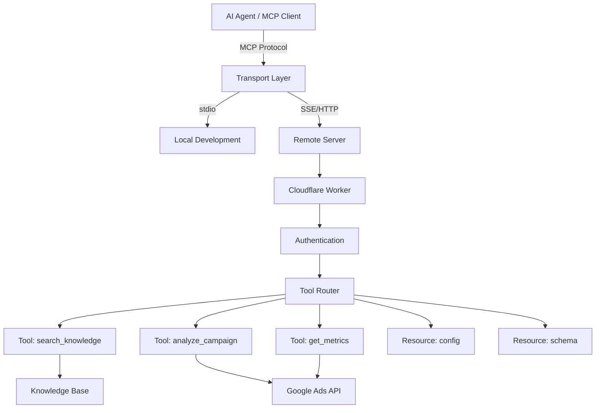

# MCP Server Creation

Part of [Agent Skills™](https://github.com/itallstartedwithaidea/agent-skills) by [googleadsagent.ai™](https://googleadsagent.ai)

## Description

MCP Server Creation is the skill of building Model Context Protocol servers that expose tools, resources, and capabilities to AI agents through a standardized interface. MCP has emerged as the universal integration layer for AI agent tooling — a single protocol that lets any compliant agent (Claude Code, Cursor, Codex, and others) discover and invoke server-side tools without custom integration code. Building production-quality MCP servers on Cloudflare Workers enables global, low-latency tool access with zero infrastructure management.

This skill draws from the production MCP server powering the Buddy™ agent at [googleadsagent.ai™](https://googleadsagent.ai), deployed on Cloudflare Workers in the `workers/buddy-agent/` directory. That server exposes Google Ads analysis tools, knowledge base search, entity memory management, and web search capabilities through MCP, making them available to any MCP-compatible client. The architecture handles authentication, rate limiting, and multi-tenant isolation at the edge.

The MCP specification defines three core primitives: tools (executable functions the agent can invoke), resources (read-only data the agent can access), and prompts (reusable prompt templates). A well-designed MCP server exposes a focused set of high-value tools with clear schemas, meaningful descriptions, and robust error handling. The transport layer supports both stdio (for local development) and SSE/HTTP (for remote deployment), with authentication integrated at the transport level.

## Use When

- You need to expose custom tools to AI agents through a standardized protocol
- Building integrations that work across Claude Code, Cursor, and other MCP clients
- Deploying agent tools to Cloudflare Workers for global edge access
- Creating a tool marketplace or shared tooling infrastructure for your organization
- Migrating from proprietary tool interfaces to the open MCP standard
- Your agent needs tools that require server-side secrets or API access

## How It Works



The MCP server sits between the AI agent client and the actual data sources or APIs. The transport layer handles protocol negotiation (stdio for local, SSE/HTTP for remote). For Cloudflare Workers deployment, incoming requests are authenticated (OAuth, API key, or JWT), then routed to the appropriate tool handler. Each tool handler implements the business logic — calling external APIs, querying databases, or performing computations — and returns structured results that the agent can reason over.

## Implementation

**MCP Server on Cloudflare Workers:**

```typescript
import { McpAgent } from "agents/mcp";
import { McpServer } from "@modelcontextprotocol/sdk/server/mcp.js";
import { z } from "zod";

export class BuddyMCPServer extends McpAgent {
  server = new McpServer({
    name: "buddy-agent",
    version: "1.0.0",
  });

  async init() {
    this.server.tool(
      "search_knowledge",
      "Search the Google Ads knowledge base for patterns and best practices matching a query. Use BEFORE making recommendations.",
      { query: z.string(), category: z.enum(["bidding", "targeting", "creative", "budget", "general"]).optional(), maxResults: z.number().default(5) },
      async ({ query, category, maxResults }) => {
        const results = await this.searchKnowledgeBase(query, category, maxResults);
        return { content: [{ type: "text", text: JSON.stringify(results, null, 2) }] };
      }
    );

    this.server.tool(
      "analyze_campaign",
      "Analyze a Google Ads campaign's performance metrics and return structured insights with recommendations.",
      { campaignId: z.string(), dateRange: z.enum(["7d", "30d", "90d"]).default("30d"), metrics: z.array(z.string()).optional() },
      async ({ campaignId, dateRange, metrics }) => {
        const analysis = await this.analyzeCampaign(campaignId, dateRange, metrics);
        return { content: [{ type: "text", text: JSON.stringify(analysis, null, 2) }] };
      }
    );

    this.server.tool(
      "store_entity",
      "Persist an extracted entity (decision, metric, preference) to cross-session memory.",
      { userId: z.string(), entityType: z.enum(["decision", "metric", "preference", "fact"]), content: z.string(), importance: z.number().min(0).max(1).default(0.5) },
      async ({ userId, entityType, content, importance }) => {
        await this.persistEntity(userId, entityType, content, importance);
        return { content: [{ type: "text", text: `Entity stored: [${entityType}] ${content}` }] };
      }
    );
  }

  private async searchKnowledgeBase(query: string, category?: string, limit?: number) {
    const patterns = await this.env.KNOWLEDGE_KV.list({ prefix: category ? `pattern:${category}:` : "pattern:" });
    const results = [];
    for (const key of patterns.keys.slice(0, limit || 5)) {
      const pattern = await this.env.KNOWLEDGE_KV.get(key.name, "json");
      if (pattern && this.isRelevant(query, pattern)) {
        results.push(pattern);
      }
    }
    return results;
  }
}
```

**Wrangler Configuration:**

```jsonc
// wrangler.jsonc
{
  "name": "buddy-mcp-server",
  "main": "src/index.ts",
  "compatibility_date": "2025-01-01",
  "compatibility_flags": ["nodejs_compat"],
  "kv_namespaces": [
    { "binding": "KNOWLEDGE_KV", "id": "your-kv-id" },
    { "binding": "MEMORY_KV", "id": "your-memory-kv-id" }
  ],
  "vars": {
    "ENVIRONMENT": "production"
  },
  "placement": { "mode": "smart" }
}
```

**MCP Client Configuration (Claude Code):**

```json
{
  "mcpServers": {
    "buddy-agent": {
      "type": "sse",
      "url": "https://buddy-mcp.googleadsagent.ai/sse",
      "headers": {
        "Authorization": "Bearer ${BUDDY_API_KEY}"
      }
    }
  }
}
```

**MCP Client Configuration (Cursor):**

```json
{
  "mcpServers": {
    "buddy-agent": {
      "url": "https://buddy-mcp.googleadsagent.ai/sse",
      "headers": {
        "Authorization": "Bearer ${BUDDY_API_KEY}"
      }
    }
  }
}
```

**Local Development with stdio Transport:**

```typescript
import { StdioServerTransport } from "@modelcontextprotocol/sdk/server/stdio.js";
import { McpServer } from "@modelcontextprotocol/sdk/server/mcp.js";

const server = new McpServer({ name: "buddy-agent-dev", version: "1.0.0-dev" });

server.tool(
  "search_knowledge",
  "Search the local knowledge base for development and testing.",
  { query: z.string() },
  async ({ query }) => {
    const results = searchLocalKnowledge(query);
    return { content: [{ type: "text", text: JSON.stringify(results) }] };
  }
);

const transport = new StdioServerTransport();
await server.connect(transport);
```

## Best Practices

1. **Write tool descriptions that explain when to use the tool** — the AI agent selects tools based on descriptions; "Use BEFORE making recommendations" is actionable guidance the model can follow.
2. **Use Zod schemas with descriptive enums** — constrained parameter types eliminate invalid inputs; enums are especially effective at guiding model parameter selection.
3. **Return structured JSON, not prose** — structured results are easier for the model to reason over and consume fewer tokens than narrative responses.
4. **Implement authentication at the transport layer** — never expose MCP servers without authentication; use OAuth, JWT, or API keys validated before tool routing.
5. **Keep tool count focused** — 5-10 well-designed tools outperform 50 overlapping tools; models perform better with fewer, clearer choices.
6. **Test with multiple MCP clients** — behavior can differ across Claude Code, Cursor, and other clients; test tool invocation on each target client.
7. **Deploy to the edge with Cloudflare Workers** — edge deployment minimizes latency for geographically distributed users and provides built-in DDoS protection.
8. **Version your MCP server** — as tools evolve, maintain backward compatibility or clearly version-bump to avoid breaking existing client configurations.

## Platform Compatibility

| Feature | Claude Code | Cursor | Codex | Gemini CLI |
|---|---|---|---|---|
| MCP client support | ✅ Native | ✅ Native | ⚠️ Limited | ⚠️ Limited |
| stdio transport | ✅ Full | ✅ Full | ⚠️ Custom | ⚠️ Custom |
| SSE transport | ✅ Full | ✅ Full | ⚠️ Custom | ⚠️ Custom |
| Tool discovery | ✅ Automatic | ✅ Automatic | ⚠️ Manual | ⚠️ Manual |
| OAuth support | ✅ Full | ✅ Full | ⚠️ Custom | ⚠️ Custom |

## Related Skills

- [Multi-Model Routing](../multi-model-routing/) - MCP servers can integrate model routing logic into tool execution pipelines
- [Knowledge Base Injection](../knowledge-base-injection/) - Knowledge search tools are exposed through MCP for agent-accessible domain expertise
- [Parallel Agent Orchestration](../parallel-agent-orchestration/) - MCP tools enable standardized tool access for parallel subagent dispatch
- [Shopping Ads](../../google-ads/shopping-ads/) - Merchant Center integration via MCP enables automated product feed management

## Keywords

mcp-server, model-context-protocol, cloudflare-workers, tool-definitions, resource-handlers, sse-transport, stdio-transport, authentication, edge-deployment, agent-skills

---

© 2026 [googleadsagent.ai™](https://googleadsagent.ai) | [Agent Skills™](https://github.com/itallstartedwithaidea/agent-skills) | MIT License
