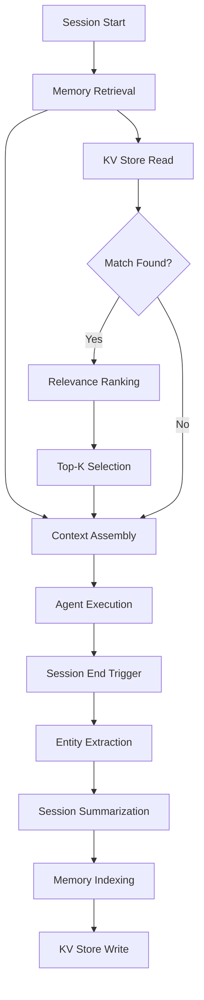

# Memory Persistence

Part of [Agent Skills™](https://github.com/itallstartedwithaidea/agent-skills) by [googleadsagent.ai™](https://googleadsagent.ai)

## Description

Memory Persistence enables AI agents to maintain knowledge across sessions, transforming stateless inference calls into stateful, continuously improving systems. Without persistence, every new session starts from zero — the agent must re-learn user preferences, re-discover codebase patterns, and repeat mistakes it has already corrected. Memory Persistence solves this by implementing hooks that save critical context at session end and reload it at session start, creating the illusion of continuous memory.

This skill is built on the production memory system powering Buddy™ at [googleadsagent.ai™](https://googleadsagent.ai), which uses Cloudflare KV as a persistent memory store. After each conversation, Buddy™ extracts entities (campaigns, metrics, user preferences, decisions made), summarizes the session, and stores the result keyed by user and session. On the next conversation, the most relevant memories are retrieved and injected into context, giving Buddy™ the ability to reference prior analyses, respect stated preferences, and build on previous decisions.

The memory system operates at three granularities: entity-level memory (individual facts like "user prefers conservative bidding"), session-level memory (summarized conversations), and pattern-level memory (recurring behaviors like "this account always overspends on branded terms"). Each granularity serves different retrieval patterns and has different storage and freshness requirements.

## Use When

- Users interact with the agent across multiple sessions and expect continuity
- The agent makes decisions that should remain consistent over time (preferences, conventions)
- Domain knowledge accumulates over sessions and should not be lost
- You want to avoid repetitive re-explanation of codebase structure or project context
- The agent needs to track evolving entities (accounts, campaigns, metrics) across time
- Session summarization is needed for audit trails or compliance

## How It Works



At session start, the memory retrieval system queries the KV store for memories relevant to the current user and task. Retrieved memories are ranked by relevance and recency, and the top-K are injected into the agent's context. During the session, the agent operates normally. At session end (triggered by hooks or explicit save), the entity extractor identifies key facts, decisions, and preferences from the conversation. The session summarizer produces a compact summary. Both entities and the summary are indexed and written to the KV store for future retrieval.

## Implementation

**Memory Store Interface (Cloudflare KV):**

```typescript
interface Memory {
  id: string;
  userId: string;
  type: "entity" | "session_summary" | "pattern";
  content: string;
  metadata: {
    sessionId: string;
    timestamp: number;
    importance: number;
    tags: string[];
  };
}

class MemoryStore {
  constructor(private kv: KVNamespace) {}

  async save(memory: Memory): Promise<void> {
    const key = `memory:${memory.userId}:${memory.type}:${memory.id}`;
    await this.kv.put(key, JSON.stringify(memory), {
      metadata: { importance: memory.metadata.importance, timestamp: memory.metadata.timestamp },
      expirationTtl: 60 * 60 * 24 * 90,
    });

    const indexKey = `index:${memory.userId}:${memory.type}`;
    const existing = await this.kv.get<string[]>(indexKey, "json") || [];
    existing.push(memory.id);
    await this.kv.put(indexKey, JSON.stringify(existing));
  }

  async retrieve(userId: string, type: string, limit = 10): Promise<Memory[]> {
    const indexKey = `index:${userId}:${type}`;
    const ids = await this.kv.get<string[]>(indexKey, "json") || [];

    const memories: Memory[] = [];
    for (const id of ids.slice(-limit * 2)) {
      const key = `memory:${userId}:${type}:${id}`;
      const mem = await this.kv.get<Memory>(key, "json");
      if (mem) memories.push(mem);
    }

    return memories
      .sort((a, b) => b.metadata.importance * 0.6 + b.metadata.timestamp * 0.4
        - (a.metadata.importance * 0.6 + a.metadata.timestamp * 0.4))
      .slice(0, limit);
  }
}
```

**Session End Hook (Entity Extraction):**

```python
ENTITY_EXTRACTION_PROMPT = """Analyze the following conversation and extract key entities.

Categories:
- DECISIONS: Choices made, strategies adopted, preferences stated
- METRICS: Specific numbers, KPIs, performance data mentioned
- PREFERENCES: User preferences for communication style, analysis depth, risk tolerance
- FACTS: Key facts about the account, project, or domain

Conversation:
{conversation}

Respond with JSON:
{{"entities": [{{"category": "...", "content": "...", "importance": 0.0-1.0}}]}}"""

async def extract_and_persist(conversation: list[dict], user_id: str, session_id: str):
    prompt = ENTITY_EXTRACTION_PROMPT.format(
        conversation=format_conversation(conversation[-20:])
    )
    result = await model.generate(prompt, temperature=0.0)
    entities = json.loads(result)["entities"]

    store = MemoryStore(kv_namespace)
    for entity in entities:
        memory = Memory(
            id=f"{session_id}_{hash(entity['content'])[:8]}",
            user_id=user_id,
            type="entity",
            content=entity["content"],
            metadata={
                "session_id": session_id,
                "timestamp": int(time.time()),
                "importance": entity["importance"],
                "tags": [entity["category"]],
            },
        )
        await store.save(memory)

    summary = await summarize_session(conversation)
    await store.save(Memory(
        id=session_id,
        user_id=user_id,
        type="session_summary",
        content=summary,
        metadata={"session_id": session_id, "timestamp": int(time.time()), "importance": 0.7, "tags": ["summary"]},
    ))
```

**Memory-Augmented Session Start:**

```python
async def build_memory_context(user_id: str, current_task: str) -> str:
    store = MemoryStore(kv_namespace)

    entities = await store.retrieve(user_id, "entity", limit=15)
    summaries = await store.retrieve(user_id, "session_summary", limit=5)

    context_parts = []
    if entities:
        context_parts.append("<prior_knowledge>")
        for entity in entities:
            tag = entity.metadata["tags"][0] if entity.metadata["tags"] else "fact"
            context_parts.append(f"[{tag.upper()}] {entity.content}")
        context_parts.append("</prior_knowledge>")

    if summaries:
        context_parts.append("<recent_sessions>")
        for s in summaries:
            context_parts.append(f"- {s.content}")
        context_parts.append("</recent_sessions>")

    return "\n".join(context_parts)
```

## Best Practices

1. **Extract entities at session end, not during** — real-time extraction interrupts the agent's flow; batch extraction at session close is cheaper and more accurate with full conversation context.
2. **Rank by importance × recency** — not all memories are equal; weight importance (user-critical decisions) higher than recency for entity memories, and recency higher for session summaries.
3. **Set TTLs aggressively** — memories older than 90 days are rarely relevant; auto-expire them to keep the store manageable and retrieval fast.
4. **Cap memory injection tokens** — dedicate no more than 10% of the context window to retrieved memories; more dilutes attention on the current task.
5. **Use the model for extraction** — regex-based entity extraction is brittle; use a fast model (Haiku-class) for extraction and reserve the primary model for the actual task.
6. **Version your memory schema** — as extraction prompts evolve, memories from older schemas may be incompatible; include a version field for migration.
7. **Test memory relevance** — periodically audit whether retrieved memories actually improve task completion; irrelevant memories waste context budget.

## Platform Compatibility

| Feature | Claude Code | Cursor | Codex | Gemini CLI |
|---|---|---|---|---|
| Session hooks | ✅ stop hooks | ✅ Extensions | ⚠️ Custom | ⚠️ Custom |
| KV storage | ✅ Any KV/file | ✅ Any KV/file | ✅ Any KV/file | ✅ Any KV/file |
| Context injection | ✅ CLAUDE.md | ✅ Rules/Skills | ✅ Instructions | ✅ System prompt |
| Entity extraction | ✅ Full | ✅ Full | ✅ Full | ✅ Full |
| Auto-save triggers | ✅ Hooks | ✅ Events | ⚠️ Manual | ⚠️ Manual |

## Related Skills

- [Entity Memory Management](../entity-memory-management/) - Granular entity-level memory built on top of the persistence layer
- [Continuous Learning](../continuous-learning/) - Persisted session data enables cross-session pattern mining and skill derivation
- [Token Optimization](../token-optimization/) - Memory injection must respect context window budgets to avoid diluting agent attention
- [Quality Score Optimization](../../google-ads/quality-score-optimization/) - Persistent QS tracking across sessions enables historical trend analysis

## Keywords

memory-persistence, session-memory, entity-extraction, cloudflare-kv, session-summarization, memory-retrieval, cross-session-context, memory-indexing, knowledge-persistence, agent-skills

---

© 2026 [googleadsagent.ai™](https://googleadsagent.ai) | [Agent Skills™](https://github.com/itallstartedwithaidea/agent-skills) | MIT License
