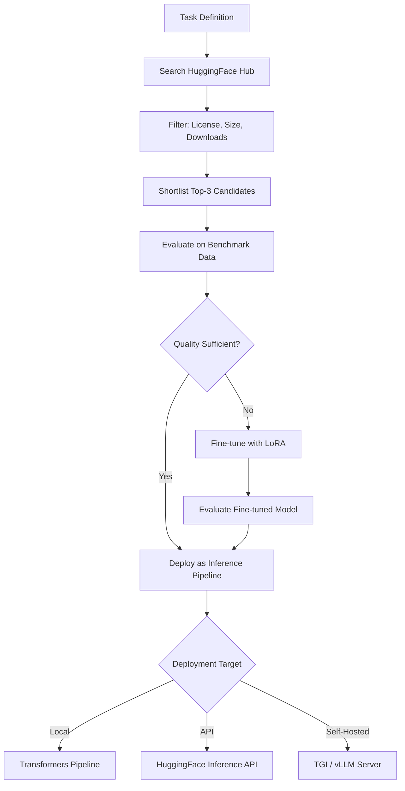

# ML Model Integration

Part of [Agent Skills™](https://github.com/itallstartedwithaidea/agent-skills) by [googleadsagent.ai™](https://googleadsagent.ai)

## Description

ML Model Integration provides workflows for discovering, evaluating, and deploying machine learning models from HuggingFace Hub. The agent searches the model registry by task type, evaluates candidates on benchmark datasets, configures inference pipelines for local or API-based execution, and orchestrates fine-tuning workflows for domain adaptation.

HuggingFace Hub hosts 500,000+ models across hundreds of task types: text generation, image classification, object detection, speech recognition, translation, summarization, and more. Navigating this landscape requires understanding model architectures, license compatibility, hardware requirements, and benchmark performance. This skill encodes that knowledge, helping the agent select the right model for the right task at the right cost.

The skill covers the complete model lifecycle: discovery (searching by task, filtering by license and size), evaluation (running inference on test data, measuring latency and quality), deployment (local Transformers pipeline, HuggingFace Inference API, or self-hosted with TGI/vLLM), and fine-tuning (LoRA adapters for domain-specific customization with minimal training data).

## Use When

- Selecting a model for a specific ML task (classification, generation, detection)
- Setting up inference pipelines locally or via API
- Fine-tuning a pre-trained model on domain-specific data
- Evaluating model quality against custom benchmarks
- Deploying models to production with optimized serving
- The user asks about HuggingFace, Transformers, or model selection

## How It Works



The workflow starts with task definition, not model selection. The agent searches for models matching the task, evaluates candidates, and only resorts to fine-tuning if off-the-shelf performance is insufficient.

## Implementation

```python
from transformers import pipeline, AutoModelForSequenceClassification, AutoTokenizer
from huggingface_hub import HfApi, ModelFilter
from peft import LoraConfig, get_peft_model, TaskType
import torch

def discover_models(task: str, min_downloads: int = 1000, license: str = "apache-2.0") -> list[dict]:
    api = HfApi()
    models = api.list_models(
        filter=ModelFilter(task=task, library="transformers"),
        sort="downloads",
        direction=-1,
        limit=20,
    )
    results = []
    for m in models:
        if m.downloads >= min_downloads:
            results.append({
                "id": m.modelId,
                "downloads": m.downloads,
                "likes": m.likes,
                "tags": m.tags,
                "pipeline_tag": m.pipeline_tag,
            })
    return results[:10]

def setup_inference(model_id: str, task: str, device: str = "auto") -> pipeline:
    return pipeline(
        task=task,
        model=model_id,
        device_map=device,
        torch_dtype=torch.float16,
    )

def evaluate_model(pipe, test_data: list[dict], label_key: str = "label") -> dict:
    correct = 0
    total = len(test_data)
    latencies = []

    for item in test_data:
        import time
        start = time.time()
        pred = pipe(item["text"])
        latencies.append((time.time() - start) * 1000)

        if pred[0]["label"] == item[label_key]:
            correct += 1

    return {
        "accuracy": correct / total,
        "avg_latency_ms": sum(latencies) / len(latencies),
        "p95_latency_ms": sorted(latencies)[int(0.95 * len(latencies))],
        "total_samples": total,
    }

def finetune_lora(
    base_model: str,
    train_dataset,
    output_dir: str,
    num_epochs: int = 3,
    lora_rank: int = 16,
):
    model = AutoModelForSequenceClassification.from_pretrained(base_model)
    tokenizer = AutoTokenizer.from_pretrained(base_model)

    lora_config = LoraConfig(
        task_type=TaskType.SEQ_CLS,
        r=lora_rank,
        lora_alpha=32,
        lora_dropout=0.1,
        target_modules=["q_proj", "v_proj"],
    )
    model = get_peft_model(model, lora_config)
    trainable = sum(p.numel() for p in model.parameters() if p.requires_grad)
    total = sum(p.numel() for p in model.parameters())
    print(f"Trainable: {trainable:,} / {total:,} ({100 * trainable / total:.1f}%)")

    from transformers import Trainer, TrainingArguments
    args = TrainingArguments(
        output_dir=output_dir,
        num_train_epochs=num_epochs,
        per_device_train_batch_size=8,
        learning_rate=2e-4,
        save_strategy="epoch",
        logging_steps=50,
        fp16=True,
    )
    trainer = Trainer(model=model, args=args, train_dataset=train_dataset, tokenizer=tokenizer)
    trainer.train()
    model.save_pretrained(output_dir)
```

## Best Practices

- Always define the task before searching for models—do not pick a model and find a task for it
- Filter by license compatibility (Apache-2.0, MIT) before evaluating performance
- Evaluate on your own data, not just published benchmarks—domain matters
- Use LoRA for fine-tuning to reduce training cost by 90% versus full fine-tuning
- Quantize models (GPTQ, AWQ, bitsandbytes) for inference on consumer hardware
- Pin model revisions by commit hash to ensure reproducible inference

## Platform Compatibility

| Platform | Support | Notes |
|----------|---------|-------|
| Cursor | Full | Python + Transformers |
| VS Code | Full | Jupyter + ML tooling |
| Windsurf | Full | ML workflow support |
| Claude Code | Full | Pipeline script generation |
| Cline | Full | Model integration |
| aider | Partial | Code generation only |

## Related Skills

- [Programmatic Video](../programmatic-video/)
- [Web Asset Generation](../web-asset-generation/)
- [React Best Practices](../../web-frontend/react-best-practices/)
- [Batch Processing](../../productivity/batch-processing/)

## Keywords

`huggingface` `transformers` `model-selection` `inference-pipeline` `fine-tuning` `lora` `model-evaluation` `ml-deployment`

---

© 2026 googleadsagent.ai™ | Agent Skills™ | MIT License
