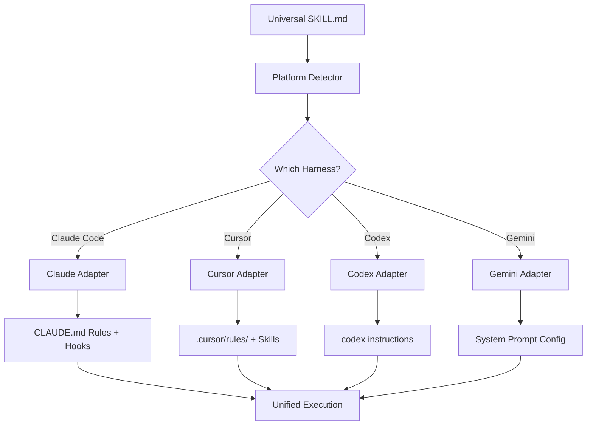

# Multi-Harness Portability

Part of [Agent Skills™](https://github.com/itallstartedwithaidea/agent-skills) by [googleadsagent.ai™](https://googleadsagent.ai)

## Description

Multi-Harness Portability is the engineering discipline of writing agent skills, prompts, and configurations that work across every major AI coding harness — Claude Code, Cursor, Codex, Gemini CLI, OpenCode, and beyond. The AI tooling landscape is fragmenting rapidly: teams use different editors, different CLI tools, different models. Skills that are locked to a single platform become liabilities; skills that are portable become assets that compound in value across the entire organization.

This skill encodes the portability architecture developed for [Agent Skills™](https://github.com/itallstartedwithaidea/agent-skills) by [googleadsagent.ai™](https://googleadsagent.ai), where every skill in the repository is designed to function across all major harnesses. The key insight is that portability is an architectural decision, not an afterthought. It requires abstraction layers that map platform-specific capabilities (hooks, rules, instructions, system prompts) to a universal skill interface, with platform-specific adapters handling the translation.

The portability layer handles three categories of platform differences: skill loading (how the skill enters the agent's context), tool access (what tools are available and how they're invoked), and output formatting (how the agent delivers results). Each category requires its own adapter pattern, and the combination provides true write-once-run-anywhere agent skills.

## Use When

- Your team uses multiple AI coding tools (Claude Code, Cursor, Codex, etc.)
- You want to maintain a single skill repository that serves all platforms
- Skills developed for one platform need to be ported to others
- You are building an open-source skill library for the community
- CI/CD pipelines need to validate skills across multiple platforms
- Organization policy requires platform-agnostic tooling

## How It Works



The portability layer sits between the universal skill definition (SKILL.md) and the platform-specific loading mechanism. A platform detector identifies the current execution environment. Platform adapters translate the universal skill format into the native configuration of each harness: Claude Code uses CLAUDE.md and hooks, Cursor uses `.cursor/rules/` and SKILL.md files, Codex uses instruction files, and Gemini uses system prompt configuration. The unified execution layer ensures that regardless of the loading path, the agent receives equivalent instructions and constraints.

## Implementation

**Platform Detection:**

```bash
#!/bin/bash
detect_platform() {
  if [ -n "$CLAUDE_CODE" ] || [ -f "CLAUDE.md" ]; then
    echo "claude-code"
  elif [ -d ".cursor" ] || [ -n "$CURSOR_SESSION" ]; then
    echo "cursor"
  elif [ -n "$CODEX_SESSION" ] || [ -f ".codex/instructions.md" ]; then
    echo "codex"
  elif [ -n "$GEMINI_CLI" ]; then
    echo "gemini"
  else
    echo "generic"
  fi
}
```

**Universal Skill Installer:**

```python
import os
import shutil
from pathlib import Path

class SkillInstaller:
    PLATFORM_CONFIGS = {
        "claude-code": {
            "skill_dir": ".",
            "rules_file": "CLAUDE.md",
            "hooks_dir": ".claude/hooks",
            "format": "markdown_rules",
        },
        "cursor": {
            "skill_dir": ".cursor/skills",
            "rules_file": ".cursor/rules/{name}.md",
            "hooks_dir": None,
            "format": "skill_md",
        },
        "codex": {
            "skill_dir": ".codex",
            "rules_file": ".codex/instructions.md",
            "hooks_dir": None,
            "format": "instructions",
        },
        "gemini": {
            "skill_dir": ".gemini",
            "rules_file": ".gemini/system_prompt.md",
            "hooks_dir": None,
            "format": "system_prompt",
        },
    }

    def install(self, skill_path: str, platform: str, project_root: str):
        config = self.PLATFORM_CONFIGS[platform]
        skill = self.parse_skill(skill_path)

        if config["format"] == "markdown_rules":
            self.install_claude_code(skill, config, project_root)
        elif config["format"] == "skill_md":
            self.install_cursor(skill, config, project_root)
        elif config["format"] == "instructions":
            self.install_codex(skill, config, project_root)
        elif config["format"] == "system_prompt":
            self.install_gemini(skill, config, project_root)

    def install_cursor(self, skill, config, root):
        skill_dir = Path(root) / config["skill_dir"] / skill["name"]
        skill_dir.mkdir(parents=True, exist_ok=True)
        (skill_dir / "SKILL.md").write_text(skill["content"])

    def install_claude_code(self, skill, config, root):
        claude_md = Path(root) / config["rules_file"]
        existing = claude_md.read_text() if claude_md.exists() else ""
        section = f"\n\n## Skill: {skill['name']}\n\n{skill['instructions']}\n"
        if skill["name"] not in existing:
            claude_md.write_text(existing + section)

    def parse_skill(self, path: str) -> dict:
        content = Path(path).read_text()
        name = content.split("\n")[0].replace("# ", "").strip()
        return {"name": name, "content": content, "instructions": self.extract_instructions(content)}

    def extract_instructions(self, content: str) -> str:
        sections = content.split("\n## ")
        for section in sections:
            if section.startswith("Use When") or section.startswith("Best Practices"):
                return section
        return content[:2000]
```

**Cross-Platform Skill Testing:**

```yaml
# .github/workflows/skill-test.yml
name: Skill Portability Test
on: [push, pull_request]

jobs:
  test-skills:
    strategy:
      matrix:
        platform: [claude-code, cursor, codex, gemini]
    runs-on: ubuntu-latest
    steps:
      - uses: actions/checkout@v4
      - name: Install skill for ${{ matrix.platform }}
        run: |
          python scripts/install_skill.py \
            --skill skills/claude-mythos/context-engineering/SKILL.md \
            --platform ${{ matrix.platform }} \
            --root ./test-project
      - name: Validate installation
        run: |
          python scripts/validate_installation.py \
            --platform ${{ matrix.platform }} \
            --root ./test-project
      - name: Run platform-specific checks
        run: |
          python scripts/platform_checks.py \
            --platform ${{ matrix.platform }} \
            --root ./test-project
```

**Portable Skill Template:**

```markdown
# {Skill Name}

Part of [Agent Skills™](https://github.com/itallstartedwithaidea/agent-skills)

<!-- PORTABLE: This skill is designed for cross-platform compatibility -->
<!-- PLATFORMS: claude-code, cursor, codex, gemini -->

## Description
{Platform-agnostic description using no platform-specific terminology}

## Use When
{Conditions that apply regardless of platform}

## Implementation
{Code examples using standard libraries, no platform-specific APIs}

## Platform Notes
| Platform | Loading | Notes |
|---|---|---|
| Claude Code | CLAUDE.md / hooks | {specific guidance} |
| Cursor | .cursor/skills/ | {specific guidance} |
| Codex | instructions.md | {specific guidance} |
| Gemini | system_prompt | {specific guidance} |
```

## Best Practices

1. **Write platform-agnostic instructions first** — the core skill logic should use no platform-specific terminology; platform adapters handle translation.
2. **Test on at least two platforms** — portability bugs are only caught by actually running the skill on multiple platforms; CI validation is essential.
3. **Use the SKILL.md format as the universal source** — it is the most widely supported format; all other formats are derived from it.
4. **Document platform-specific limitations** — if a feature requires hooks (Claude Code only) or extensions (Cursor only), document it clearly in the compatibility table.
5. **Avoid tool-specific assumptions** — not all platforms have the same tools; use capability detection rather than assuming tool availability.
6. **Version your adapter layer** — as platforms evolve their skill loading mechanisms, adapters need updates; version them independently from skill content.
7. **Provide fallback instructions** — if a platform doesn't support a feature natively, provide manual instructions the user can follow.

## Platform Compatibility

| Feature | Claude Code | Cursor | Codex | Gemini CLI |
|---|---|---|---|---|
| SKILL.md loading | ✅ Via CLAUDE.md | ✅ Native | ⚠️ Via instructions | ⚠️ Via system prompt |
| Automated installation | ✅ Hooks | ✅ Skills | ✅ CLI | ✅ Config |
| Cross-platform CI | ✅ Full | ✅ Full | ✅ Full | ✅ Full |
| Adapter layer | ✅ Full | ✅ Full | ✅ Full | ✅ Full |
| Hot-reload | ✅ File watch | ✅ Native | ❌ Restart needed | ❌ Restart needed |

## Related Skills

- [Prompt Architecture](../prompt-architecture/) - Platform-agnostic prompt layering that forms the portable core adapted by harness-specific loaders
- [Anthropic Tool Mastery](../anthropic-tool-mastery/) - Tool orchestration patterns that must be adapted across platform-specific tool interfaces
- [Context Engineering](../context-engineering/) - Context management techniques that apply universally but require platform-specific token budget tuning

## Keywords

multi-harness, portability, cross-platform, write-once-run-anywhere, platform-adapter, skill-installation, claude-code, cursor, codex, gemini, agent-skills

---

© 2026 [googleadsagent.ai™](https://googleadsagent.ai) | [Agent Skills™](https://github.com/itallstartedwithaidea/agent-skills) | MIT License
