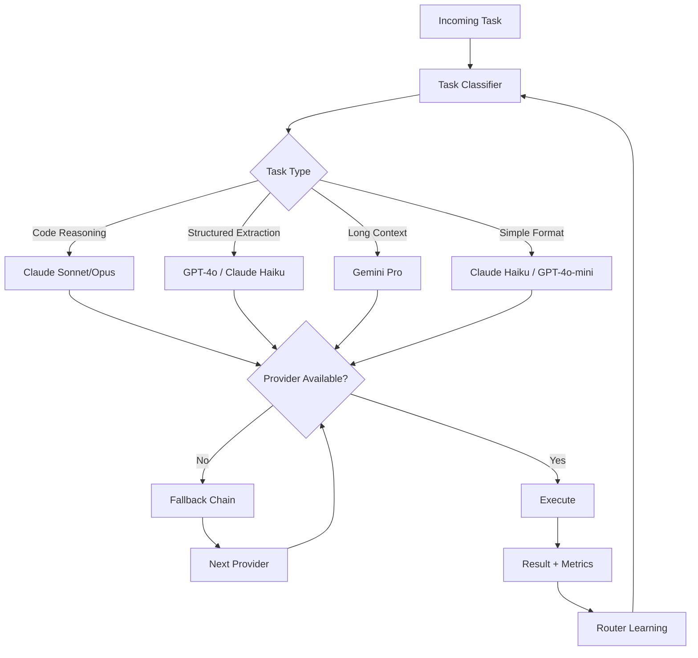

# Multi-Model Routing

Part of [Agent Skills™](https://github.com/itallstartedwithaidea/agent-skills) by [googleadsagent.ai™](https://googleadsagent.ai)

## Description

Multi-Model Routing is the intelligent dispatch of agent tasks to the optimal model provider based on task characteristics, cost constraints, latency requirements, and availability. Production AI systems that rely on a single model provider are fragile and expensive. Multi-Model Routing creates a resilient, cost-efficient agent architecture that leverages the strengths of Claude, GPT, Gemini, and open-source models, automatically selecting the best model for each task and failing over gracefully when a provider is unavailable.

This skill documents the multi-model routing architecture powering the Buddy™ agent at [googleadsagent.ai™](https://googleadsagent.ai), which routes between Claude (primary — strongest reasoning), GPT-4o (secondary — strong function calling), and Gemini (tertiary — large context, low cost) based on task classification. The routing layer reduced costs by 45% compared to using Claude for all tasks while maintaining equivalent quality scores, because many subtasks (formatting, summarization, data extraction) perform identically on cheaper models.

The routing decision incorporates four factors: model strengths (code reasoning, long context, structured output, creative writing), cost per token (varies 100x between model tiers), latency targets (real-time vs. batch), and availability (rate limits, outages, degraded performance). A circuit breaker pattern ensures that temporary provider issues don't cascade into user-facing failures.

## Use When

- Monthly AI costs need reduction without sacrificing quality
- You need resilience against single-provider outages or rate limits
- Different subtasks have fundamentally different model requirements
- Latency-sensitive and latency-tolerant tasks coexist in the same system
- You want to evaluate new models without fully committing to them
- Compliance requires not being locked into a single AI vendor

## How It Works



The routing pipeline classifies each incoming task by type (code reasoning, structured extraction, long context processing, simple formatting), then maps to the optimal model provider. Before dispatch, a circuit breaker checks provider availability — if a provider has failed recently, the task is immediately routed to the fallback chain. After execution, the result quality and performance metrics feed back into the router, allowing it to refine its model-task mapping over time.

## Implementation

**Model Provider Registry:**

```typescript
interface ModelProvider {
  id: string;
  name: string;
  models: ModelConfig[];
  circuitBreaker: CircuitBreakerState;
}

interface ModelConfig {
  id: string;
  strengths: string[];
  costPer1kInput: number;
  costPer1kOutput: number;
  maxContextTokens: number;
  avgLatencyMs: number;
}

const PROVIDERS: ModelProvider[] = [
  {
    id: "anthropic",
    name: "Anthropic",
    models: [
      { id: "claude-opus", strengths: ["reasoning", "code", "analysis"], costPer1kInput: 0.015, costPer1kOutput: 0.075, maxContextTokens: 200000, avgLatencyMs: 3000 },
      { id: "claude-sonnet", strengths: ["reasoning", "code", "balanced"], costPer1kInput: 0.003, costPer1kOutput: 0.015, maxContextTokens: 200000, avgLatencyMs: 1500 },
      { id: "claude-haiku", strengths: ["speed", "extraction", "formatting"], costPer1kInput: 0.00025, costPer1kOutput: 0.00125, maxContextTokens: 200000, avgLatencyMs: 500 },
    ],
    circuitBreaker: { failures: 0, lastFailure: 0, state: "closed" },
  },
  {
    id: "openai",
    name: "OpenAI",
    models: [
      { id: "gpt-4o", strengths: ["function-calling", "structured-output", "general"], costPer1kInput: 0.005, costPer1kOutput: 0.015, maxContextTokens: 128000, avgLatencyMs: 1200 },
      { id: "gpt-4o-mini", strengths: ["speed", "extraction", "formatting"], costPer1kInput: 0.00015, costPer1kOutput: 0.0006, maxContextTokens: 128000, avgLatencyMs: 400 },
    ],
    circuitBreaker: { failures: 0, lastFailure: 0, state: "closed" },
  },
  {
    id: "google",
    name: "Google",
    models: [
      { id: "gemini-pro", strengths: ["long-context", "multimodal", "general"], costPer1kInput: 0.00125, costPer1kOutput: 0.005, maxContextTokens: 1000000, avgLatencyMs: 2000 },
    ],
    circuitBreaker: { failures: 0, lastFailure: 0, state: "closed" },
  },
];
```

**Intelligent Router:**

```python
class MultiModelRouter:
    TASK_MODEL_MAP = {
        "code_reasoning": ["claude-sonnet", "claude-opus", "gpt-4o"],
        "structured_extraction": ["claude-haiku", "gpt-4o-mini", "gpt-4o"],
        "long_context": ["gemini-pro", "claude-sonnet", "gpt-4o"],
        "simple_formatting": ["claude-haiku", "gpt-4o-mini", "gemini-pro"],
        "creative_writing": ["claude-opus", "claude-sonnet", "gpt-4o"],
        "analysis": ["claude-sonnet", "gpt-4o", "gemini-pro"],
    }

    def __init__(self, providers: dict, circuit_breakers: dict):
        self.providers = providers
        self.breakers = circuit_breakers

    def route(self, task_type: str, constraints: dict = None) -> str:
        candidates = self.TASK_MODEL_MAP.get(task_type, ["claude-sonnet"])
        constraints = constraints or {}

        for model_id in candidates:
            provider = self.get_provider(model_id)
            if self.breakers[provider].is_open():
                continue
            if constraints.get("max_cost") and self.estimate_cost(model_id, constraints) > constraints["max_cost"]:
                continue
            if constraints.get("max_latency_ms") and self.avg_latency(model_id) > constraints["max_latency_ms"]:
                continue
            return model_id

        return candidates[0]  # Last resort: try primary anyway

    def estimate_cost(self, model_id: str, constraints: dict) -> float:
        config = self.get_model_config(model_id)
        est_input = constraints.get("estimated_input_tokens", 1000)
        est_output = constraints.get("estimated_output_tokens", 500)
        return (est_input / 1000 * config["costPer1kInput"] +
                est_output / 1000 * config["costPer1kOutput"])
```

**Circuit Breaker:**

```python
class CircuitBreaker:
    def __init__(self, failure_threshold=3, recovery_timeout=60):
        self.failure_threshold = failure_threshold
        self.recovery_timeout = recovery_timeout
        self.failures = 0
        self.last_failure = 0
        self.state = "closed"

    def record_success(self):
        self.failures = 0
        self.state = "closed"

    def record_failure(self):
        self.failures += 1
        self.last_failure = time.time()
        if self.failures >= self.failure_threshold:
            self.state = "open"

    def is_open(self) -> bool:
        if self.state == "open":
            if time.time() - self.last_failure > self.recovery_timeout:
                self.state = "half-open"
                return False
            return True
        return False
```

**Unified Execution Interface:**

```python
class UnifiedModelClient:
    def __init__(self, router: MultiModelRouter, clients: dict):
        self.router = router
        self.clients = clients

    async def generate(self, task_type: str, messages: list, **kwargs) -> dict:
        model_id = self.router.route(task_type, kwargs.get("constraints"))
        client = self.clients[self.router.get_provider(model_id)]

        try:
            result = await client.generate(model=model_id, messages=messages, **kwargs)
            self.router.breakers[self.router.get_provider(model_id)].record_success()
            return {"result": result, "model": model_id, "provider": self.router.get_provider(model_id)}
        except Exception as e:
            self.router.breakers[self.router.get_provider(model_id)].record_failure()
            fallback_model = self.router.route(task_type, {**kwargs.get("constraints", {}), "exclude": [model_id]})
            fallback_client = self.clients[self.router.get_provider(fallback_model)]
            result = await fallback_client.generate(model=fallback_model, messages=messages, **kwargs)
            return {"result": result, "model": fallback_model, "fallback": True}
```

## Best Practices

1. **Map model strengths empirically** — benchmark each model on your specific task types; published benchmarks rarely reflect domain-specific performance.
2. **Implement circuit breakers per provider** — don't let one provider's outage cascade into retry storms; fail fast and fall over to alternatives.
3. **Track cost per successful task** — raw token costs are misleading; measure total cost including retries, fallbacks, and failed attempts.
4. **Use the cheapest model that meets quality thresholds** — for many tasks, a Haiku-class model produces identical results to an Opus-class model at 1/60th the cost.
5. **Normalize message formats across providers** — maintain a unified message format internally and translate to provider-specific formats at the adapter layer.
6. **Log routing decisions for analysis** — every routing decision should be logged with the task type, selected model, constraints, and outcome for continuous router optimization.
7. **Review fallback chains quarterly** — model capabilities, pricing, and availability change frequently; update your provider registry and routing maps accordingly.

## Platform Compatibility

| Feature | Claude Code | Cursor | Codex | Gemini CLI |
|---|---|---|---|---|
| Multi-model selection | ✅ --model flag | ✅ Model picker | ⚠️ OpenAI only | ⚠️ Google only |
| Programmatic routing | ✅ Via MCP/API | ✅ Via extensions | ✅ Via API | ✅ Via API |
| Circuit breaker | ✅ Custom | ✅ Custom | ✅ Custom | ✅ Custom |
| Cost tracking | ✅ Custom | ✅ Custom | ✅ Custom | ✅ Custom |
| Fallback chains | ✅ Custom | ✅ Custom | ✅ Custom | ✅ Custom |

## Related Skills

- [Token Optimization](../token-optimization/) - Model routing is the highest-leverage token cost optimization technique
- [Parallel Agent Orchestration](../parallel-agent-orchestration/) - Parallel subagents benefit from uniform model selection for consistent quality
- [MCP Server Creation](../mcp-server-creation/) - Model routing logic integrates into MCP server tool execution pipelines
- [Budget Optimization](../../google-ads/budget-optimization/) - Portfolio optimization principles parallel the model cost-quality tradeoff

## Keywords

multi-model-routing, model-selection, cost-optimization, circuit-breaker, fallback-chains, provider-resilience, task-classification, latency-routing, load-balancing, agent-skills

---

© 2026 [googleadsagent.ai™](https://googleadsagent.ai) | [Agent Skills™](https://github.com/itallstartedwithaidea/agent-skills) | MIT License
