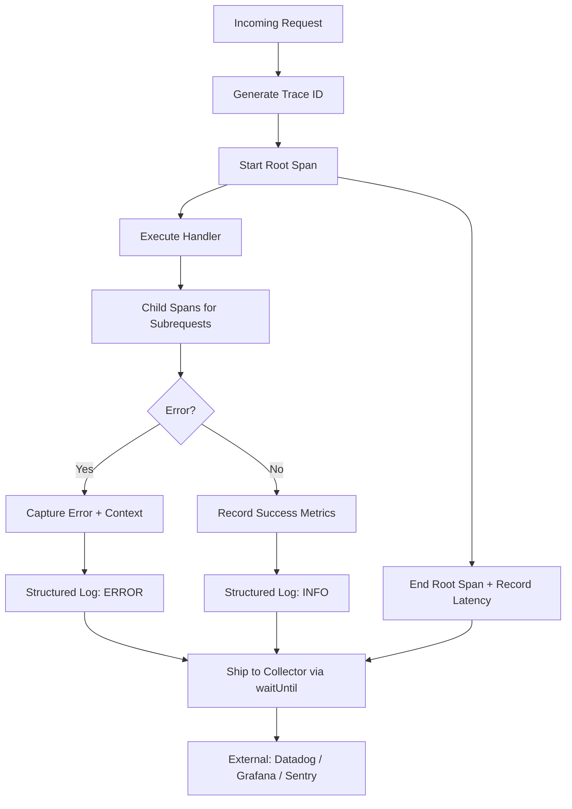

# Observability

Part of [Agent Skills™](https://github.com/itallstartedwithaidea/agent-skills) by [googleadsagent.ai™](https://googleadsagent.ai)

## Description

Observability implements structured logging, distributed tracing, and error monitoring for Cloudflare Workers and edge applications. The agent instruments code with contextual log entries, trace spans, error boundaries, and alerting rules that provide full visibility into production behavior without sacrificing performance.

Workers present unique observability challenges. There are no persistent processes to attach profilers to, no filesystem for log files, and no APM agent to inject. Observability must be built into the application layer through structured log events shipped to external collectors, request-scoped trace contexts, and explicit error capture with stack traces and request metadata.

This skill covers three pillars: **Logging** (structured JSON events with correlation IDs), **Tracing** (request-scoped spans with timing and metadata), and **Monitoring** (error rate tracking, latency percentiles, and alerting thresholds). Together, they answer the three questions of production debugging: what happened, how long did it take, and how often does it fail.

## Use When

- Adding logging to Workers or edge applications
- Debugging production issues with distributed request tracing
- Setting up error monitoring and alerting
- Implementing health check endpoints
- Measuring and reporting latency percentiles
- Building dashboards for operational visibility

## How It Works



Every request receives a trace ID that propagates through all subrequests and log entries. Spans measure duration of individual operations. Logs and spans are batched and shipped asynchronously via `waitUntil()` to avoid adding latency to the response.

## Implementation

```typescript
interface LogEntry {
  timestamp: string;
  level: "debug" | "info" | "warn" | "error";
  traceId: string;
  spanId: string;
  message: string;
  data?: Record<string, unknown>;
  error?: { name: string; message: string; stack?: string };
  duration_ms?: number;
}

class RequestTracer {
  private traceId: string;
  private spans: LogEntry[] = [];
  private startTime: number;

  constructor(request: Request) {
    this.traceId = request.headers.get("x-trace-id") ?? crypto.randomUUID();
    this.startTime = performance.now();
  }

  span<T>(name: string, fn: () => Promise<T>): Promise<T> {
    const spanId = crypto.randomUUID().slice(0, 8);
    const start = performance.now();
    return fn().then(
      result => {
        this.log("info", name, { duration_ms: performance.now() - start }, spanId);
        return result;
      },
      error => {
        this.log("error", name, {
          duration_ms: performance.now() - start,
          error: { name: error.name, message: error.message, stack: error.stack },
        }, spanId);
        throw error;
      }
    );
  }

  log(level: LogEntry["level"], message: string, data?: Record<string, unknown>, spanId?: string): void {
    this.spans.push({
      timestamp: new Date().toISOString(),
      level,
      traceId: this.traceId,
      spanId: spanId ?? "root",
      message,
      ...data,
    });
  }

  async flush(env: { LOG_COLLECTOR: Fetcher }): Promise<void> {
    const rootDuration = performance.now() - this.startTime;
    this.log("info", "request_complete", { duration_ms: rootDuration });

    await env.LOG_COLLECTOR.fetch("https://collector/ingest", {
      method: "POST",
      body: JSON.stringify(this.spans),
      headers: { "Content-Type": "application/json" },
    });
  }
}

export default {
  async fetch(request: Request, env: Env, ctx: ExecutionContext): Promise<Response> {
    const tracer = new RequestTracer(request);
    try {
      const data = await tracer.span("fetch_data", () => fetchData(env));
      const html = await tracer.span("render", () => render(data));
      return new Response(html, { status: 200 });
    } catch (error) {
      tracer.log("error", "unhandled_error", {
        error: { name: (error as Error).name, message: (error as Error).message },
        url: request.url,
        method: request.method,
      });
      return new Response("Internal Error", { status: 500 });
    } finally {
      ctx.waitUntil(tracer.flush(env));
    }
  },
} satisfies ExportedHandler<Env>;
```

## Best Practices

- Ship logs asynchronously via `waitUntil()` to avoid adding latency to responses
- Include trace IDs in all error responses so users can report them for debugging
- Use structured JSON logging—never unstructured `console.log` in production
- Set alerting thresholds on error rate (>1%) and p99 latency (>500ms)
- Sample debug-level logs in production (1-10%) to control volume and cost
- Propagate trace IDs across service boundaries via the `x-trace-id` header

## Platform Compatibility

| Platform | Support | Notes |
|----------|---------|-------|
| Cursor | Full | Instrumentation code generation |
| VS Code | Full | Log viewer integration |
| Windsurf | Full | Observability patterns |
| Claude Code | Full | Worker instrumentation |
| Cline | Full | Logging + tracing setup |
| aider | Partial | Code-level instrumentation |

## Related Skills

- [Cloudflare Workers](../cloudflare-workers/)
- [CI/CD Pipelines](../ci-cd-pipelines/)
- [Service Discovery](../service-discovery/)
- [Agent Security Scanning](../../security/agent-security-scanning/)

## Keywords

`observability` `structured-logging` `distributed-tracing` `error-monitoring` `cloudflare-workers` `alerting` `latency` `trace-id`

---

© 2026 googleadsagent.ai™ | Agent Skills™ | MIT License
