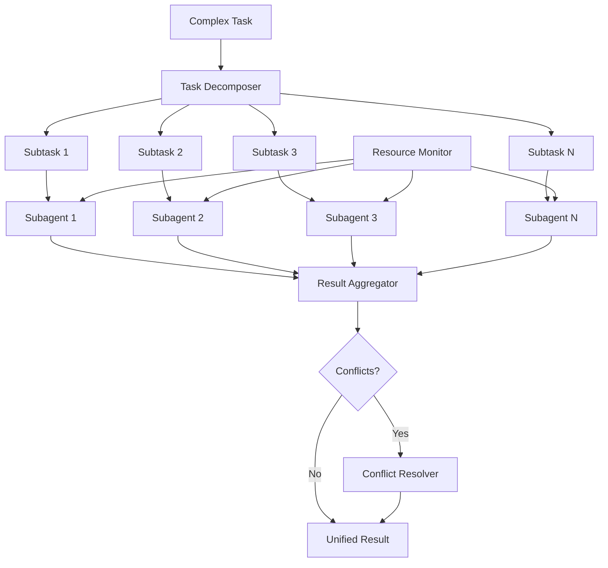

# Parallel Agent Orchestration

Part of [Agent Skills™](https://github.com/itallstartedwithaidea/agent-skills) by [googleadsagent.ai™](https://googleadsagent.ai)

## Description

Parallel Agent Orchestration is the discipline of dispatching, coordinating, and aggregating results from multiple concurrent subagents to dramatically accelerate complex tasks. Sequential single-agent execution is the default mode for most AI workflows, but it leaves enormous performance on the table. When a task can be decomposed into independent subtasks — analyzing multiple campaigns, reviewing multiple files, searching multiple data sources — parallel dispatch can reduce wall-clock time by 3-10x while maintaining result quality.

This skill encodes the subagent orchestration patterns developed for the Superpowers extension ecosystem and deployed in production at [googleadsagent.ai™](https://googleadsagent.ai), where Buddy™ routinely dispatches parallel subagents to analyze different aspects of a Google Ads account simultaneously. One subagent analyzes bidding strategy, another evaluates keyword performance, a third assesses creative quality — all running concurrently. The orchestrator then aggregates their findings into a unified recommendation set, resolving any conflicts between the independent analyses.

The key challenges in parallel orchestration are task partitioning (decomposing the work into truly independent units), result aggregation (combining outputs that may conflict or overlap), resource management (respecting rate limits and cost budgets across parallel agents), and progress monitoring (tracking multiple concurrent streams without losing visibility).

## Use When

- A task naturally decomposes into 3+ independent subtasks
- Wall-clock time is a critical constraint (user waiting, SLA requirements)
- Multiple data sources or documents need analysis simultaneously
- Code review spans many files that can be reviewed independently
- Batch operations (migrations, refactoring) across multiple files or services
- You need diverse perspectives on the same problem (ensemble reasoning)

## How It Works



The orchestrator receives a complex task and decomposes it into independent subtasks using a task decomposer (either rule-based for well-known patterns or model-assisted for novel tasks). Each subtask is dispatched to a subagent that executes independently, with a resource monitor enforcing shared rate limits and budget constraints. As subagents complete, their results flow to the aggregator, which merges outputs and detects conflicts. Conflicting results (e.g., subagent 1 recommends increasing bids while subagent 2 recommends decreasing them) are resolved by a conflict resolver that applies domain rules or escalates to the orchestrating agent for judgment.

## Implementation

**Task Decomposer:**

```typescript
interface SubTask {
  id: string;
  description: string;
  context: Record<string, unknown>;
  dependencies: string[];
  priority: number;
}

class TaskDecomposer {
  decompose(task: string, context: Record<string, unknown>): SubTask[] {
    const patterns: Record<string, (ctx: Record<string, unknown>) => SubTask[]> = {
      account_audit: (ctx) => {
        const campaigns = ctx.campaigns as string[];
        return campaigns.map((campaign, i) => ({
          id: `campaign_${i}`,
          description: `Analyze campaign: ${campaign}`,
          context: { campaign, metrics: ctx.metrics },
          dependencies: [],
          priority: 1,
        }));
      },
      code_review: (ctx) => {
        const files = ctx.changedFiles as string[];
        return files.map((file, i) => ({
          id: `review_${i}`,
          description: `Review changes in ${file}`,
          context: { file, diff: ctx.diffs?.[file] },
          dependencies: [],
          priority: file.includes("test") ? 2 : 1,
        }));
      },
    };

    const taskType = this.classifyTask(task);
    const decomposer = patterns[taskType];
    return decomposer ? decomposer(context) : [{ id: "single", description: task, context, dependencies: [], priority: 1 }];
  }

  private classifyTask(task: string): string {
    if (task.includes("audit") || task.includes("account")) return "account_audit";
    if (task.includes("review") || task.includes("PR")) return "code_review";
    return "generic";
  }
}
```

**Parallel Orchestrator:**

```python
import asyncio

class ParallelOrchestrator:
    def __init__(self, max_concurrency=5, budget_limit=None):
        self.semaphore = asyncio.Semaphore(max_concurrency)
        self.budget_limit = budget_limit
        self.total_tokens = 0
        self.results = {}

    async def execute(self, subtasks: list[dict], agent_factory) -> dict:
        dependency_graph = self.build_dependency_graph(subtasks)
        ready = [t for t in subtasks if not t["dependencies"]]
        pending = [t for t in subtasks if t["dependencies"]]

        while ready or pending:
            batch_results = await asyncio.gather(*[
                self.run_subtask(task, agent_factory) for task in ready
            ], return_exceptions=True)

            for task, result in zip(ready, batch_results):
                if isinstance(result, Exception):
                    self.results[task["id"]] = {"success": False, "error": str(result)}
                else:
                    self.results[task["id"]] = {"success": True, "result": result}

            completed_ids = set(self.results.keys())
            ready = [t for t in pending if all(d in completed_ids for d in t["dependencies"])]
            pending = [t for t in pending if t not in ready]

        return self.results

    async def run_subtask(self, task: dict, agent_factory):
        async with self.semaphore:
            if self.budget_limit and self.total_tokens >= self.budget_limit:
                raise BudgetExceededError(f"Token budget {self.budget_limit} exceeded")
            agent = agent_factory(task)
            result = await agent.execute(task["description"], task["context"])
            self.total_tokens += result.get("tokens_used", 0)
            return result

    def build_dependency_graph(self, subtasks):
        return {t["id"]: t["dependencies"] for t in subtasks}
```

**Result Aggregator with Conflict Resolution:**

```python
class ResultAggregator:
    def aggregate(self, results: dict, strategy: str = "merge") -> dict:
        successful = {k: v for k, v in results.items() if v["success"]}
        failed = {k: v for k, v in results.items() if not v["success"]}

        if strategy == "merge":
            merged = self.merge_results(successful)
        elif strategy == "vote":
            merged = self.majority_vote(successful)
        else:
            merged = self.concatenate_results(successful)

        conflicts = self.detect_conflicts(successful)
        if conflicts:
            merged = self.resolve_conflicts(merged, conflicts)

        return {
            "aggregated_result": merged,
            "subtask_count": len(results),
            "success_count": len(successful),
            "failure_count": len(failed),
            "conflicts_resolved": len(conflicts),
            "failed_tasks": list(failed.keys()),
        }

    def detect_conflicts(self, results: dict) -> list[dict]:
        conflicts = []
        recommendations = {}
        for task_id, result in results.items():
            for rec in result.get("result", {}).get("recommendations", []):
                key = rec.get("target")
                if key in recommendations:
                    if recommendations[key]["action"] != rec["action"]:
                        conflicts.append({
                            "target": key,
                            "conflict": [recommendations[key], rec],
                            "tasks": [recommendations[key]["source"], task_id],
                        })
                recommendations[key] = {**rec, "source": task_id}
        return conflicts

    def resolve_conflicts(self, merged: dict, conflicts: list) -> dict:
        for conflict in conflicts:
            higher_confidence = max(conflict["conflict"], key=lambda c: c.get("confidence", 0))
            merged["recommendations"] = [
                r for r in merged.get("recommendations", [])
                if r.get("target") != conflict["target"]
            ]
            merged["recommendations"].append(higher_confidence)
            merged.setdefault("conflict_notes", []).append(
                f"Conflict on {conflict['target']}: chose {higher_confidence['action']} (confidence: {higher_confidence.get('confidence', 'N/A')})"
            )
        return merged
```

## Best Practices

1. **Only parallelize truly independent tasks** — subtasks that share mutable state or depend on each other's outputs must be sequenced, not parallelized.
2. **Enforce concurrency limits** — unbounded parallelism hits rate limits and inflates costs; cap at 3-5 concurrent subagents for most use cases.
3. **Set per-subtask and total budgets** — prevent runaway costs by limiting tokens per subagent and total tokens across the orchestration.
4. **Handle partial failures gracefully** — if 8 of 10 subagents succeed, aggregate the 8 results rather than failing the entire orchestration.
5. **Detect and resolve conflicts explicitly** — when subagents produce contradictory recommendations, surface the conflict and apply a resolution strategy (confidence-based, majority vote, or escalation).
6. **Monitor progress in real-time** — provide a dashboard or status updates showing which subagents are running, completed, or failed.
7. **Use the same model tier for parallel subtasks** — mixing model tiers within a parallel batch produces inconsistent quality; use a uniform model for comparable results.

## Platform Compatibility

| Feature | Claude Code | Cursor | Codex | Gemini CLI |
|---|---|---|---|---|
| Subagent dispatch | ✅ Native subagents | ✅ Task tool | ✅ Async tasks | ✅ Async tasks |
| Parallel execution | ✅ Full | ✅ Full | ✅ Full | ✅ Full |
| Concurrency control | ✅ Custom | ✅ Custom | ✅ Custom | ✅ Custom |
| Result aggregation | ✅ Full | ✅ Full | ✅ Full | ✅ Full |
| Progress monitoring | ✅ Status updates | ✅ Background tasks | ✅ Custom | ✅ Custom |

## Mythos Preview Reference

Anthropic’s [Mythos Preview](https://red.anthropic.com/2026/mythos-preview/) workload scales by running **many Claude instances in parallel**, each **focused on a different file** so parallel runs explore distinct surface area instead of rediscovering the same issue. Results are then **aggregated and de-duplicated** downstream (including validation passes).

For orchestration, treat **file (or module) boundaries** as natural sharding keys, cap concurrency to respect budgets, and standardize an **aggregation contract** so partial outputs merge cleanly. Source: [Mythos Preview](https://red.anthropic.com/2026/mythos-preview/).

## Related Skills

- [Long-Horizon Workflows](../long-horizon-workflows/) - Parallel dispatch accelerates individual phases within multi-phase workflows
- [Multi-Model Routing](../multi-model-routing/) - Optimal model selection for parallel subagents balances cost and quality
- [Token Optimization](../token-optimization/) - Per-subtask and total budget limits prevent runaway costs in parallel execution
- [Google Ads Audit](../../google-ads/google-ads-audit/) - Multi-campaign audit analysis is a canonical parallel orchestration use case

## Keywords

parallel-orchestration, subagents, task-decomposition, result-aggregation, conflict-resolution, concurrency, resource-management, batch-processing, ensemble-reasoning, agent-skills

---

© 2026 [googleadsagent.ai™](https://googleadsagent.ai) | [Agent Skills™](https://github.com/itallstartedwithaidea/agent-skills) | MIT License
