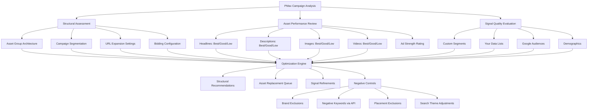

# Performance Max Optimization

Part of [Agent Skills™](https://github.com/itallstartedwithaidea/agent-skills) by [googleadsagent.ai™](https://googleadsagent.ai)

## Description

The Performance Max Optimization skill provides expert-level management of Google's most automated campaign type. Performance Max (PMax) campaigns serve across all Google inventory — Search, Display, YouTube, Discover, Gmail, and Maps — using AI-driven targeting. While Google automates much of the delivery, the advertiser's strategic inputs dramatically influence performance: asset quality, audience signals, URL strategies, search themes, and campaign structure determine whether PMax delivers efficient growth or wasteful spend.

This skill addresses the core challenge of PMax: optimizing a black-box system. It establishes structural best practices (asset group architecture mapped to product lines or audience segments), configures audience signals that accelerate machine learning without constraining reach, manages URL expansion settings to balance automation with brand safety, and leverages the search themes feature to influence where PMax appears on Search.

Critical to PMax success is asset performance management. The skill monitors asset performance ratings (Best, Good, Low, combinations available), identifies underperforming creative elements, and generates replacement assets. It also manages the often-overlooked negative controls: brand exclusions to prevent cannibalization of branded search campaigns, negative keywords (available via API or Google rep), and placement exclusions to maintain brand safety on Display and YouTube inventory.

## Use When

- User asks about "Performance Max" or "PMax" campaigns
- User wants to "optimize PMax" or "improve PMax performance"
- User mentions "asset groups" or "asset performance"
- User asks about "audience signals" for PMax
- User mentions "URL expansion" or "final URL" settings
- User wants to "add search themes" to PMax
- User asks about "PMax cannibalization" of Search campaigns
- User mentions "PMax negative keywords" or "brand exclusions"
- User wants to "structure PMax campaigns" or "create asset groups"

## Architecture



## Implementation

PMax campaign assessment and optimization engine:

```javascript
async function optimizePMax(customerId, campaignId) {
  const campaign = await getPMaxCampaignData(customerId, campaignId);
  const assetGroups = await getAssetGroups(customerId, campaignId);
  const audienceSignals = await getAudienceSignals(customerId, campaignId);
  const searchTermInsights = await getSearchTermInsights(customerId, campaignId);

  return {
    structuralAssessment: assessStructure(campaign, assetGroups),
    assetPerformance: analyzeAssets(assetGroups),
    signalQuality: evaluateSignals(audienceSignals),
    searchAnalysis: analyzeSearchTerms(searchTermInsights),
    recommendations: generateRecommendations(campaign, assetGroups, audienceSignals),
    negativeControls: reviewNegativeControls(campaign)
  };
}

function assessStructure(campaign, assetGroups) {
  const issues = [];

  if (assetGroups.length === 1 && campaign.productCount > 20) {
    issues.push({
      severity: 'high',
      finding: 'Single asset group serving all products',
      recommendation: 'Split into themed asset groups by product category for tailored messaging'
    });
  }

  for (const group of assetGroups) {
    if (group.headlines.length < 5) {
      issues.push({
        severity: 'medium',
        assetGroup: group.name,
        finding: `Only ${group.headlines.length} headlines (minimum 5, recommended 15)`,
        recommendation: 'Add headlines to maximize ad combination options'
      });
    }
    if (!group.videos || group.videos.length === 0) {
      issues.push({
        severity: 'high',
        assetGroup: group.name,
        finding: 'No videos provided — Google will auto-generate low-quality videos',
        recommendation: 'Upload at least one custom video to prevent auto-generation'
      });
    }
    if (group.adStrength !== 'EXCELLENT') {
      issues.push({
        severity: 'medium',
        assetGroup: group.name,
        finding: `Ad strength: ${group.adStrength} (target: Excellent)`,
        recommendation: 'Add more unique, diverse assets to improve ad strength'
      });
    }
  }

  return {
    urlExpansion: campaign.urlExpansionEnabled,
    finalUrlStrategy: campaign.finalUrlStrategy,
    biddingStrategy: campaign.biddingStrategy,
    issues
  };
}

function analyzeAssets(assetGroups) {
  const analysis = [];

  for (const group of assetGroups) {
    const allAssets = [
      ...group.headlines.map(a => ({ ...a, type: 'headline' })),
      ...group.descriptions.map(a => ({ ...a, type: 'description' })),
      ...group.images.map(a => ({ ...a, type: 'image' })),
      ...(group.videos || []).map(a => ({ ...a, type: 'video' }))
    ];

    const lowPerformers = allAssets.filter(a => a.performanceLabel === 'LOW');
    const bestPerformers = allAssets.filter(a => a.performanceLabel === 'BEST');

    analysis.push({
      assetGroup: group.name,
      totalAssets: allAssets.length,
      performanceDistribution: {
        best: bestPerformers.length,
        good: allAssets.filter(a => a.performanceLabel === 'GOOD').length,
        low: lowPerformers.length,
        learning: allAssets.filter(a => a.performanceLabel === 'LEARNING').length
      },
      replacementCandidates: lowPerformers.map(a => ({
        type: a.type,
        content: a.text || a.url,
        performanceLabel: a.performanceLabel,
        action: 'replace_with_new_variant'
      })),
      topPerformers: bestPerformers.map(a => ({
        type: a.type,
        content: a.text || a.url,
        insight: 'Use this as a template for new variants'
      }))
    });
  }

  return analysis;
}
```

Search themes and negative keyword management:

```javascript
function configureSearchThemes(campaign, searchTermInsights) {
  const topConvertingTerms = searchTermInsights
    .filter(t => t.conversions > 0)
    .sort((a, b) => b.conversionValue - a.conversionValue);

  const missingCoverage = searchTermInsights
    .filter(t => t.impressionShare < 0.3 && t.conversions > 0);

  return {
    recommendedThemes: topConvertingTerms.slice(0, 25).map(t => ({
      theme: t.searchTerm,
      rationale: `${t.conversions} conversions, ${formatCurrency(t.conversionValue)} value`,
      searchVolume: t.estimatedVolume
    })),
    expansionOpportunities: missingCoverage.map(t => ({
      theme: t.searchTerm,
      currentImpressionShare: t.impressionShare,
      potentialGain: `Up to ${((1 - t.impressionShare) * t.conversions).toFixed(0)} additional conversions`
    })),
    maxThemes: 25
  };
}

async function manageNegativeKeywords(customerId, campaignId) {
  const searchTerms = await getSearchTermInsights(customerId, campaignId);

  const negatives = searchTerms.filter(term =>
    term.clicks > 5 && term.conversions === 0 && term.cost > 50
  );

  return {
    recommendedNegatives: negatives.map(n => ({
      term: n.searchTerm,
      clicks: n.clicks,
      cost: n.cost,
      matchType: 'EXACT'
    })),
    implementation: {
      method: 'google_ads_api',
      note: 'PMax negative keywords require API access or Google rep assistance',
      apiEndpoint: 'CampaignCriterionService',
      criterionType: 'KEYWORD',
      negativeType: 'campaign_level'
    },
    brandExclusions: {
      enabled: true,
      excludedBrands: [],
      recommendation: 'Exclude own brand if running separate branded Search campaigns'
    }
  };
}
```

## Integration with Buddy™ Agent

Performance Max Optimization is a high-priority skill within Buddy™ Agent because PMax campaigns increasingly dominate Google Ads account spend. Buddy™ monitors PMax asset performance ratings daily, automatically flagging "Low" rated assets and generating replacement suggestions using the Ad Copy Generation skill.

Buddy™ addresses the PMax transparency challenge by correlating search term insights with conversion data, building a clearer picture of where PMax is finding conversions. It detects Search campaign cannibalization by monitoring branded query attribution and recommends brand exclusions when PMax is consuming branded traffic at higher CPCs than dedicated Search campaigns.

The platform manages audience signal lifecycle, refreshing Customer Match lists on schedule and recommending signal updates as conversion patterns shift. For e-commerce accounts, Buddy™ coordinates PMax with the Shopping Ads skill to optimize product feed data that directly impacts PMax Shopping placements.

## Best Practices

1. Create separate asset groups for distinct product categories or audience segments
2. Provide at least 15 headlines, 4 descriptions, 15 images, and 1+ custom videos per asset group
3. Upload custom videos to prevent Google from auto-generating low-quality video assets
4. Add search themes to guide PMax's Search inventory placement toward high-intent queries
5. Enable brand exclusions if running separate branded Search campaigns to prevent cannibalization
6. Review asset performance weekly and replace "Low" rated assets within 2 weeks
7. Start with strong audience signals (Customer Match, remarketing lists) to accelerate learning
8. Disable URL expansion if you need strict control over which landing pages receive traffic
9. Allow 4-6 weeks for PMax to exit the learning phase before making structural changes
10. Monitor search term insights weekly and add negative keywords for irrelevant queries via API

## Platform Compatibility

| Platform | Supported |
|----------|-----------|
| Claude Code | ✅ |
| Cursor | ✅ |
| Codex | ✅ |
| Gemini | ✅ |

## Related Skills

- [Audience Targeting](../audience-targeting/) - Audience signals are critical inputs that accelerate PMax machine learning
- [Shopping Ads](../shopping-ads/) - Product feed quality directly impacts PMax Shopping placements
- [Ad Copy Generation](../ad-copy-generation/) - Asset generation and replacement for PMax headlines, descriptions, and creative
- [Continuous Learning](../../ai-agent-engineering/continuous-learning/) - Auto-discovers optimization patterns from PMax campaign performance data

## Keywords

performance max, pmax optimization, asset groups, audience signals, search themes, pmax assets, url expansion, pmax negative keywords, brand exclusions, asset performance, pmax campaign structure, pmax best practices, google pmax, performance max campaigns, pmax cannibalization

---

© 2026 [googleadsagent.ai™](https://googleadsagent.ai) | [Agent Skills™](https://github.com/itallstartedwithaidea/agent-skills) | MIT License
