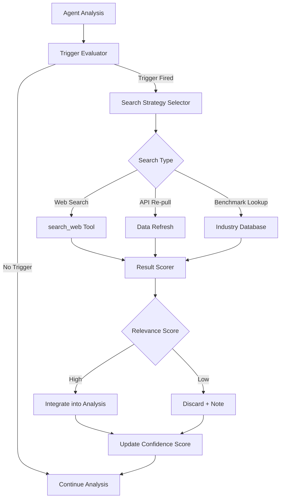

# Proactive Intelligence

Part of [Agent Skills™](https://github.com/itallstartedwithaidea/agent-skills) by [googleadsagent.ai™](https://googleadsagent.ai)

## Description

Proactive Intelligence enables agents to autonomously seek out external information — web searches, API re-pulls, data freshness checks — during analysis without waiting for explicit user requests. Traditional reactive agents only work with the data provided to them. Proactive agents recognize when their current context is insufficient, stale, or contradictory, and take independent action to fill knowledge gaps. This transforms the agent from a passive processor into an active investigator that delivers more accurate, more current, and more comprehensive results.

This skill is modeled on the `search_web` tool integration in the Buddy™ agent at [googleadsagent.ai™](https://googleadsagent.ai), where the agent autonomously searches for competitor data, industry benchmarks, recent Google Ads policy changes, and platform updates when it detects that such information would improve its analysis. When Buddy™ encounters a campaign strategy it hasn't seen before, or metrics that deviate significantly from expected ranges, it proactively searches for context rather than speculating. This behavior is triggered by explicit conditions, not random curiosity, ensuring the additional latency and cost are justified.

The proactive intelligence framework operates on a trigger-search-integrate cycle: the agent evaluates trigger conditions during analysis, dispatches targeted searches when conditions are met, scores the relevance and freshness of results, and integrates verified findings into its ongoing reasoning. Confidence scoring ensures the agent distinguishes between well-supported conclusions and speculative ones.

## Use When

- The agent analyzes data that may be affected by recent external changes (policy updates, market shifts)
- Competitive intelligence is needed alongside internal data analysis
- The agent encounters unexpected patterns that need external context to explain
- Data freshness is critical and the provided data may be outdated
- Industry benchmarks or best practices are needed to contextualize performance
- The agent must fact-check its own assumptions against current sources

## How It Works



The trigger evaluator runs continuously during analysis, checking predefined conditions: data anomalies (metrics outside expected ranges), knowledge gaps (encountering unfamiliar strategies or terms), staleness indicators (data older than a threshold), and explicit search cues (user mentions competitors or asks "is this normal"). When a trigger fires, the search strategy selector determines the most efficient information-gathering approach. Results are scored for relevance and freshness before integration, and the agent's confidence score is updated to reflect whether the proactive search strengthened or weakened its conclusions.

## Implementation

**Trigger Condition Engine:**

```python
class TriggerEngine:
    def __init__(self):
        self.triggers = [
            AnomalyTrigger(),
            StalenessTrigger(max_age_days=7),
            KnowledgeGapTrigger(),
            CompetitorMentionTrigger(),
        ]

    def evaluate(self, context: dict) -> list[dict]:
        fired = []
        for trigger in self.triggers:
            result = trigger.check(context)
            if result["fired"]:
                fired.append(result)
        return sorted(fired, key=lambda t: t["priority"], reverse=True)


class AnomalyTrigger:
    THRESHOLDS = {
        "ctr": (0.005, 0.15),
        "cpc": (0.10, 50.00),
        "conversion_rate": (0.005, 0.30),
        "roas": (0.5, 20.0),
    }

    def check(self, context: dict) -> dict:
        metrics = context.get("campaign_metrics", {})
        anomalies = []
        for metric, (low, high) in self.THRESHOLDS.items():
            value = metrics.get(metric)
            if value is not None and (value < low or value > high):
                anomalies.append({
                    "metric": metric,
                    "value": value,
                    "expected_range": (low, high),
                })
        return {
            "fired": len(anomalies) > 0,
            "trigger": "anomaly",
            "priority": 0.9,
            "details": anomalies,
            "search_query": self.build_query(anomalies) if anomalies else None,
        }

    def build_query(self, anomalies: list) -> str:
        metrics = [a["metric"] for a in anomalies]
        return f"Google Ads {' '.join(metrics)} unusual values industry benchmark 2026"


class StalenessTrigger:
    def __init__(self, max_age_days=7):
        self.max_age_days = max_age_days

    def check(self, context: dict) -> dict:
        data_date = context.get("data_date")
        if not data_date:
            return {"fired": False, "trigger": "staleness"}
        age_days = (datetime.utcnow() - datetime.fromisoformat(data_date)).days
        return {
            "fired": age_days > self.max_age_days,
            "trigger": "staleness",
            "priority": 0.7,
            "details": {"age_days": age_days, "threshold": self.max_age_days},
            "search_query": f"Google Ads recent changes updates {datetime.utcnow().strftime('%B %Y')}",
        }
```

**Proactive Search Executor:**

```python
class ProactiveSearchAgent:
    def __init__(self, search_tool, model, max_searches_per_session=5):
        self.search_tool = search_tool
        self.model = model
        self.searches_remaining = max_searches_per_session
        self.search_log = []

    async def search_if_triggered(self, context: dict) -> list[dict]:
        if self.searches_remaining <= 0:
            return []

        engine = TriggerEngine()
        triggers = engine.evaluate(context)
        if not triggers:
            return []

        results = []
        for trigger in triggers[:2]:
            if self.searches_remaining <= 0:
                break
            query = trigger.get("search_query")
            if not query:
                continue

            search_results = await self.search_tool.execute(query)
            scored = self.score_results(search_results, trigger)
            relevant = [r for r in scored if r["relevance"] > 0.5]

            self.search_log.append({
                "trigger": trigger["trigger"],
                "query": query,
                "results_found": len(search_results),
                "relevant_results": len(relevant),
            })
            self.searches_remaining -= 1
            results.extend(relevant)

        return results

    def score_results(self, results: list, trigger: dict) -> list[dict]:
        scored = []
        for result in results:
            freshness = self.freshness_score(result.get("date"))
            relevance = self.relevance_score(result.get("snippet", ""), trigger)
            scored.append({
                **result,
                "freshness": freshness,
                "relevance": relevance,
                "combined_score": freshness * 0.3 + relevance * 0.7,
            })
        return sorted(scored, key=lambda r: r["combined_score"], reverse=True)

    def freshness_score(self, date_str: str | None) -> float:
        if not date_str:
            return 0.5
        try:
            age = (datetime.utcnow() - datetime.fromisoformat(date_str)).days
            return max(0, 1 - (age / 365))
        except ValueError:
            return 0.5

    def relevance_score(self, text: str, trigger: dict) -> float:
        keywords = trigger.get("search_query", "").lower().split()
        text_lower = text.lower()
        matches = sum(1 for kw in keywords if kw in text_lower)
        return min(1.0, matches / max(len(keywords), 1))
```

**Integration into Analysis Pipeline:**

```python
async def analyze_with_proactive_intelligence(campaign_data: dict, user_query: str):
    search_agent = ProactiveSearchAgent(search_tool=WebSearchTool(), model=model)

    context = {
        "campaign_metrics": campaign_data.get("metrics", {}),
        "data_date": campaign_data.get("date"),
        "user_query": user_query,
    }

    proactive_results = await search_agent.search_if_triggered(context)

    knowledge_block = ""
    if proactive_results:
        knowledge_block = "\n<proactive_research>\n"
        for r in proactive_results[:5]:
            knowledge_block += f"Source: {r.get('url', 'N/A')}\n{r.get('snippet', '')}\n\n"
        knowledge_block += "</proactive_research>\n"

    messages = [
        {"role": "system", "content": f"""You are Buddy™ by googleadsagent.ai™.
{knowledge_block}
Analyze the campaign data and provide recommendations. If proactive research is included above, integrate those findings into your analysis and cite sources."""},
        {"role": "user", "content": json.dumps(campaign_data) + f"\n\n{user_query}"},
    ]

    return await model.generate(messages)
```

## Best Practices

1. **Define explicit trigger conditions** — proactive search should fire for specific, justified reasons (anomalies, staleness, knowledge gaps), not randomly or on every query.
2. **Cap searches per session** — limit to 3-5 proactive searches per session to control latency and cost; prioritize by trigger importance.
3. **Score results for relevance and freshness** — not all search results are useful; filter aggressively before injecting into the agent's context.
4. **Log every proactive search** — record what triggered the search, the query used, and whether the results were actually useful for post-hoc optimization.
5. **Clearly separate proactive findings from user-provided data** — use XML tags or clear labels to distinguish agent-gathered information from user input.
6. **Instruct the agent to cite proactive sources** — recommendations grounded in cited sources are more trustworthy and auditable.
7. **Adjust trigger thresholds based on feedback** — if proactive searches frequently return irrelevant results, tighten the trigger conditions.

## Platform Compatibility

| Feature | Claude Code | Cursor | Codex | Gemini CLI |
|---|---|---|---|---|
| Web search tool | ✅ MCP/custom | ✅ MCP/built-in | ⚠️ Custom | ✅ Built-in |
| Trigger evaluation | ✅ Full | ✅ Full | ✅ Full | ✅ Full |
| Result integration | ✅ Full | ✅ Full | ✅ Full | ✅ Full |
| Search budget limits | ✅ Custom | ✅ Custom | ✅ Custom | ✅ Custom |
| Citation tracking | ✅ Full | ✅ Full | ✅ Full | ✅ Full |

## Mythos Preview Reference

[Mythos Preview](https://red.anthropic.com/2026/mythos-preview/) scaffolding highlights **end-to-end autonomous chaining**: after a brief initial prompt, the model **hypothesizes from code**, **runs the program** (and tooling like debuggers) to confirm or refute, repeats as needed, then emits a structured conclusion—**discovery → exploitation → triage** in one flow—without per-step human approval.

When designing proactive agents, mirror that flow: explicit triggers to **gather or re-check reality** (runs, tests, sandboxes), then fold evidence back into analysis so the chain stays grounded rather than speculative. Source: [Mythos Preview](https://red.anthropic.com/2026/mythos-preview/).

## Related Skills

- [Knowledge Base Injection](../knowledge-base-injection/) - Proactive search fills knowledge gaps that the static knowledge base cannot cover
- [Continuous Learning](../continuous-learning/) - Successful proactive search patterns are captured and codified into reusable triggers
- [Competitor Analysis](../../google-ads/competitor-analysis/) - Real-time competitive intelligence is a primary proactive search trigger
- [Conversion Tracking](../../google-ads/conversion-tracking/) - Data anomaly detection triggers proactive investigation of tracking issues

## Keywords

proactive-intelligence, autonomous-search, trigger-conditions, data-freshness, web-search, result-scoring, knowledge-gaps, anomaly-detection, competitive-intelligence, agent-skills

---

© 2026 [googleadsagent.ai™](https://googleadsagent.ai) | [Agent Skills™](https://github.com/itallstartedwithaidea/agent-skills) | MIT License
