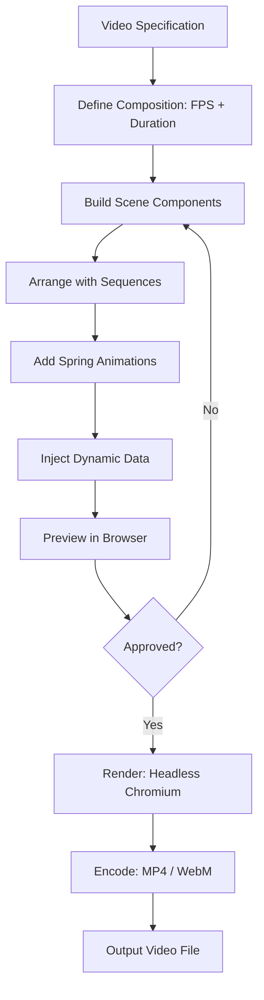

# Programmatic Video

Part of [Agent Skills™](https://github.com/itallstartedwithaidea/agent-skills) by [googleadsagent.ai™](https://googleadsagent.ai)

## Description

Programmatic Video enables React-based video rendering with Remotion, where every frame is a React component and every animation is expressed in code. The agent builds video compositions with sequences, transitions, spring animations, and data-driven content, producing MP4/WebM output rendered in headless Chromium without any video editing software.

Traditional video editing is manual, non-reproducible, and impossible to template. Programmatic video treats video as code: compositions are versioned in git, parameterized for batch rendering, and tested with snapshot assertions. A single template can generate thousands of personalized videos by changing the input data—product demos, social media clips, onboarding sequences, or marketing videos, each customized per recipient.

Remotion's architecture maps React's component model to video: each component receives a `frame` number and the total `durationInFrames`, using these to calculate animations, transitions, and timing. The agent composes scenes from reusable components, orchestrates their timing with `<Sequence>` wrappers, and applies spring-based physics animations for natural motion.

## Use When

- Creating videos from code without video editing software
- Generating personalized or data-driven video content at scale
- Building animated explainers, product demos, or social media clips
- Automating video production in CI/CD pipelines
- The user requests "programmatic video", "Remotion", or "video from code"
- Producing video assets with consistent branding across hundreds of variants

## How It Works



Each scene is a React component that receives the current frame number. Compositions define the canvas size, frame rate, and total duration. Sequences place scenes at specific time offsets. Rendering captures each frame as a screenshot and encodes them into video.

## Implementation

```tsx
import { AbsoluteFill, Composition, Sequence, useCurrentFrame, useVideoConfig,
  interpolate, spring } from "remotion";

const TextReveal: React.FC<{ text: string }> = ({ text }) => {
  const frame = useCurrentFrame();
  const { fps } = useVideoConfig();

  const opacity = interpolate(frame, [0, 15], [0, 1], { extrapolateRight: "clamp" });
  const translateY = spring({ frame, fps, config: { damping: 12, stiffness: 200 } });
  const y = interpolate(translateY, [0, 1], [40, 0]);

  return (
    <AbsoluteFill style={{ justifyContent: "center", alignItems: "center" }}>
      <h1 style={{
        fontSize: 72,
        fontWeight: "bold",
        color: "white",
        opacity,
        transform: `translateY(${y}px)`,
      }}>
        {text}
      </h1>
    </AbsoluteFill>
  );
};

const DataDrivenSlide: React.FC<{ metric: string; value: number }> = ({ metric, value }) => {
  const frame = useCurrentFrame();
  const displayValue = Math.round(interpolate(frame, [0, 45], [0, value], { extrapolateRight: "clamp" }));

  return (
    <AbsoluteFill style={{ justifyContent: "center", alignItems: "center", background: "#0a0a0a" }}>
      <div style={{ textAlign: "center" }}>
        <div style={{ fontSize: 120, fontWeight: "bold", color: "#3b82f6" }}>
          {displayValue.toLocaleString()}
        </div>
        <div style={{ fontSize: 32, color: "#a1a1aa", marginTop: 16 }}>{metric}</div>
      </div>
    </AbsoluteFill>
  );
};

export const MainComposition: React.FC<{ title: string; metrics: Array<{ name: string; value: number }> }> = ({
  title, metrics
}) => {
  return (
    <AbsoluteFill style={{ background: "#0a0a0a" }}>
      <Sequence durationInFrames={60}>
        <TextReveal text={title} />
      </Sequence>
      {metrics.map((m, i) => (
        <Sequence key={m.name} from={60 + i * 75} durationInFrames={75}>
          <DataDrivenSlide metric={m.name} value={m.value} />
        </Sequence>
      ))}
    </AbsoluteFill>
  );
};

export const RemotionRoot: React.FC = () => (
  <Composition
    id="MainVideo"
    component={MainComposition}
    durationInFrames={300}
    fps={30}
    width={1920}
    height={1080}
    defaultProps={{
      title: "Q1 Performance",
      metrics: [
        { name: "Page Views", value: 18247 },
        { name: "Conversions", value: 1432 },
        { name: "Revenue", value: 89500 },
      ],
    }}
  />
);
```

```bash
# Preview in browser
npx remotion studio

# Render to MP4
npx remotion render MainVideo output.mp4

# Batch render with different data
npx remotion render MainVideo --props='{"title":"Q2","metrics":[...]}'
```

## Best Practices

- Use `spring()` for natural-feeling animations instead of linear interpolation
- Clamp all `interpolate()` calls to prevent values from overshooting
- Keep compositions at 30fps for standard content, 60fps for smooth motion
- Preload all assets (images, fonts) before rendering to avoid missing frames
- Use `<Sequence>` to organize scenes with explicit timing, not frame-based conditionals
- Test video output at multiple resolutions (1080p, 720p, square) for platform compatibility

## Platform Compatibility

| Platform | Support | Notes |
|----------|---------|-------|
| Cursor | Full | React + Remotion development |
| VS Code | Full | Remotion extension available |
| Windsurf | Full | React-based development |
| Claude Code | Full | Component + config generation |
| Cline | Full | Video pipeline setup |
| aider | Partial | Code generation only |

## Related Skills

- [Web Asset Generation](../web-asset-generation/)
- [ML Model Integration](../ml-model-integration/)
- [View Transitions](../../web-frontend/view-transitions/)
- [Batch Processing](../../productivity/batch-processing/)

## Keywords

`programmatic-video` `remotion` `react-video` `animation` `data-driven-video` `batch-rendering` `composition` `spring-animation`

---

© 2026 googleadsagent.ai™ | Agent Skills™ | MIT License
