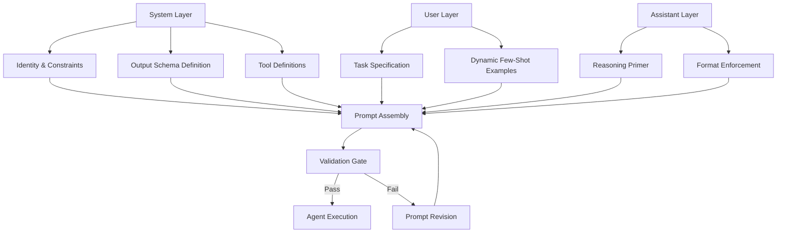

# Prompt Architecture

Part of [Agent Skills™](https://github.com/itallstartedwithaidea/agent-skills) by [googleadsagent.ai™](https://googleadsagent.ai)

## Description

Prompt Architecture is the structural engineering of agent instructions. Where casual prompt writing produces fragile, inconsistent results, architectural prompt design creates deterministic, high-performance agent behaviors that hold up under adversarial conditions and scale across thousands of invocations. This skill distills the prompt engineering methodology developed within the [googleadsagent.ai™](https://googleadsagent.ai) platform, where Buddy™ handles complex Google Ads analysis through meticulously layered prompt structures.

The fundamental principle is that prompts are not strings — they are programs. A well-architected prompt has a clear execution model: system-level invariants establish the agent's identity and constraints, user-level instructions define the current task, and assistant-level priming shapes the output format and reasoning trajectory. Each layer serves a distinct purpose and must be engineered independently before composition.

Advanced prompt architecture incorporates constraint propagation, output schema enforcement, chain-of-thought scaffolding, and dynamic few-shot example selection. These techniques eliminate the "prompt lottery" problem where identical inputs produce wildly varying output quality across runs.

## Use When

- Agent outputs are inconsistent across invocations with the same input
- You need deterministic formatting (JSON, structured reports, specific schemas)
- Complex multi-step reasoning requires explicit chain-of-thought scaffolding
- The agent must adhere to strict behavioral constraints (safety, tone, scope)
- Few-shot examples are needed to establish domain-specific patterns
- You are designing system prompts for production deployment at scale

## How It Works



The three-layer architecture ensures separation of concerns. The system layer defines who the agent is and what it can do — this layer rarely changes across invocations. The user layer carries the task-specific payload and any dynamically selected examples. The assistant layer provides a "running start" that primes the model's generation trajectory. The validation gate checks assembled prompts against structural rules before execution, catching malformed or conflicting instructions.

## Implementation

**Three-Layer Prompt Builder:**

```typescript
interface PromptLayer {
  role: "system" | "user" | "assistant";
  sections: PromptSection[];
}

interface PromptSection {
  name: string;
  content: string;
  priority: number;
  tokenBudget: number;
}

function assemblePrompt(layers: PromptLayer[], maxTokens: number): Message[] {
  const messages: Message[] = [];
  for (const layer of layers) {
    const sections = layer.sections
      .sort((a, b) => b.priority - a.priority)
      .reduce((acc, section) => {
        const currentTokens = countTokens(acc.map(s => s.content).join("\n"));
        if (currentTokens + section.tokenBudget <= maxTokens * 0.4) {
          acc.push(section);
        }
        return acc;
      }, [] as PromptSection[]);

    messages.push({
      role: layer.role,
      content: sections.map(s => s.content).join("\n\n"),
    });
  }
  return messages;
}
```

**Constrained Output Enforcement:**

```python
SCHEMA_ENFORCEMENT_PROMPT = """
You MUST respond with valid JSON matching this exact schema:
{schema}

Rules:
- Every field is required unless marked optional
- String fields must not exceed {max_length} characters
- Numeric fields must be within specified ranges
- Do not include fields not in the schema
- Do not wrap the JSON in markdown code blocks

Begin your response with the opening brace {{.
"""

def build_constrained_prompt(schema: dict, task: str) -> list[dict]:
    return [
        {"role": "system", "content": SCHEMA_ENFORCEMENT_PROMPT.format(
            schema=json.dumps(schema, indent=2),
            max_length=500
        )},
        {"role": "user", "content": task},
        {"role": "assistant", "content": "{"}  # Prime the generation
    ]
```

**Dynamic Few-Shot Selection:**

```python
class FewShotSelector:
    def __init__(self, examples: list[dict], embedder):
        self.examples = examples
        self.embedder = embedder
        self.embeddings = [embedder.encode(ex["input"]) for ex in examples]

    def select(self, query: str, k: int = 3) -> list[dict]:
        query_emb = self.embedder.encode(query)
        similarities = [
            cosine_similarity(query_emb, emb) for emb in self.embeddings
        ]
        top_indices = sorted(
            range(len(similarities)),
            key=lambda i: similarities[i],
            reverse=True
        )[:k]
        return [self.examples[i] for i in top_indices]

    def format_examples(self, examples: list[dict]) -> str:
        parts = []
        for ex in examples:
            parts.append(f"Input: {ex['input']}\nOutput: {ex['output']}")
        return "\n\n---\n\n".join(parts)
```

## Best Practices

1. **Separate identity from instructions** — the system prompt's first paragraph should define who the agent is; subsequent sections define what it does. Identity persists; instructions vary.
2. **Use XML tags for section boundaries** — `<task>`, `<constraints>`, `<examples>` tags create unambiguous section delimiters that models parse reliably.
3. **Place constraints before instructions** — models attend more strongly to information appearing earlier in the system prompt; put non-negotiable rules first.
4. **Prime the assistant turn** — prefilling the assistant message with the opening tokens of the desired format (e.g., `{` for JSON, `## Analysis` for markdown) dramatically improves format compliance.
5. **Version and A/B test prompts** — treat prompts as code artifacts with version control, automated evaluation, and regression testing across model versions.
6. **Minimize redundancy across layers** — if the system prompt defines output format, the user prompt should not restate it; redundancy wastes tokens and can introduce contradictions.
7. **Calibrate temperature to task type** — use 0.0-0.3 for deterministic extraction, 0.5-0.7 for analytical reasoning, 0.8-1.0 for creative generation.
8. **Test with adversarial inputs** — verify that the prompt architecture holds when users provide malformed, contradictory, or injection-laden inputs.

## Platform Compatibility

| Feature | Claude Code | Cursor | Codex | Gemini CLI |
|---|---|---|---|---|
| System prompt layering | ✅ Full | ✅ Rules + Skills | ✅ Instructions | ✅ System prompts |
| Assistant prefill | ✅ Native | ⚠️ Limited | ❌ Not supported | ⚠️ Limited |
| Few-shot injection | ✅ Full | ✅ Full | ✅ Full | ✅ Full |
| XML section tags | ✅ Preferred | ✅ Supported | ✅ Supported | ✅ Supported |
| Temperature control | ✅ API param | ⚠️ Model default | ✅ API param | ✅ API param |

## Mythos Preview Reference

Anthropic’s [Mythos Preview](https://red.anthropic.com/2026/mythos-preview/) write-up shows that a **short, single-paragraph task prompt** can drive long, complex autonomous work when the harness is right: they launch an isolated container with the project, invoke Claude Code with Mythos Preview, give roughly one paragraph (e.g., ask the model to find a security issue), and **let the agent run**—reading code, experimenting, and iterating without step-by-step human steering.

That pattern is a useful reference when you want **high autonomy** without over-specifying every tool call in the prompt. Treat the paragraph as the *goal and constraints*; rely on the runtime (tools, environment, verification) for execution detail. Source: [Mythos Preview](https://red.anthropic.com/2026/mythos-preview/).

## Related Skills

- [Cognitive Scaffolding](../cognitive-scaffolding/) - Attention-zone placement that determines where prompt layers achieve maximum model focus
- [Context Engineering](../context-engineering/) - Token budget management that constrains prompt layer sizes and triggers compression
- [Anthropic Tool Mastery](../anthropic-tool-mastery/) - Tool definition design that operates within the prompt architecture's system layer
- [Verification Loops](../verification-loops/) - Output validation that enforces the schema constraints defined in the prompt architecture

## Keywords

prompt-architecture, system-prompt, few-shot, chain-of-thought, constrained-generation, output-format, prompt-layering, instruction-hierarchy, temperature-tuning, agent-skills

---

© 2026 [googleadsagent.ai™](https://googleadsagent.ai) | [Agent Skills™](https://github.com/itallstartedwithaidea/agent-skills) | MIT License
