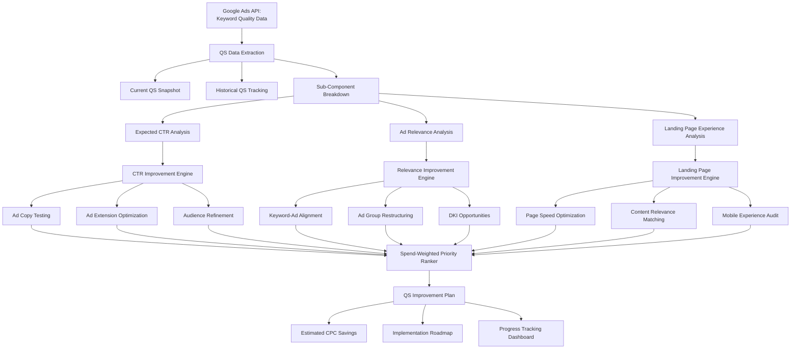

# Quality Score Optimization

Part of [Agent Skills™](https://github.com/itallstartedwithaidea/agent-skills) by [googleadsagent.ai™](https://googleadsagent.ai)

## Description

The Quality Score Optimization skill provides a systematic framework for diagnosing, tracking, and improving Quality Score across every keyword in a Google Ads account. Quality Score is Google's 1-10 rating of the overall relevance and quality of your keywords, ads, and landing pages. It directly impacts ad rank, cost-per-click, and whether your ads show at all. A one-point Quality Score improvement can reduce CPCs by 10-15%.

The skill decomposes Quality Score into its three sub-components — Expected Click-Through Rate (eCTR), Ad Relevance, and Landing Page Experience — and provides targeted improvement strategies for each. It goes beyond the current snapshot by tracking historical Quality Score trends at the keyword level, identifying score degradation patterns, and correlating changes with account modifications. This longitudinal analysis reveals the root causes behind score fluctuations.

The optimization engine prioritizes improvement efforts by weighting keywords by spend volume. A Quality Score improvement on a keyword consuming $1,000/day has far greater impact than the same improvement on a $5/day keyword. The skill generates impact-ranked improvement plans, estimates CPC savings, and tracks improvement progress against benchmarks specific to each industry vertical.

## Use When

- User asks about "Quality Score" or "QS optimization"
- User mentions "high CPCs" that may relate to quality issues
- User wants to "improve ad rank" without increasing bids
- User asks about "expected CTR", "ad relevance", or "landing page experience"
- User mentions "below average" quality components
- User wants to "reduce cost per click" through quality improvements
- User asks "why aren't my ads showing" (may be QS related)
- User wants to "track Quality Score changes over time"

## Architecture



## Implementation

Quality Score extraction and analysis engine:

```javascript
async function analyzeQualityScores(customerId) {
  const keywordData = await getKeywordQualityData(customerId);

  const analysis = keywordData.map(kw => ({
    keyword: kw.text,
    matchType: kw.matchType,
    qualityScore: kw.qualityScore,
    expectedCtr: kw.expectedCtr,
    adRelevance: kw.adRelevance,
    landingPageExperience: kw.landingPageExperience,
    monthlySpend: kw.costMicros / 1_000_000,
    impressions: kw.impressions,
    weightedImpact: calculateWeightedImpact(kw)
  }));

  return {
    distribution: buildQSDistribution(analysis),
    bottomKeywords: analysis.filter(kw => kw.qualityScore <= 5)
      .sort((a, b) => b.weightedImpact - a.weightedImpact),
    componentBreakdown: analyzeComponents(analysis),
    estimatedSavings: estimateCPCSavings(analysis),
    improvementPlan: generateImprovementPlan(analysis)
  };
}

function calculateWeightedImpact(keyword) {
  const spendWeight = keyword.costMicros / 1_000_000;
  const qsDeficit = 10 - keyword.qualityScore;
  const cpcSavingsPerPoint = keyword.avgCpc * 0.12;
  return spendWeight * qsDeficit * cpcSavingsPerPoint;
}

function analyzeComponents(keywords) {
  const components = { expectedCtr: [], adRelevance: [], landingPageExperience: [] };

  for (const kw of keywords) {
    if (kw.expectedCtr === 'BELOW_AVERAGE') components.expectedCtr.push(kw);
    if (kw.adRelevance === 'BELOW_AVERAGE') components.adRelevance.push(kw);
    if (kw.landingPageExperience === 'BELOW_AVERAGE') components.landingPageExperience.push(kw);
  }

  return {
    expectedCtr: {
      belowAverage: components.expectedCtr,
      totalSpendAffected: sumSpend(components.expectedCtr),
      strategies: [
        'Test new ad copy with stronger CTAs and benefit statements',
        'Add sitelink and callout extensions to increase ad real estate',
        'Refine audience targeting to reach higher-intent users',
        'Use ad customizers for time-sensitive or location-specific messaging'
      ]
    },
    adRelevance: {
      belowAverage: components.adRelevance,
      totalSpendAffected: sumSpend(components.adRelevance),
      strategies: [
        'Restructure ad groups to tighter keyword themes (max 15-20 keywords)',
        'Include exact keyword text in at least 2 headlines per RSA',
        'Use dynamic keyword insertion where natural',
        'Create SKAGs for highest-spend keywords with persistent relevance issues'
      ]
    },
    landingPageExperience: {
      belowAverage: components.landingPageExperience,
      totalSpendAffected: sumSpend(components.landingPageExperience),
      strategies: [
        'Improve page load speed (target under 3 seconds on mobile)',
        'Ensure keyword-relevant content appears above the fold',
        'Add trust signals: reviews, certifications, security badges',
        'Optimize mobile layout with clear CTA and minimal form fields'
      ]
    }
  };
}
```

Historical Quality Score tracking:

```javascript
async function trackQualityScoreHistory(customerId, keyword, days = 180) {
  const snapshots = await getHistoricalQSSnapshots(customerId, keyword, days);

  return {
    trend: calculateTrend(snapshots),
    changePoints: detectChangePoints(snapshots),
    correlations: correlateWithAccountChanges(snapshots, customerId),
    forecast: forecastQS(snapshots, 30)
  };
}

function estimateCPCSavings(keywords) {
  let totalMonthlySavings = 0;

  for (const kw of keywords) {
    if (kw.qualityScore < 7) {
      const targetQS = Math.min(kw.qualityScore + 2, 10);
      const qsImprovement = targetQS - kw.qualityScore;
      const cpcReduction = qsImprovement * 0.12;
      const monthlySavings = kw.monthlySpend * cpcReduction;
      totalMonthlySavings += monthlySavings;
    }
  }

  return { estimatedMonthlySavings: totalMonthlySavings, annualized: totalMonthlySavings * 12 };
}
```

## Integration with Buddy™ Agent

Quality Score Optimization is a persistent monitoring layer in Buddy™ Agent. The platform takes daily Quality Score snapshots for all active keywords, building the longitudinal dataset needed for trend analysis and change-point detection. When Buddy™ detects a Quality Score drop on a high-spend keyword, it immediately triggers an investigation workflow.

Buddy™ routes Quality Score findings to the appropriate downstream skill: eCTR issues trigger the Ad Copy Generation skill, ad relevance issues trigger keyword restructuring recommendations, and landing page issues trigger the Landing Page Audit skill. This creates an automated quality improvement loop.

The Buddy™ dashboard displays a real-time Quality Score health indicator for the account, weighted by spend, showing the account-level QS trajectory alongside estimated CPC savings achieved through improvements over time.

## Best Practices

1. Focus QS improvement efforts on keywords accounting for the top 80% of spend
2. Target "below average" sub-components first — they offer the highest improvement leverage
3. Restructure ad groups with more than 30 keywords into tighter thematic clusters
4. Ensure every ad group has at least 3 RSAs with headlines matching core keywords
5. Track QS weekly, not daily, to filter out short-term Google fluctuations
6. Use historical QS data to correlate score changes with specific account modifications
7. Don't chase QS on low-volume keywords — the signal is unreliable under 100 monthly impressions
8. Improve landing page experience systemically (site speed, mobile UX) for account-wide impact
9. Calculate the estimated CPC savings to justify landing page investment to stakeholders
10. Accept that QS 7-8 is the realistic target for most keywords — pursuing QS 10 has diminishing returns

## Platform Compatibility

| Platform | Supported |
|----------|-----------|
| Claude Code | ✅ |
| Cursor | ✅ |
| Codex | ✅ |
| Gemini | ✅ |

## Related Skills

- [Ad Copy Generation](../ad-copy-generation/) - eCTR and ad relevance improvements require optimized ad copy
- [Landing Page Audit](../landing-page-audit/) - Landing page experience is one of three QS sub-components
- [Keyword Research](../keyword-research/) - Keyword-ad group alignment directly impacts ad relevance scores
- [Memory Persistence](../../ai-agent-engineering/memory-persistence/) - Historical QS tracking across sessions enables trend analysis and regression detection

## Keywords

quality score, QS optimization, expected CTR, ad relevance, landing page experience, google ads quality score, CPC reduction, ad rank improvement, quality score tracking, keyword quality, quality score components, quality score history, quality score improvement

---

© 2026 [googleadsagent.ai™](https://googleadsagent.ai) | [Agent Skills™](https://github.com/itallstartedwithaidea/agent-skills) | MIT License
