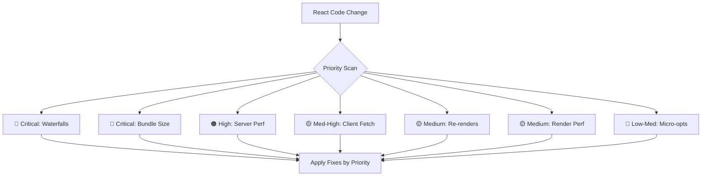

# React Best Practices

Part of [Agent Skills™](https://github.com/itallstartedwithaidea/agent-skills) by [googleadsagent.ai™](https://googleadsagent.ai)

## Description

React Best Practices codifies 40+ rules across 8 priority categories, from Critical (eliminating waterfalls, reducing bundle size) to Low-Medium (JavaScript micro-optimizations). Each rule is actionable, includes a severity rating, and provides before/after code examples. The agent applies these rules automatically when writing or reviewing React code.

The rules are ordered by impact, not by ease of implementation. Eliminating client-server waterfalls and reducing bundle size yield the largest performance gains and therefore receive Critical priority. Server-side rendering performance and client data fetching patterns follow. Re-render optimization—often the first thing developers reach for—is rated Medium because it rarely causes measurable user-facing performance problems compared to network and bundle issues.

This skill treats React performance as a system property, not a component property. The highest-impact optimizations happen at the architecture level: where data is fetched, how bundles are split, and which rendering strategy is chosen. Component-level optimizations (memoization, key stability) are included but correctly deprioritized.

## Use When

- Writing new React components or pages
- Reviewing React code for performance issues
- Debugging slow page loads or sluggish interactions
- Optimizing Core Web Vitals (LCP, FID, CLS)
- Migrating from client-side to server-side rendering
- Reducing JavaScript bundle size

## How It Works



Rules are evaluated in priority order. Critical issues are flagged as blockers; lower-priority items are noted as suggestions. The agent applies the highest-impact fixes first.

## Implementation

### Critical: Eliminate Client-Server Waterfalls

```tsx
// BAD: Sequential fetches create waterfalls
function Dashboard() {
  const user = use(fetchUser());         // 200ms
  const posts = use(fetchPosts(user.id)); // 200ms after user resolves
  const stats = use(fetchStats(user.id)); // 200ms after user resolves
  // Total: 600ms sequential
}

// GOOD: Parallel fetches with server components
async function Dashboard() {
  const user = await fetchUser();
  const [posts, stats] = await Promise.all([
    fetchPosts(user.id),
    fetchStats(user.id),
  ]);
  // Total: 400ms (user + parallel posts/stats)
}
```

### Critical: Bundle Size Reduction

```tsx
// BAD: Import entire library
import { format } from "date-fns";

// GOOD: Tree-shakeable import
import { format } from "date-fns/format";

// BAD: Eager loading heavy components
import { HeavyChart } from "./HeavyChart";

// GOOD: Lazy loading with Suspense
const HeavyChart = lazy(() => import("./HeavyChart"));
```

### Medium: Re-render Optimization

```tsx
// BAD: New object reference every render
<UserContext.Provider value={{ user, theme, locale }}>

// GOOD: Stable reference with useMemo
const contextValue = useMemo(
  () => ({ user, theme, locale }),
  [user, theme, locale]
);
<UserContext.Provider value={contextValue}>
```

## Best Practices

- Fix Critical issues before optimizing Medium or Low items
- Measure before optimizing—use React DevTools Profiler and Lighthouse
- Prefer server components for data fetching; reserve client components for interactivity
- Use `dynamic(() => import(...))` for any component not visible in the initial viewport
- Avoid premature `useMemo`/`useCallback`—profile first to confirm the re-render is costly
- Keep client component boundaries as narrow as possible to minimize hydration cost

## Platform Compatibility

| Platform | Support | Notes |
|----------|---------|-------|
| Cursor | Full | Lint + review integration |
| VS Code | Full | ESLint plugin support |
| Windsurf | Full | React-aware analysis |
| Claude Code | Full | Code review application |
| Cline | Full | Rule-based review |
| aider | Partial | Manual rule application |

## Related Skills

- [Composition Patterns](../composition-patterns/)
- [View Transitions](../view-transitions/)
- [Web Design Guidelines](../web-design-guidelines/)
- [Edge Rendering](../../infrastructure/edge-rendering/)

## Keywords

`react` `performance` `best-practices` `bundle-size` `waterfall-elimination` `server-components` `re-render-optimization` `core-web-vitals`

---

© 2026 googleadsagent.ai™ | Agent Skills™ | MIT License
