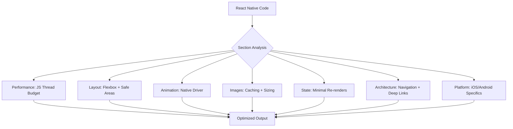

# React Native Guidelines

Part of [Agent Skills™](https://github.com/itallstartedwithaidea/agent-skills) by [googleadsagent.ai™](https://googleadsagent.ai)

## Description

React Native Guidelines codifies 16 rules across 7 sections—Performance, Layout, Animation, Images, State, Architecture, and Platform—that prevent the most common pitfalls in cross-platform mobile development. Each rule addresses a specific failure mode unique to React Native's bridge architecture and native rendering pipeline.

React Native's performance characteristics differ fundamentally from web React. The JavaScript thread, the UI thread, and the native modules thread communicate asynchronously, and bottlenecks in any thread degrade the user experience. These guidelines focus on keeping the JS thread unblocked, using the native driver for animations, optimizing FlatList rendering, and minimizing bridge crossings.

The rules are calibrated for production applications running on both iOS and Android. Platform-specific behaviors, gesture handling differences, and navigation patterns are addressed explicitly rather than treated as edge cases.

## Use When

- Building new React Native screens or components
- Debugging performance issues on iOS or Android
- Reviewing React Native code for cross-platform correctness
- Implementing animations or gesture interactions
- Optimizing list rendering for large datasets
- Handling platform-specific behavior differences

## How It Works



Each section contains 2-3 focused rules targeting the highest-impact issues in that category. Rules are applied during code generation and flagged during review.

## Implementation

### Performance: Optimize FlatList

```tsx
// BAD: Re-creates renderItem on every render
<FlatList
  data={items}
  renderItem={({ item }) => <Card item={item} />}
/>

// GOOD: Stable renderItem + keyExtractor + windowing config
const renderItem = useCallback(
  ({ item }: { item: Item }) => <Card item={item} />,
  []
);

<FlatList
  data={items}
  renderItem={renderItem}
  keyExtractor={item => item.id}
  getItemLayout={(_, index) => ({
    length: CARD_HEIGHT,
    offset: CARD_HEIGHT * index,
    index,
  })}
  maxToRenderPerBatch={10}
  windowSize={5}
  removeClippedSubviews
/>
```

### Animation: Use Native Driver

```tsx
// BAD: JS-driven animation blocks the thread
Animated.timing(opacity, {
  toValue: 1,
  duration: 300,
  useNativeDriver: false,
}).start();

// GOOD: Native driver runs on UI thread
Animated.timing(opacity, {
  toValue: 1,
  duration: 300,
  useNativeDriver: true,
}).start();

// BEST: Reanimated for gesture-driven animations
const animatedStyle = useAnimatedStyle(() => ({
  transform: [{ translateX: withSpring(offset.value) }],
}));
```

### Platform: Safe Area Handling

```tsx
import { useSafeAreaInsets } from "react-native-safe-area-context";

function Screen({ children }: PropsWithChildren) {
  const insets = useSafeAreaInsets();
  return (
    <View style={{ paddingTop: insets.top, paddingBottom: insets.bottom }}>
      {children}
    </View>
  );
}
```

## Best Practices

- Profile with Flipper or React DevTools before optimizing—measure, do not guess
- Keep the JS thread under 16ms per frame for 60fps rendering
- Use `useNativeDriver: true` for all opacity and transform animations
- Avoid inline styles in list items—use `StyleSheet.create` for static styles
- Handle both iOS and Android safe areas, notches, and gesture navigation
- Test on real devices, not just simulators—performance differs significantly

## Platform Compatibility

| Platform | Support | Notes |
|----------|---------|-------|
| Cursor | Full | React Native project support |
| VS Code | Full | React Native Tools extension |
| Windsurf | Full | Mobile development support |
| Claude Code | Full | Code generation + review |
| Cline | Full | React Native aware |
| aider | Partial | Limited mobile context |

## Related Skills

- [React Best Practices](../react-best-practices/)
- [Composition Patterns](../composition-patterns/)
- [Web Design Guidelines](../web-design-guidelines/)
- [CI/CD Pipelines](../../infrastructure/ci-cd-pipelines/)

## Keywords

`react-native` `mobile` `performance` `flatlist` `native-driver` `animation` `safe-area` `cross-platform` `ios` `android`

---

© 2026 googleadsagent.ai™ | Agent Skills™ | MIT License
