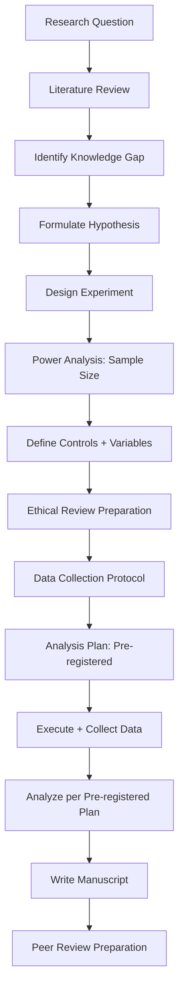

# Research Methodology

Part of [Agent Skills™](https://github.com/itallstartedwithaidea/agent-skills) by [googleadsagent.ai™](https://googleadsagent.ai)

## Description

Research Methodology guides the agent through the complete scientific research lifecycle: hypothesis generation from literature gaps, experimental design with proper controls, systematic literature review, data collection protocols, and peer review preparation. The agent functions as a research collaborator that enforces methodological rigor at every stage.

Weak methodology invalidates results regardless of how sophisticated the analysis is. This skill prevents common methodological failures: hypotheses that are unfalsifiable, experiments without proper controls, sample sizes without power analysis, and conclusions that overreach the data. The agent asks the hard questions early—before time and resources are committed to a flawed design.

The skill also covers the practical aspects of research preparation: structuring literature searches with Boolean queries, maintaining citation databases, designing reproducible experimental protocols, preparing materials for ethical review boards, and formatting submissions to meet journal-specific requirements. It bridges the gap between knowing what good research looks like and executing it systematically.

## Use When

- Formulating research questions and hypotheses
- Designing experiments with proper controls and sample sizes
- Conducting systematic literature reviews
- Preparing manuscripts for peer review submission
- Writing grant proposals or research proposals
- Evaluating the methodology of existing papers

## How It Works



The methodology flow is sequential with gates: the hypothesis must be falsifiable before designing the experiment, the experiment must have adequate power before collecting data, and the analysis plan must be pre-registered before execution begins.

## Implementation

```python
class ResearchProtocol:
    def formulate_hypothesis(self, observation: str, literature: list[str]) -> dict:
        return {
            "null_hypothesis": "There is no significant difference between...",
            "alternative_hypothesis": "Treatment X increases Y by at least Z...",
            "falsifiability": "This hypothesis is falsifiable because...",
            "variables": {
                "independent": ["Treatment type (A vs B vs control)"],
                "dependent": ["Measured outcome Y"],
                "controlled": ["Age, sex, baseline Z"],
                "confounding": ["Prior exposure to X"],
            },
        }

    def power_analysis(self, effect_size: float, alpha: float = 0.05, power: float = 0.80) -> dict:
        from statsmodels.stats.power import TTestIndPower
        analysis = TTestIndPower()
        n = analysis.solve_power(effect_size=effect_size, alpha=alpha, power=power)
        return {
            "required_n_per_group": int(np.ceil(n)),
            "total_n": int(np.ceil(n)) * 2,
            "effect_size": effect_size,
            "alpha": alpha,
            "power": power,
            "recommendation": f"Recruit {int(np.ceil(n * 1.2))} per group to account for 20% attrition",
        }

    def literature_search(self, topic: str) -> dict:
        return {
            "databases": ["PubMed", "Scopus", "Web of Science"],
            "query": f'("{topic}") AND (randomized OR controlled) AND ("2020"[Date] : "2026"[Date])',
            "inclusion_criteria": [
                "Peer-reviewed original research",
                "English language",
                "Human subjects",
                "Published 2020-2026",
            ],
            "exclusion_criteria": [
                "Review articles (captured separately)",
                "Case reports (n < 10)",
                "Non-peer-reviewed preprints",
            ],
            "prisma_flow": "Record screening, eligibility, and inclusion counts per PRISMA 2020",
        }

    def experimental_design(self, hypothesis: dict) -> dict:
        return {
            "design": "Randomized controlled trial, double-blind, parallel group",
            "randomization": "Block randomization with variable block sizes (4, 6, 8)",
            "blinding": "Participants and assessors blinded; unblinded statistician",
            "primary_outcome": hypothesis["variables"]["dependent"][0],
            "secondary_outcomes": [],
            "timeline": "Baseline → 4 weeks intervention → 8 weeks follow-up",
            "analysis_plan": "Pre-registered at OSF.io before data collection",
        }
```

## Best Practices

- Pre-register analysis plans before data collection to prevent p-hacking
- Conduct power analysis during design, not after collecting data
- Use PRISMA guidelines for systematic reviews and CONSORT for clinical trials
- Maintain a living literature database with citation manager (Zotero, Mendeley)
- Separate exploratory analyses from confirmatory analyses in reporting
- Include a limitations section that honestly addresses methodological weaknesses

## Platform Compatibility

| Platform | Support | Notes |
|----------|---------|-------|
| Cursor | Full | Protocol + analysis code |
| VS Code | Full | LaTeX + Python integration |
| Windsurf | Full | Research workflow support |
| Claude Code | Full | Methodology guidance |
| Cline | Full | Research protocol generation |
| aider | Partial | Code-level support |

## Related Skills

- [Scientific Writing](../scientific-writing/)
- [Data Analysis](../data-analysis/)
- [Machine Learning](../machine-learning/)
- [Knowledge Base RAG](../../productivity/knowledge-base-rag/)

## Keywords

`research-methodology` `hypothesis-generation` `experimental-design` `literature-review` `power-analysis` `pre-registration` `peer-review` `prisma`

---

© 2026 googleadsagent.ai™ | Agent Skills™ | MIT License
