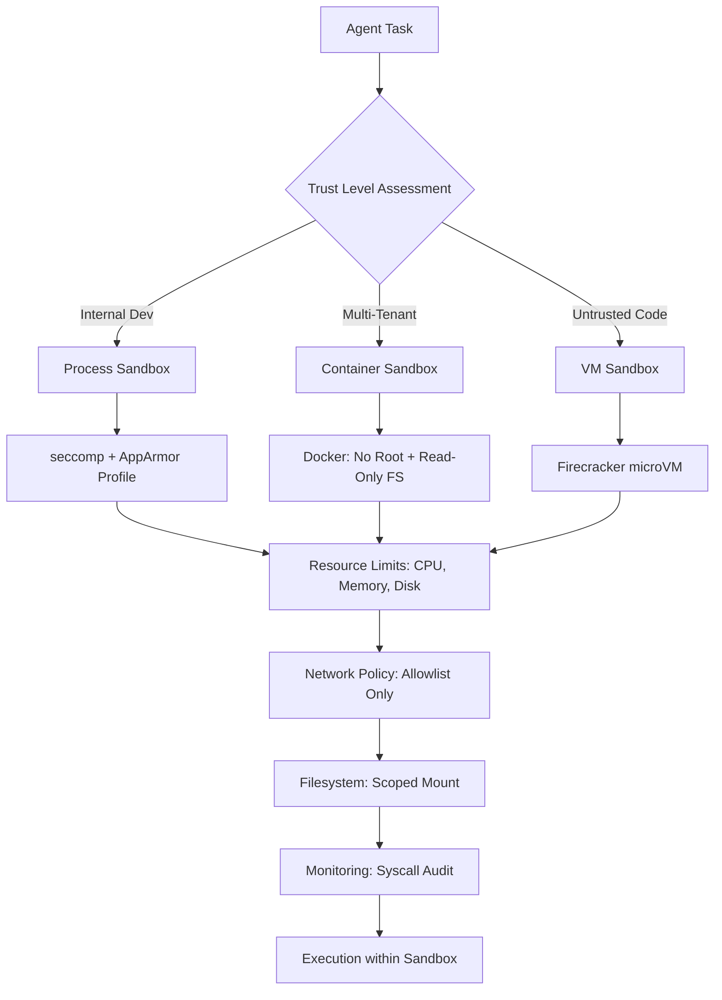

# Sandbox Hardening

Part of [Agent Skills™](https://github.com/itallstartedwithaidea/agent-skills) by [googleadsagent.ai™](https://googleadsagent.ai)

## Description

Sandbox Hardening isolates agent execution environments using container sandboxing, permission boundaries, resource limits, and network segmentation. The agent configures and validates sandboxes that prevent AI-generated code from accessing unauthorized resources, consuming unbounded compute, or affecting the host system.

An AI agent with unrestricted shell access is a security liability. Without sandboxing, a prompt injection or hallucinated command could delete files, exfiltrate data, install malware, or consume unbounded resources. Sandbox Hardening applies the principle of least privilege: the agent receives only the permissions it needs, in an isolated environment with strict resource limits and monitored network access.

This skill covers three isolation levels: process-level sandboxing (seccomp, AppArmor), container-level isolation (Docker with restricted capabilities), and VM-level isolation (microVMs like Firecracker). The appropriate level depends on the trust boundary: internal development tools use process-level, multi-tenant platforms use container-level, and untrusted code execution requires VM-level isolation.

## Use When

- Running AI-generated code in production or shared environments
- Configuring agent execution environments with least-privilege access
- Deploying multi-tenant AI platforms where users share infrastructure
- Executing untrusted code from user inputs or AI outputs
- Implementing compliance requirements for isolated execution
- Building sandboxed development environments for agents

## How It Works



The sandbox is configured before the agent executes any code. Trust level determines the isolation technology, and all levels apply resource limits, network restrictions, and filesystem scoping.

## Implementation

```dockerfile
# Container sandbox: minimal, non-root, read-only
FROM node:20-slim AS sandbox
RUN groupadd -r agent && useradd -r -g agent -d /workspace agent
WORKDIR /workspace
COPY --chown=agent:agent . .
USER agent
```

```yaml
# docker-compose sandbox configuration
services:
  agent-sandbox:
    build: .
    read_only: true
    tmpfs:
      - /tmp:size=100M,noexec
    security_opt:
      - no-new-privileges:true
      - seccomp:seccomp-profile.json
    cap_drop:
      - ALL
    cap_add:
      - NET_BIND_SERVICE
    deploy:
      resources:
        limits:
          cpus: "2.0"
          memory: 512M
          pids: 100
        reservations:
          cpus: "0.5"
          memory: 128M
    networks:
      - sandbox-net
    dns:
      - 1.1.1.1

networks:
  sandbox-net:
    driver: bridge
    internal: false
```

```python
import resource
import os

class ProcessSandbox:
    """Process-level sandboxing for single-tenant development."""

    @staticmethod
    def apply_limits(
        max_memory_mb: int = 256,
        max_cpu_seconds: int = 30,
        max_file_size_mb: int = 10,
        max_open_files: int = 64,
        max_processes: int = 10,
    ):
        mb = 1024 * 1024
        resource.setrlimit(resource.RLIMIT_AS, (max_memory_mb * mb, max_memory_mb * mb))
        resource.setrlimit(resource.RLIMIT_CPU, (max_cpu_seconds, max_cpu_seconds))
        resource.setrlimit(resource.RLIMIT_FSIZE, (max_file_size_mb * mb, max_file_size_mb * mb))
        resource.setrlimit(resource.RLIMIT_NOFILE, (max_open_files, max_open_files))
        resource.setrlimit(resource.RLIMIT_NPROC, (max_processes, max_processes))

    @staticmethod
    def restrict_filesystem(allowed_dirs: list[str]):
        """Use chroot or bind mounts to restrict filesystem access."""
        for d in allowed_dirs:
            assert os.path.isabs(d), f"Allowed dirs must be absolute: {d}"
            assert os.path.exists(d), f"Allowed dir does not exist: {d}"

    @staticmethod
    def validate_command(command: str, blocklist: list[str]) -> bool:
        """Check command against blocklist before execution."""
        return not any(blocked in command for blocked in blocklist)

COMMAND_BLOCKLIST = [
    "rm -rf /", "mkfs", "dd if=", "> /dev/sd",
    "curl | sh", "wget | bash", "chmod 777",
    "iptables", "mount", "umount",
]
```

## Best Practices

- Drop all Linux capabilities and add back only what is strictly required
- Run containers as non-root with `no-new-privileges` security option
- Set memory, CPU, PID, and file descriptor limits to prevent resource exhaustion
- Use read-only root filesystems with writable tmpfs for scratch space only
- Restrict network access to an explicit allowlist of required endpoints
- Monitor and log all syscalls in the sandbox for post-incident forensic analysis

## Platform Compatibility

| Platform | Support | Notes |
|----------|---------|-------|
| Cursor | Full | Docker + process sandboxing |
| VS Code | Full | Dev container support |
| Windsurf | Full | Sandbox configuration |
| Claude Code | Full | Container-based isolation |
| Cline | Full | Security boundary config |
| aider | Partial | Process-level only |

## Related Skills

- [Agent Security Scanning](../agent-security-scanning/) - Vulnerability detection that identifies threats the sandbox must contain
- [Secret Protection](../secret-protection/) - Credential isolation that prevents sandboxed agents from accessing secrets outside their scope
- [Configuration Management](../../infrastructure/configuration-management/) - Infrastructure-as-code patterns for declaratively managing sandbox configurations across environments

## Keywords

`sandbox` `container-security` `isolation` `least-privilege` `resource-limits` `seccomp` `docker-hardening` `agent-isolation`

---

© 2026 googleadsagent.ai™ | Agent Skills™ | MIT License
