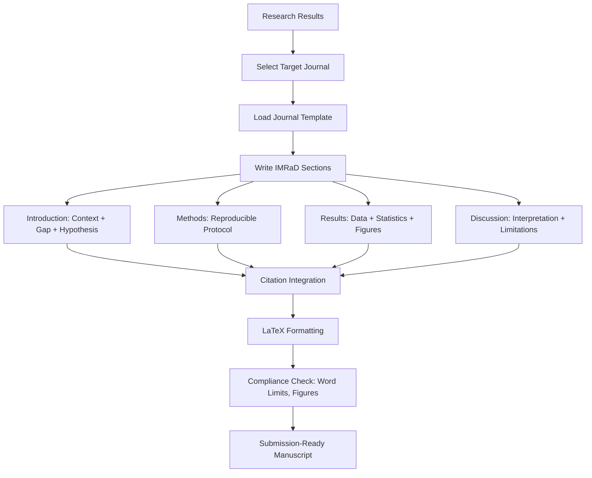

# Scientific Writing

Part of [Agent Skills™](https://github.com/itallstartedwithaidea/agent-skills) by [googleadsagent.ai™](https://googleadsagent.ai)

## Description

Scientific Writing guides the production of research papers, abstracts, grant proposals, and supplementary materials with proper citation management, LaTeX formatting, and journal-specific template compliance. The agent produces manuscript sections that adhere to the conventions of scientific discourse: precise language, logical argument structure, and claims supported by evidence.

Scientific writing is not creative writing. Every sentence serves a function: establishing context, presenting evidence, drawing conclusions, or acknowledging limitations. This skill enforces the IMRaD structure (Introduction, Methods, Results, and Discussion), ensures citations follow the target journal's style, and maintains the passive-to-active voice balance expected by modern journals.

The skill handles the mechanical aspects of manuscript preparation: BibTeX citation management, LaTeX formatting for equations and figures, table generation with proper statistical notation, and compliance with journal submission requirements (word limits, figure formats, reference styles). These mechanical tasks consume disproportionate researcher time and are ideally suited to agent automation.

## Use When

- Writing or editing research manuscript sections
- Formatting papers in LaTeX for specific journals
- Managing citations and generating bibliographies
- Writing abstracts within word count constraints
- Preparing supplementary materials and appendices
- Converting between citation styles (APA, IEEE, Nature)

## How It Works



Each section is written according to its rhetorical function. The Introduction narrows from broad context to the specific gap; Results presents data without interpretation; Discussion interprets results in context of existing literature.

## Implementation

```latex
\documentclass[twocolumn]{article}
\usepackage[utf8]{inputenc}
\usepackage{amsmath, amssymb}
\usepackage{graphicx}
\usepackage[numbers]{natbib}
\usepackage{booktabs}

\title{Edge-Rendered SEO Pages: A Scalable Approach to Local Search Optimization}
\author{Research Team \\ googleadsagent.ai}
\date{2026}

\begin{document}
\maketitle

\begin{abstract}
We present an edge rendering architecture that generates 18,000+ unique
landing pages from a matrix of 116 services and 155 cities, achieving
sub-50ms time-to-first-byte globally. Our approach eliminates the
build-time scaling limitations of static site generation while maintaining
the SEO benefits of server-rendered HTML. Evaluation across 6 months of
production traffic demonstrates a 34\% improvement in organic search
impressions compared to the previous SSG approach ($p < 0.001$, $d = 0.72$).
\end{abstract}

\section{Introduction}
Local search optimization requires unique, high-quality pages for each
service-location combination~\cite{moz2025local}. Static site generation
(SSG) approaches face quadratic build time growth as the service-location
matrix expands~\cite{vercel2024ssg}.
\end{document}
```

```python
class ManuscriptBuilder:
    SECTION_GUIDELINES = {
        "abstract": {"max_words": 250, "structure": ["background", "methods", "results", "conclusion"]},
        "introduction": {"paragraphs": [
            "Broad context and importance",
            "Current state of knowledge",
            "Knowledge gap or limitation",
            "Study objective and hypothesis",
        ]},
        "methods": {"requirements": ["reproducible", "past_tense", "no_results"]},
        "results": {"requirements": ["data_driven", "no_interpretation", "stats_with_effect_sizes"]},
        "discussion": {"paragraphs": [
            "Principal findings",
            "Comparison with existing literature",
            "Mechanistic interpretation",
            "Limitations",
            "Future directions and conclusion",
        ]},
    }

    def validate_abstract(self, text: str, max_words: int = 250) -> dict:
        words = text.split()
        return {
            "word_count": len(words),
            "within_limit": len(words) <= max_words,
            "has_background": any(kw in text.lower() for kw in ["context", "background", "importance"]),
            "has_conclusion": any(kw in text.lower() for kw in ["conclude", "demonstrate", "suggest"]),
        }
```

## Best Practices

- Follow IMRaD structure unless the target journal specifies otherwise
- Report statistics as: test name, degrees of freedom, test statistic, p-value, effect size
- Use active voice for clarity: "We measured" not "Measurements were taken"
- Keep abstracts within the target journal's word limit (typically 150-300 words)
- Cite primary sources, not reviews, when supporting specific claims
- Include a limitations section that preemptively addresses reviewer concerns

## Platform Compatibility

| Platform | Support | Notes |
|----------|---------|-------|
| Cursor | Full | LaTeX + BibTeX support |
| VS Code | Full | LaTeX Workshop extension |
| Windsurf | Full | Scientific writing support |
| Claude Code | Full | Manuscript generation |
| Cline | Full | Template-based writing |
| aider | Partial | Text editing only |

## Related Skills

- [Research Methodology](../research-methodology/)
- [Data Analysis](../data-analysis/)
- [AI Chat Studio](../../productivity/ai-chat-studio/)
- [Assistant Presets](../../productivity/assistant-presets/)

## Keywords

`scientific-writing` `latex` `imrad` `citations` `bibtex` `manuscript` `abstract` `journal-submission` `peer-review`

---

© 2026 googleadsagent.ai™ | Agent Skills™ | MIT License
