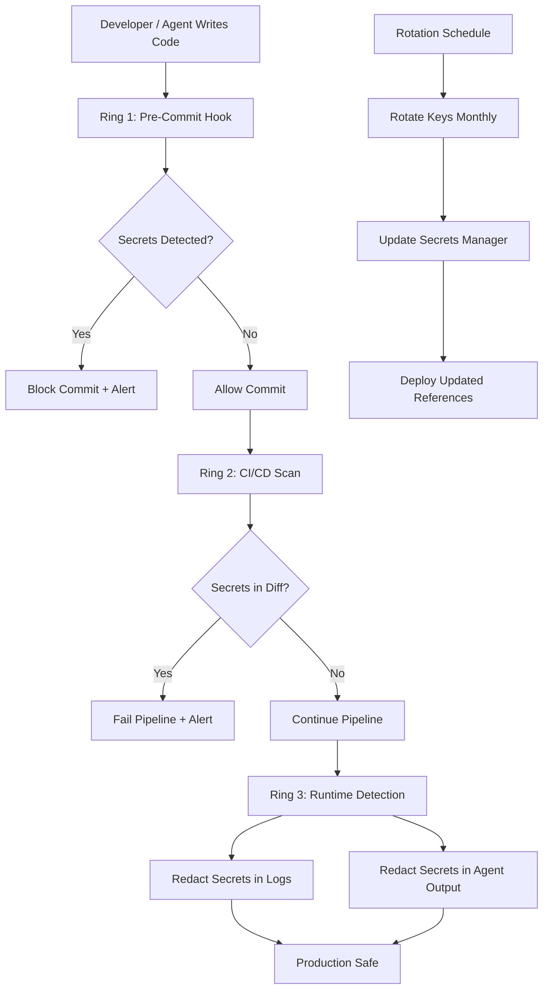

# Secret Protection

Part of [Agent Skills™](https://github.com/itallstartedwithaidea/agent-skills) by [googleadsagent.ai™](https://googleadsagent.ai)

## Description

Secret Protection prevents credential leaks across the development lifecycle through `.env` scanning, pre-commit hooks, secret rotation policies, and runtime detection. The agent enforces a zero-tolerance policy for secrets in code, configuration, logs, or AI conversation history—catching leaks before they reach version control, CI artifacts, or production logs.

Secrets in source code are the most common cause of security breaches in modern applications. A single committed API key can compromise an entire cloud account within minutes of being pushed to a public repository. Automated bots continuously scan GitHub for exposed credentials, and the average time from commit to exploitation is under 15 minutes. This skill prevents that by intercepting secrets at every stage.

The protection operates in three rings: pre-commit (prevent secrets from entering the repository), CI/CD (catch secrets that bypass pre-commit), and runtime (detect and redact secrets in logs, error messages, and AI agent outputs). Each ring is independent—if one fails, the next catches the leak. Secret rotation is enforced on a schedule, ensuring that even an undetected exposure has a limited blast radius.

## Use When

- Setting up a new repository with proper secret management
- Adding pre-commit hooks to prevent credential leaks
- Auditing existing repositories for committed secrets
- Configuring CI/CD pipelines with secret scanning gates
- Implementing secret rotation policies
- Preventing agents from exposing secrets in their outputs

## How It Works



Three independent rings ensure that a secret leak must bypass all three layers to cause damage. The rotation schedule limits the blast radius of any undetected exposure.

## Implementation

```yaml
# .pre-commit-config.yaml
repos:
  - repo: https://github.com/gitleaks/gitleaks
    rev: v8.18.0
    hooks:
      - id: gitleaks

  - repo: local
    hooks:
      - id: dotenv-check
        name: Check .env files not committed
        entry: bash -c 'git diff --cached --name-only | grep -E "\.env($|\.)" && exit 1 || exit 0'
        language: system
        pass_filenames: false
```

```python
import re
from dataclasses import dataclass

@dataclass
class SecretPattern:
    name: str
    pattern: str
    severity: str

SECRET_PATTERNS = [
    SecretPattern("AWS Access Key", r"AKIA[0-9A-Z]{16}", "CRITICAL"),
    SecretPattern("AWS Secret Key", r"(?i)aws_secret_access_key\s*=\s*[A-Za-z0-9/+=]{40}", "CRITICAL"),
    SecretPattern("GitHub Token", r"gh[ps]_[A-Za-z0-9_]{36,}", "CRITICAL"),
    SecretPattern("Generic API Key", r"(?i)(api[_-]?key|apikey)\s*[:=]\s*['\"][A-Za-z0-9]{20,}['\"]", "HIGH"),
    SecretPattern("Private Key", r"-----BEGIN (?:RSA |EC |DSA )?PRIVATE KEY-----", "CRITICAL"),
    SecretPattern("Cloudflare Token", r"(?i)cloudflare.*(?:token|key)\s*[:=]\s*['\"][A-Za-z0-9_-]{40,}['\"]", "CRITICAL"),
    SecretPattern("JWT Token", r"eyJ[A-Za-z0-9_-]{10,}\.eyJ[A-Za-z0-9_-]{10,}\.[A-Za-z0-9_-]{10,}", "HIGH"),
    SecretPattern("Database URL", r"(?:postgres|mysql|mongodb)://\w+:[^@\s]+@", "CRITICAL"),
]

class SecretScanner:
    def __init__(self, patterns: list[SecretPattern] = SECRET_PATTERNS):
        self.patterns = [(p, re.compile(p.pattern)) for p in patterns]

    def scan_text(self, text: str, source: str = "unknown") -> list[dict]:
        findings = []
        for pattern, compiled in self.patterns:
            for match in compiled.finditer(text):
                findings.append({
                    "type": pattern.name,
                    "severity": pattern.severity,
                    "source": source,
                    "position": match.start(),
                    "preview": self._redact(match.group(), keep_chars=4),
                })
        return findings

    def redact_output(self, text: str) -> str:
        """Redact any detected secrets from agent output."""
        for pattern, compiled in self.patterns:
            text = compiled.sub(f"[REDACTED:{pattern.name}]", text)
        return text

    @staticmethod
    def _redact(secret: str, keep_chars: int = 4) -> str:
        if len(secret) <= keep_chars * 2:
            return "*" * len(secret)
        return secret[:keep_chars] + "*" * (len(secret) - keep_chars * 2) + secret[-keep_chars:]

class SecretRotationPolicy:
    ROTATION_SCHEDULES = {
        "CRITICAL": 30,
        "HIGH": 90,
        "MEDIUM": 180,
    }

    def check_rotation_due(self, secret_metadata: dict) -> bool:
        from datetime import datetime, timedelta
        last_rotated = datetime.fromisoformat(secret_metadata["last_rotated"])
        max_age = self.ROTATION_SCHEDULES[secret_metadata["severity"]]
        return datetime.now() - last_rotated > timedelta(days=max_age)
```

## Best Practices

- Install pre-commit hooks as the first action in any new repository
- Never suppress secret findings—fix them or demonstrate they are false positives
- Store secrets in a dedicated secrets manager (Wrangler secrets, Vault, AWS Secrets Manager)
- Rotate CRITICAL secrets (cloud credentials, API keys) every 30 days
- Redact secrets from all log output, error messages, and agent conversation history
- Scan git history (`gitleaks detect`) periodically—secrets committed then deleted remain in history

## Platform Compatibility

| Platform | Support | Notes |
|----------|---------|-------|
| Cursor | Full | Pre-commit + scanning |
| VS Code | Full | gitleaks extension |
| Windsurf | Full | Secret detection |
| Claude Code | Full | Pre-commit integration |
| Cline | Full | Security scanning |
| aider | Full | Pre-commit hook support |

## Related Skills

- [Agent Security Scanning](../agent-security-scanning/) - Broader security analysis that includes secret detection within its three-layer scanning pipeline
- [Sandbox Hardening](../sandbox-hardening/) - Execution isolation that restricts agent access to secrets through filesystem scoping and permission boundaries
- [CodeQL & Semgrep](../codeql-semgrep/) - Static analysis rules that detect hardcoded credentials and insecure secret handling patterns in code

## Keywords

`secret-protection` `credential-leak` `pre-commit` `gitleaks` `secret-rotation` `redaction` `.env-scanning` `api-key-security`

---

© 2026 googleadsagent.ai™ | Agent Skills™ | MIT License
