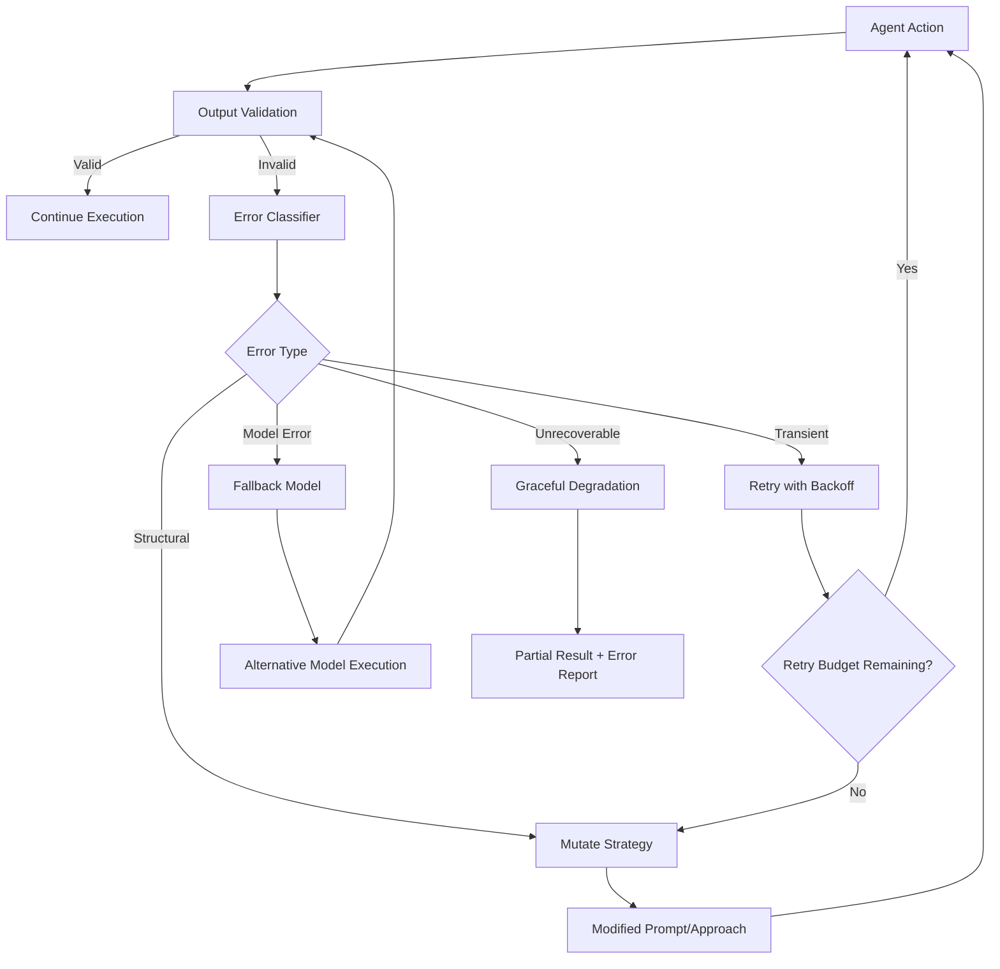

# Self-Healing Agents

Part of [Agent Skills™](https://github.com/itallstartedwithaidea/agent-skills) by [googleadsagent.ai™](https://googleadsagent.ai)

## Description

Self-Healing Agents are autonomous systems that detect their own failure modes and self-correct without human intervention. In production environments, agent failures are not exceptional — they are expected. Network calls timeout, APIs return unexpected schemas, models hallucinate confidently, and tool outputs violate assumptions. The difference between a prototype and a production agent is the ability to recover gracefully from every category of failure.

This skill encodes the self-healing patterns developed for the Buddy™ agent at [googleadsagent.ai™](https://googleadsagent.ai), where autonomous Google Ads analysis must complete reliably even when upstream APIs change, rate limits are hit, or model outputs contain structural errors. The system operates on a detect-diagnose-repair cycle that mirrors biological immune responses: identify the pathogen, classify the threat, and deploy the appropriate countermeasure.

Self-healing is not merely retry logic. It encompasses error classification, strategy mutation (retrying with a different approach rather than the same one), fallback model selection, output validation with automatic repair, and graceful degradation when full recovery is impossible. Agents built with these patterns achieve 99%+ task completion rates in production.

## Use When

- Building agents that must operate autonomously without human oversight
- Tool calls or API integrations are unreliable or subject to rate limits
- Model outputs must conform to strict schemas and occasionally don't
- Long-running workflows cannot afford to fail mid-execution
- You need to maintain SLA commitments for agent-powered features
- The agent must handle novel error types it hasn't encountered before

## How It Works



The self-healing cycle activates whenever output validation detects an anomaly. The error classifier categorizes the failure into one of four types: transient errors (network timeouts, rate limits) are retried with exponential backoff; structural errors (schema violations, missing fields) trigger strategy mutation where the agent modifies its approach; model errors (hallucinations, refusals) invoke fallback model selection; and unrecoverable errors trigger graceful degradation that returns the best partial result with a clear error report.

## Implementation

**Error Classification Engine:**

```typescript
enum ErrorType {
  Transient = "transient",
  Structural = "structural",
  ModelError = "model_error",
  Unrecoverable = "unrecoverable",
}

interface ClassifiedError {
  type: ErrorType;
  message: string;
  retryable: boolean;
  suggestedStrategy: string;
}

function classifyError(error: unknown, context: ExecutionContext): ClassifiedError {
  if (error instanceof NetworkError || error instanceof RateLimitError) {
    return {
      type: ErrorType.Transient,
      message: String(error),
      retryable: true,
      suggestedStrategy: "exponential_backoff",
    };
  }
  if (error instanceof SchemaValidationError) {
    return {
      type: ErrorType.Structural,
      message: `Schema violation: ${error.path} — ${error.message}`,
      retryable: true,
      suggestedStrategy: "mutate_prompt",
    };
  }
  if (error instanceof ModelRefusalError || isHallucination(error, context)) {
    return {
      type: ErrorType.ModelError,
      message: String(error),
      retryable: true,
      suggestedStrategy: "fallback_model",
    };
  }
  return {
    type: ErrorType.Unrecoverable,
    message: String(error),
    retryable: false,
    suggestedStrategy: "graceful_degradation",
  };
}
```

**Self-Healing Execution Loop:**

```python
class SelfHealingAgent:
    def __init__(self, primary_model, fallback_models, max_retries=3):
        self.primary_model = primary_model
        self.fallback_models = fallback_models
        self.max_retries = max_retries

    async def execute(self, task, validator):
        attempts = []
        current_model = self.primary_model
        current_prompt = task.prompt

        for attempt in range(self.max_retries + len(self.fallback_models)):
            try:
                result = await current_model.generate(current_prompt)
                validation = validator.validate(result)
                if validation.is_valid:
                    return HealingResult(result=result, attempts=attempts)

                error = classify_error(validation.error, task.context)
                attempts.append({"attempt": attempt, "error": error, "model": current_model.name})

                if error.strategy == "mutate_prompt":
                    current_prompt = self.mutate_prompt(current_prompt, error)
                elif error.strategy == "fallback_model":
                    current_model = self.next_fallback(current_model)

            except Exception as e:
                error = classify_error(e, task.context)
                attempts.append({"attempt": attempt, "error": error})
                if not error.retryable:
                    break
                await asyncio.sleep(2 ** attempt)

        return HealingResult(
            result=self.graceful_degradation(task, attempts),
            attempts=attempts,
            degraded=True
        )

    def mutate_prompt(self, prompt, error):
        mutations = {
            "schema_violation": f"{prompt}\n\nPrevious attempt had error: {error.message}. Ensure strict schema compliance.",
            "missing_field": f"{prompt}\n\nYou MUST include all required fields. Missing: {error.message}",
        }
        return mutations.get(error.subtype, f"{prompt}\n\nPrevious error: {error.message}. Adjust approach.")

    def next_fallback(self, current):
        idx = ([self.primary_model] + self.fallback_models).index(current)
        if idx < len(self.fallback_models):
            return self.fallback_models[idx]
        return current
```

**Output Validation with Auto-Repair:**

```python
def validate_and_repair(output: str, schema: dict) -> tuple[dict, bool]:
    try:
        parsed = json.loads(output)
    except json.JSONDecodeError:
        extracted = extract_json_from_text(output)
        if extracted:
            parsed = extracted
        else:
            raise StructuralError("No valid JSON found in output")

    repaired = False
    for field, rules in schema.get("required_fields", {}).items():
        if field not in parsed:
            if "default" in rules:
                parsed[field] = rules["default"]
                repaired = True
            else:
                raise StructuralError(f"Missing required field: {field}")

    return parsed, repaired
```

## Best Practices

1. **Classify before retrying** — blind retries waste tokens and time; always classify the error type to select the optimal recovery strategy.
2. **Mutate on retry, don't repeat** — if the same prompt failed, sending it again rarely helps; append error context or restructure the request.
3. **Set hard retry budgets** — limit total retries (typically 3-5) and total token expenditure to prevent runaway healing loops.
4. **Log every healing attempt** — each retry, mutation, and fallback invocation should be logged with full context for post-mortem analysis.
5. **Design graceful degradation outputs** — partial results with clear error annotations are vastly more useful than empty failures.
6. **Test healing paths explicitly** — inject known failure modes in testing to verify each healing pathway activates correctly.
7. **Monitor healing rates** — a healing rate above 10% indicates upstream issues that should be fixed at the source, not masked by self-healing.

## Platform Compatibility

| Feature | Claude Code | Cursor | Codex | Gemini CLI |
|---|---|---|---|---|
| Retry with mutation | ✅ Full | ✅ Full | ✅ Full | ✅ Full |
| Fallback model selection | ✅ Via API | ✅ Via extensions | ✅ Via API | ✅ Via API |
| Output validation | ✅ Full | ✅ Full | ✅ Full | ✅ Full |
| Error classification | ✅ Full | ✅ Full | ✅ Full | ✅ Full |
| Graceful degradation | ✅ Full | ✅ Full | ✅ Full | ✅ Full |

## Related Skills

- [Verification Loops](../verification-loops/) - Multi-stage validation pipelines that detect the failures self-healing agents recover from
- [Agent Instinct System](../agent-instinct-system/) - Pre-action safety gates that prevent errors before they require self-healing
- [Adversarial Resilience](../adversarial-resilience/) - Defense layers that handle adversarial-induced failures alongside transient and structural errors

## Keywords

self-healing, error-recovery, retry-strategy, fallback-models, output-validation, graceful-degradation, strategy-mutation, error-classification, resilience, agent-skills

---

© 2026 [googleadsagent.ai™](https://googleadsagent.ai) | [Agent Skills™](https://github.com/itallstartedwithaidea/agent-skills) | MIT License
