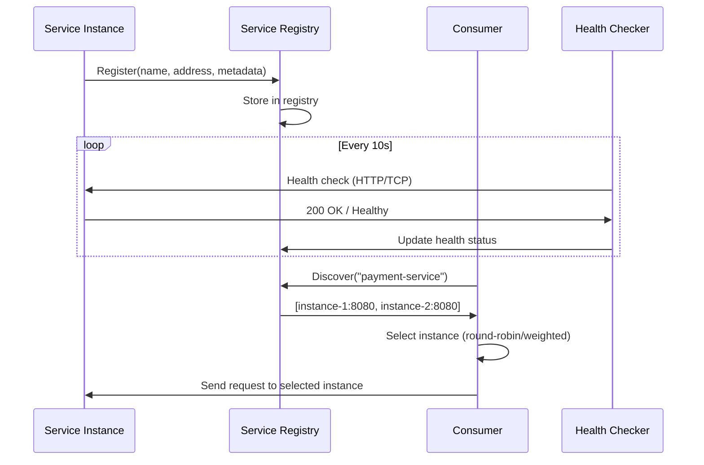

# Service Discovery

Part of [Agent Skills™](https://github.com/itallstartedwithaidea/agent-skills) by [googleadsagent.ai™](https://googleadsagent.ai)

## Description

Service Discovery implements dynamic service registry, health check monitoring, and intelligent load balancing patterns inspired by Nacos for cloud-native applications. Services register themselves on startup, announce their capabilities and health status, and are discovered by consumers without hardcoded addresses. The registry becomes the single source of truth for the service topology.

In microservice and edge-distributed architectures, services are ephemeral. Instances scale up and down, deploy across regions, and fail independently. Hardcoded service URLs create brittle coupling that breaks under any topology change. Service discovery replaces static configuration with a living registry that reflects the actual state of the system at any moment.

This skill covers three complementary patterns: self-registration (services announce themselves), health checking (the registry verifies liveness), and client-side discovery (consumers query the registry and select instances). Together, these patterns enable zero-downtime deployments, automatic failover, and region-aware routing without manual configuration changes.

## Use When

- Building microservice architectures with dynamic scaling
- Implementing health-check-driven load balancing
- Replacing hardcoded service URLs with dynamic discovery
- Supporting blue-green or canary deployments
- Building multi-region applications with region-aware routing
- Integrating multiple Workers or services that need to find each other

## How It Works



Services register on startup and deregister on shutdown. The health checker continuously verifies liveness. Consumers query the registry and apply a load-balancing strategy to select an instance.

## Implementation

```typescript
interface ServiceInstance {
  id: string;
  name: string;
  address: string;
  port: number;
  metadata: Record<string, string>;
  health: "healthy" | "degraded" | "unhealthy";
  lastHeartbeat: number;
}

class ServiceRegistry {
  private instances = new Map<string, ServiceInstance[]>();

  register(instance: ServiceInstance): void {
    const existing = this.instances.get(instance.name) ?? [];
    existing.push({ ...instance, lastHeartbeat: Date.now() });
    this.instances.set(instance.name, existing);
  }

  deregister(serviceName: string, instanceId: string): void {
    const existing = this.instances.get(serviceName) ?? [];
    this.instances.set(
      serviceName,
      existing.filter(i => i.id !== instanceId)
    );
  }

  discover(serviceName: string): ServiceInstance[] {
    const instances = this.instances.get(serviceName) ?? [];
    return instances.filter(i => i.health === "healthy");
  }

  heartbeat(serviceName: string, instanceId: string): void {
    const instances = this.instances.get(serviceName) ?? [];
    const instance = instances.find(i => i.id === instanceId);
    if (instance) instance.lastHeartbeat = Date.now();
  }

  pruneStale(maxAgeMs: number = 30_000): void {
    const cutoff = Date.now() - maxAgeMs;
    for (const [name, instances] of this.instances) {
      this.instances.set(
        name,
        instances.filter(i => i.lastHeartbeat > cutoff)
      );
    }
  }
}

function loadBalance(instances: ServiceInstance[]): ServiceInstance {
  const weights = instances.map(i =>
    i.health === "healthy" ? 100 : i.health === "degraded" ? 25 : 0
  );
  const totalWeight = weights.reduce((sum, w) => sum + w, 0);
  let random = Math.random() * totalWeight;
  for (let i = 0; i < instances.length; i++) {
    random -= weights[i];
    if (random <= 0) return instances[i];
  }
  return instances[0];
}
```

## Best Practices

- Implement graceful deregistration on service shutdown signals (SIGTERM)
- Use heartbeat TTL (30s default) to automatically prune unresponsive instances
- Include metadata in registrations (version, region, capabilities) for smart routing
- Implement circuit breakers on the consumer side to handle discovery failures
- Cache discovery results locally with short TTL to reduce registry load
- Monitor registry size and health check latency as infrastructure metrics

## Platform Compatibility

| Platform | Support | Notes |
|----------|---------|-------|
| Cursor | Full | Config + code generation |
| VS Code | Full | Microservice tooling |
| Windsurf | Full | Cloud-native support |
| Claude Code | Full | Architecture guidance |
| Cline | Full | Service scaffolding |
| aider | Partial | Code-level support only |

## Related Skills

- [Cloudflare Workers](../cloudflare-workers/)
- [Configuration Management](../configuration-management/)
- [Observability](../observability/)
- [Sandbox Hardening](../../security/sandbox-hardening/)

## Keywords

`service-discovery` `nacos` `health-check` `load-balancing` `microservices` `registry` `cloud-native` `dynamic-routing`

---

© 2026 googleadsagent.ai™ | Agent Skills™ | MIT License
